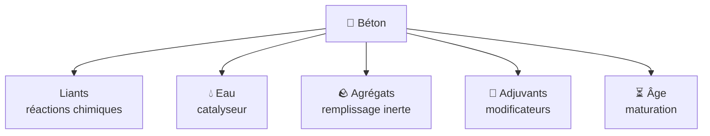
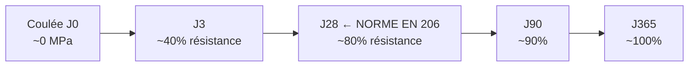
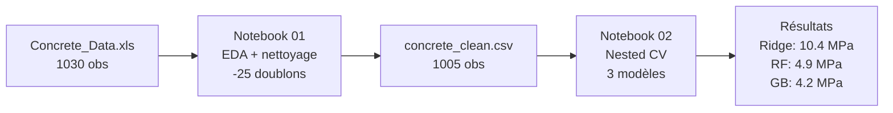

# Fiche 00 — Le Projet & le Dataset

> Ton point de départ : comprendre CE QU'ON FAIT et POURQUOI.

---

## Le Projet en une phrase

> On entraîne des modèles de Machine Learning pour **prédire la résistance à la compression du béton** à partir de sa composition chimique et de son âge. C'est de la **régression supervisée**.

---

## C'est quoi la résistance à la compression ?

La **résistance à la compression** (en MPa — MégaPascals) mesure la force qu'un bloc de béton peut supporter avant de se fissurer.

- 20 MPa → béton standard pour dallage
- 30–40 MPa → béton structurel (poutres, dalles)
- 60+ MPa → béton haute performance (ponts, gratte-ciels)

**1 MPa = 1 Newton par mm²** → un béton à 30 MPa supporte 30 kg sur 1 mm².

Pourquoi c'est important ? Si un ingénieur se trompe dans sa formulation, **le bâtiment peut s'effondrer**.

---

## Le Dataset — UCI Concrete (Yeh, 1998)

| Propriété | Valeur |
|---|---|
| Source | UC Irvine ML Repository |
| Auteur | I-Cheng Yeh, 1998 |
| Fichier original | `data/Concrete_Data.xls` |
| Observations | 1030 (→ **1005** après suppression de 25 doublons) |
| Features | **8** (toutes continues, en kg/m³ sauf `age` en jours) |
| Target | `Concrete compressive strength` (MPa) |
| Target moyenne | ~35 MPa, std ~16 MPa, range [2.3 ; 82.6] |

---

## Les 8 Ingrédients du Béton (Features)

| Catégorie | Feature | Rôle |
|---|---|---|
| **Liants** (réactions chimiques) | `cement` | Ciment Portland — liant principal |
| | `slag` | Laitier de haut fourneau — déchet d'aciérie recyclé |
| | `fly_ash` | Cendres volantes — cendres de centrale charbon |
| **Eau** (catalyseur) | `water` | Loi de Féret : excès = fragilité |
| **Agrégats** (remplissage inerte) | `coarse_agg` | Graviers > 5mm |
| | `fine_agg` | Sable fin < 5mm |
| **Adjuvants** (modificateurs) | `superplasticizer` | Fluidifiant — réduit l'eau nécessaire |
| **Âge** (maturation) | `age` | Jours depuis la coulée — hydratation logarithmique |

---

## Explication de chaque feature

### `cement` — Ciment Portland (liant principal)
C'est la poudre grise classique du béton. Quand le ciment rencontre l'eau, une réaction chimique appelée **hydratation** crée des cristaux (silicates de calcium hydratés) qui soudent tous les éléments ensemble. **Plus de ciment = plus de réactions = plus résistant.** Corrélation r ≈ +0.50 avec la résistance (la plus forte du dataset).

### `slag` — Laitier de haut fourneau (liant secondaire)
Un **sous-produit industriel** de la production d'acier : la scorie fondue est refroidie brusquement à l'eau, ce qui la rend vitreuse et réactive. Il remplace partiellement le ciment. Il durcit **lentement** mais donne une bonne résistance à long terme. C'est un matériau "vert" car c'est un déchet recyclé.

### `fly_ash` — Cendres volantes (liant tertiaire)
**Ce sont littéralement les cendres récupérées dans les filtres à fumée des centrales thermiques au charbon.** Très fines, elles réagissent avec l'hydroxyde de calcium libéré par le ciment. Réaction lente = effet surtout après 28 jours. Beaucoup d'observations ont `fly_ash = 0` car ce n'est pas toujours utilisé.

### `water` — Eau (catalyseur mais aussi ennemi)
L'eau déclenche l'hydratation du ciment. **Mais attention** : trop d'eau dilue le mélange et, en s'évaporant, laisse des pores microscopiques → béton plus fragile. C'est la **Loi de Féret (1897)** :

$$\text{Résistance} \propto \frac{1}{\left(\frac{\text{eau}}{\text{ciment}}\right)^2}$$

→ C'est pourquoi `water` a un **coefficient négatif** dans Ridge et une importance élevée dans GB.

### `superplasticizer` — Superplastifiant (réducteur d'eau)
Un **additif chimique** qui fluidifie le béton sans ajouter d'eau. En enrobant les grains de ciment, il les empêche de s'agglomérer. Résultat : béton fluide ET peu d'eau → haute résistance. **Corrélé négativement avec `water`** (r ≈ -0.66) → si on met plus de superplastifiant, on met moins d'eau.

### `coarse_agg` — Gros granulats (squelette inerte)
Les **cailloux et graviers** (> 5mm). Ils constituent le squelette du béton mais n'ont aucun rôle chimique. Importance GB ~1.8% — juste du remplissage.

### `fine_agg` — Sable fin (remplissage inerte)
Le **sable** (< 5mm). Remplit les espaces entre les gros granulats. Également peu d'impact chimique — importance GB ~4.5%.

### `age` — Âge du béton au moment du test
Le béton durcit **pendant des semaines, voire des mois** après la coulée. La réaction d'hydratation continue lentement. La résistance augmente de manière **logarithmique** :

**Pourquoi la relation est logarithmique ?** La vitesse d'hydratation ralentit au fil du temps car le ciment anhydre restant est de plus en plus difficile à atteindre (il est entouré de cristaux déjà formés).

---

## Statistiques descriptives clés

| Feature | Unité | Min | Max | Moy | Particularité |
|---|---|---|---|---|---|
| cement | kg/m³ | 102 | 540 | 281 | Distribution normale |
| slag | kg/m³ | 0 | 359 | 73 | ~50% de zéros |
| fly_ash | kg/m³ | 0 | 200 | 54 | ~55% de zéros |
| water | kg/m³ | 122 | 247 | 182 | Continue, peu de zéros |
| superplasticizer | kg/m³ | 0 | 32 | 6.2 | ~30% de zéros |
| coarse_agg | kg/m³ | 801 | 1145 | 972 | Peu de variance |
| fine_agg | kg/m³ | 594 | 993 | 773 | Peu de variance |
| age | jours | 1 | 365 | 45.7 | Très asymétrique, pic à 28j |
| **strength** | **MPa** | **2.3** | **82.6** | **35.8** | Légèrement asymétrique |

---

## Pourquoi c'est difficile à prédire ?

1. **Relations non-linéaires** : `age` suit une loi logarithmique → Ridge ne peut pas capter ça
2. **Interactions** : le ratio eau/ciment est plus important que chaque variable seule
3. **Zéros nombreux** : slag, fly_ash, superplasticizer = 0 dans 40-70% des cas
4. **Multicolinéarité** : `water` et `superplasticizer` corrélés à r ≈ -0.66

---

## Physique clé à retenir pour l'oral

| Loi | Formule | Implication |
|---|---|---|
| **Loi de Féret (1897)** | Résistance ∝ 1/(E/C)² | Plus d'eau = plus de pores = moins résistant |
| **Hydratation logarithmique** | Résistance ∝ log(age) | Durcissement rapide au début, lent ensuite |
| **Dosage ciment** | Linéaire positif | Plus de ciment = plus de cristaux |

---

## Ce qu'on a fait

---

## Résultats Finaux

| Modèle | RMSE outer CV | R² | Rang |
|---|---|---|---|
| Ridge | 10.385 ± 0.449 MPa | 0.590 | 3/3 |
| Random Forest | 4.935 ± 0.318 MPa | 0.907 | 2/3 |
| **Gradient Boosting** | **4.208 ± 0.261 MPa** | **0.932** | **1/3** |

**Meilleurs HPs Gradient Boosting :**
`learning_rate=0.2, max_depth=4, n_estimators=300, subsample=1.0`

**Ce que signifie RMSE = 4.2 MPa concrètement :**
- Sur un béton estimé à 40 MPa → erreur typique ±4.2 MPa (10.5%)
- Acceptable pour l'aide à la formulation en laboratoire
- **NON acceptable** pour une décision structurelle critique (il faut des essais physiques)

---

## À retenir pour l'oral

> *"Notre projet prédit la résistance à la compression du béton (MPa) à partir de 8 features : 3 liants chimiques (ciment, laitier de haut fourneau, cendres volantes de centrale charbon), l'eau (dont l'excès fragilise via la loi de Féret), un fluidifiant, 2 agrégats inertes, et l'âge. La physique prédit que cement et age dominent — nos modèles le confirment avec ~64% de l'importance combinée. Le Gradient Boosting atteint RMSE = 4.2 MPa (R² = 0.932) avec zéro data leakage via Pipeline sklearn et nested cross-validation 5-fold."*
