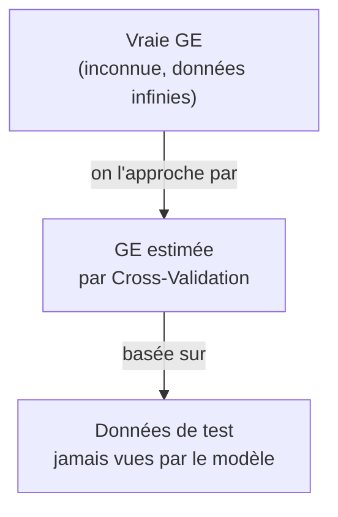
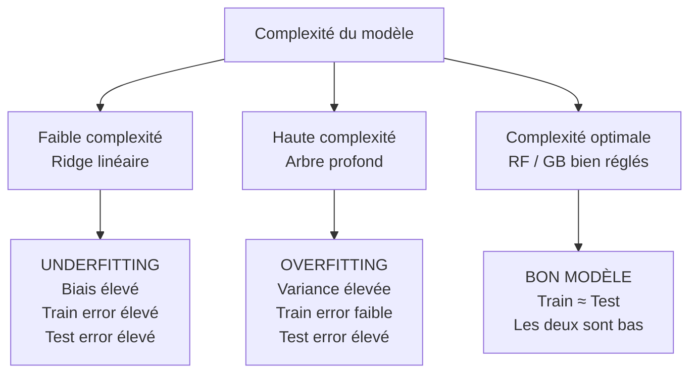

# Fiche 01 — Erreur de Généralisation

> Synthèse 4 — La question fondamentale : mon modèle est-il vraiment bon, ou a-t-il juste mémorisé ?

---

## Le Problème Central

Imagine que tu passes un examen avec les **mêmes questions exactes que les devoirs corrigés**. Tu as 20/20. Mais tu es réellement bon en maths ?

En ML c'est pareil. Un modèle qui "mémorise" les données d'entraînement a 0% d'erreur sur ces données — mais il sera nul sur de nouvelles données.

**La vraie question :** est-ce que mon modèle fait de bonnes prédictions sur des données qu'il n'a **jamais vues** ?

---

## Train Error — Toujours Optimiste

$$\mathcal{R}_{emp}(\hat{f}) = \frac{1}{n}\sum_{i=1}^n L\left(y_i, \hat{f}(x_i)\right)$$

**Cause du biais :** on entraîne le modèle en minimisant cette erreur. Il a été **construit exprès** pour faire bien sur ces données. Il connaît les réponses.

**Exemple extrême :** le modèle 1-NN (1 plus proche voisin) → train error = **0** toujours. Pourquoi ? Pour chaque point d'entraînement, le plus proche voisin c'est... lui-même. Pourtant il est souvent mauvais en généralisation.

→ **Conclusion : le train error sous-estime TOUJOURS l'erreur réelle.**

---

## Generalization Error (GE) — Ce qu'on veut vraiment mesurer

$$GE(\hat{f}) = \mathbb{E}_{(x,y) \sim \mathbb{P}_{xy}}\left[L\left(y, \hat{f}(x)\right)\right]$$

**C'est quoi :** l'erreur **moyenne** si on testait le modèle sur une infinité de nouvelles données, tirées du même processus que le dataset original.

**Problème :** on n'a pas de données infinies. On ne peut pas la calculer directement.

**Solution :** on l'**estime** avec des techniques de rééchantillonnage (cross-validation).



---

## Overfitting & Underfitting



| Situation | Train Error | Test Error | Cause | Remède |
|---|---|---|---|---|
| **Underfitting** | Élevé | Élevé | Modèle trop simple | Algorithme plus complexe |
| **Overfitting** | Faible | Élevé | Modèle trop complexe | Régularisation, plus de données |
| **Bon modèle** | ≈ Test Error | Bas | ✅ Équilibre | — |

---

## Décomposition Biais-Variance

$$GE = \underbrace{\text{Biais}^2}_{\text{underfitting}} + \underbrace{\text{Variance}}_{\text{overfitting}} + \underbrace{\sigma^2_\epsilon}_{\text{bruit irréductible}}$$

**Biais :** erreur systématique. Le modèle "rate" toujours dans la même direction. Exemple : Ridge prédit des relations linéaires mais la vraie relation de `age` est logarithmique → biais structurel.

**Variance :** sensibilité aux fluctuations du dataset. Change les données d'entraînement légèrement → le modèle change beaucoup. Exemple : un seul arbre CART profond.

**Bruit irréductible :** même avec un modèle parfait, il y a toujours une variabilité naturelle dans les données qu'on ne peut pas prédire.

**Trade-off fondamental :**
```
Complexité ↑ → Biais ↓  mais  Variance ↑
Complexité ↓ → Biais ↑  mais  Variance ↓
```

---

## Application dans notre projet

| Modèle | Situation | Biais | Variance | RMSE outer CV | Explication |
|---|---|---|---|---|---|
| Ridge | **Underfit** | Élevé | Faible | 10.4 MPa | Linéaire → rate log(age) et la loi de Féret quadratique |
| Random Forest | **Bon équilibre** | Faible | Maîtrisée | 4.9 MPa | Chaque arbre overfit individuellement, mais la moyenne de 300 arbres compense — outer CV confirme une bonne généralisation |
| Gradient Boosting | **Meilleur équilibre** | Très faible | Maîtrisée | 4.2 MPa | Corrige itérativement le biais résiduel → meilleure GE |

> ⚠️ **Attention** : RF et GB ne "overfit" pas dans notre cas — leurs RMSE outer CV (4.9 et 4.2 MPa) sont les estimations de généralisation réelles, calculées sur des folds jamais vus. Un overfit se manifesterait par un très faible train error **et** un test error élevé. Ici, le test error est bon.

---

## Biais Pessimiste de nos RMSE

$$\mathbb{E}[\widehat{GE}_{CV}] \approx GE(\mathcal{I}, n_{train}) \geq GE(\mathcal{I}, n)$$

Nos RMSE outer CV sont calculés sur des modèles entraînés sur **80% des données** (4 folds sur 5 en 5-fold CV). Le modèle final — entraîné sur **100%** des données avec les meilleurs HPs — serait **légèrement meilleur**.

→ Notre estimation est **pessimiste** (légèrement conservative). C'est une propriété **souhaitable** : on ne sur-vend pas nos performances.

---

## À retenir pour l'oral

> *"Le train error est biaisé optimistement — le modèle a mémorisé les réponses. La vraie métrique à mesurer est la Generalization Error : l'erreur sur des données nouvelles. On ne peut pas la calculer directement, alors on l'estime par cross-validation. Notre RMSE de 4.2 MPa est calculé sur des folds de test que le modèle n'a jamais vus — c'est une estimation légèrement pessimiste de la vraie GE, car le modèle final est entraîné sur 100% des données."*
