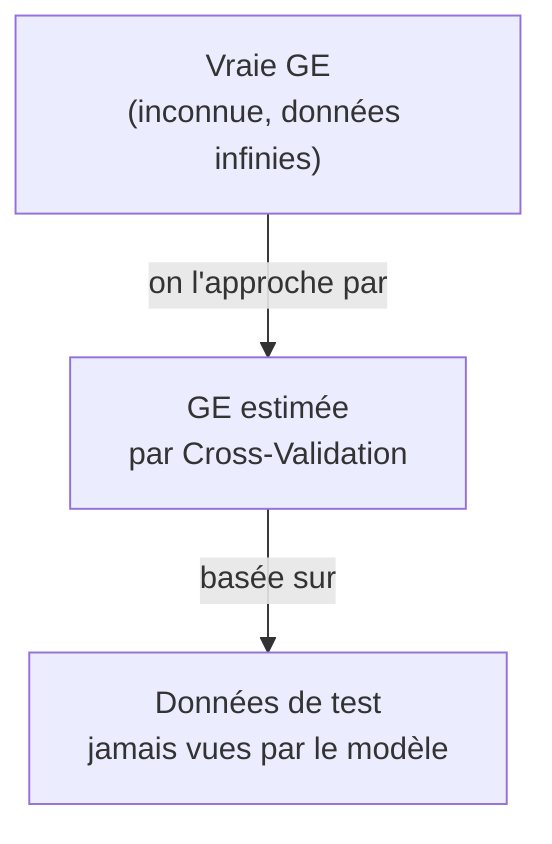
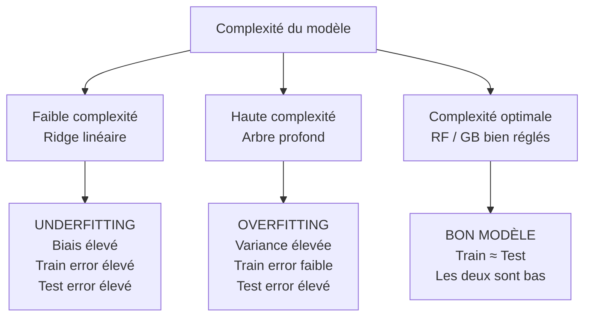

# Fiche 01 — Erreur de Généralisation

> Synthèse 4 — La question fondamentale : mon modèle est-il vraiment bon, ou a-t-il juste mémorisé ?

---

## Le Problème Central

Imagine que tu passes un examen avec les **mêmes questions exactes que les devoirs corrigés**. Tu as 20/20. Mais tu es réellement bon en maths ?

En ML c'est pareil. Un modèle qui "mémorise" les données d'entraînement a 0% d'erreur sur ces données — mais il sera nul sur de nouvelles données.

**La vraie question :** est-ce que mon modèle fait de bonnes prédictions sur des données qu'il n'a **jamais vues** ?

---

## Train Error — Toujours Optimiste

$$\mathcal{R}_{emp}(\hat{f}) = \frac{1}{n}\sum_{i=1}^n L\left(y_i, \hat{f}(x_i)\right)$$

**Cause du biais :** on entraîne le modèle en minimisant cette erreur. Il a été **construit exprès** pour faire bien sur ces données. Il connaît les réponses.

**Exemple extrême :** le modèle 1-NN (1 plus proche voisin) → train error = **0** toujours. Pourquoi ? Pour chaque point d'entraînement, le plus proche voisin c'est... lui-même. Pourtant il est souvent mauvais en généralisation.

→ **Conclusion : le train error sous-estime TOUJOURS l'erreur réelle.**

---

## Generalization Error (GE) — Ce qu'on veut vraiment mesurer

$$GE(\hat{f}) = \mathbb{E}_{(x,y) \sim \mathbb{P}_{xy}}\left[L\left(y, \hat{f}(x)\right)\right]$$

**C'est quoi :** l'erreur **moyenne** si on testait le modèle sur une infinité de nouvelles données, tirées du même processus que le dataset original.

**Problème :** on n'a pas de données infinies. On ne peut pas la calculer directement.

**Solution :** on l'**estime** avec des techniques de rééchantillonnage (cross-validation).



---

## Overfitting & Underfitting



| Situation | Train Error | Test Error | Cause | Remède |
|---|---|---|---|---|
| **Underfitting** | Élevé | Élevé | Modèle trop simple | Algorithme plus complexe |
| **Overfitting** | Faible | Élevé | Modèle trop complexe | Régularisation, plus de données |
| **Bon modèle** | ≈ Test Error | Bas | ✅ Équilibre | — |

---

## Décomposition Biais-Variance

### L'idée, sans aucune formule : la cible de fléchettes

Imagine que tu lances des fléchettes sur une cible, et que le **centre de la cible = la vraie valeur** (la vraie résistance du béton). Tu lances **plusieurs fois** (= tu entraînes le modèle sur plusieurs jeux de données d'entraînement légèrement différents). Où atterrissent tes fléchettes ?

| | Variance FAIBLE | Variance ÉLEVÉE |
|---|---|---|
| **Biais FAIBLE** | 🎯 Toutes les fléchettes groupées au centre — **modèle idéal** | 🎯 Fléchettes éparpillées AUTOUR du centre — **1 arbre CART profond** : en moyenne juste, mais très instable |
| **Biais ÉLEVÉ** | 🎯 Fléchettes groupées MAIS décalées du centre — **Ridge** : cohérent mais systématiquement à côté | 🎯 Fléchettes éparpillées ET décalées — **pire des cas** |

- **Le biais** = est-ce que tes fléchettes sont **centrées** sur la cible **en moyenne** ? Si non → tu as un défaut systématique de visée (ex: tu vises toujours 5cm trop à gauche). Pour un modèle : c'est une **erreur due à des hypothèses trop simples** (ex: Ridge suppose une relation **droite** alors que la vraie relation `age` → résistance est une **courbe logarithmique** — peu importe combien de données tu lui donnes, Ridge ne pourra jamais "voir" la courbe, il va toujours rater de la même façon).

- **La variance** = est-ce que tes fléchettes sont **groupées** entre elles, ou **éparpillées** ? Si éparpillées → ton geste est instable, change un peu et le résultat change beaucoup. Pour un modèle : c'est une **sensibilité excessive aux données d'entraînement**. Si tu changes légèrement le jeu d'entraînement (enlève 50 lignes, par exemple), un arbre CART profond va produire un arbre **complètement différent** → ses prédictions varient énormément d'un entraînement à l'autre.

- **Le bruit irréductible ($\sigma^2_\epsilon$)** = même un archer parfait ne touche pas EXACTEMENT le même point à chaque fois (le vent, le tremblement de la main...). Pour le béton : deux gâchées **avec exactement la même formulation** n'auront jamais **exactement** la même résistance (micro-défauts, conditions de séchage...). Aucun modèle, aussi bon soit-il, ne peut prédire ce résidu.

### Deux exemples concrets pour bien fixer les idées

**Le biais, concrètement :** imagine que tu dois prédire la résistance du béton selon son **âge**. La vraie relation ressemble à ça (ça monte vite au début, puis ça plafonne) :

```
résistance
   |           ____________
   |        /
   |     /
   |   /
   | /
   |/_______________________ âge
```

Ridge, lui, ne sait dessiner que des **droites**. Donc il va tracer un truc comme ça :

```
résistance
   |              /
   |           /
   |        /
   |     /
   |  /
   |/_______________________ âge
```

Résultat : pour les bétons jeunes, Ridge **sous-estime** systématiquement (la droite est en dessous de la vraie courbe). Pour les bétons très vieux, Ridge **surestime** systématiquement (la droite est au-dessus). **Toujours dans le même sens, toujours pour la même raison** (il ne peut pas faire de courbe). Ça, c'est le biais : une **erreur structurelle, prévisible, qui ne change pas** même si tu lui donnes plus de données ou un autre échantillon — son hypothèse de départ ("c'est une droite") est juste fausse.

**La variance, concrètement :** tu entraînes un arbre CART très profond sur 1000 gâchées de béton. Il fait plein de découpages très fins, jusqu'à coller presque parfaitement à CES 1000 points précis (bruit compris). Maintenant, retire 50 gâchées au hasard et réentraîne le même arbre. Comme l'arbre colle de très près aux données, ces 50 points en moins **changent complètement les découpages** → tu obtiens un arbre très différent, avec des prédictions différentes pour les mêmes nouvelles gâchées :

```
Entraînement 1 (1000 obs)               →  Arbre A  →  prédit 42 MPa pour ce béton
Entraînement 2 (950 obs, données très
similaires, juste 50 lignes en moins)   →  Arbre B  →  prédit 31 MPa pour LE MÊME béton
```

C'est ça la variance : le modèle **n'est pas stable**, son résultat dépend trop du hasard de l'échantillon d'entraînement.

**En une ligne chacun :**
- **Biais** = "je me trompe toujours de la même façon, à cause d'une hypothèse fausse" (Ridge et sa droite)
- **Variance** = "je donne des réponses très différentes selon les données sur lesquelles j'ai appris" (un arbre profond instable)

### La formule (maintenant qu'on a l'intuition)

$$GE = \underbrace{\text{Biais}^2}_{\text{underfitting}} + \underbrace{\text{Variance}}_{\text{overfitting}} + \underbrace{\sigma^2_\epsilon}_{\text{bruit irréductible}}$$

C'est juste la traduction mathématique du schéma des fléchettes : ton **erreur totale** (GE) se décompose en 3 sources indépendantes qui s'additionnent. Pour la minimiser, il faut réduire le biais ET la variance — mais comme on va le voir, **réduire l'un augmente souvent l'autre**.

| Terme | Analogie fléchettes | Concrètement pour nous |
|---|---|---|
| **Biais²** | Décalage moyen par rapport au centre | Ridge : suppose une droite, rate `log(age)` → biais structurel |
| **Variance** | Dispersion des fléchettes entre elles | 1 arbre CART profond : change le train set → arbre très différent |
| **σ²ε** | Tremblement de main inévitable | Variabilité naturelle du béton (même formulation → résistances légèrement différentes) |

### Le Trade-off Fondamental

Plus un modèle est **complexe** (= flexible, capable d'épouser des formes compliquées), plus il peut **réduire son biais** (il "voit" mieux les vraies relations) — mais il devient aussi **plus sensible aux données d'entraînement** (sa variance augmente).

```
Complexité ↑ → Biais ↓  mais  Variance ↑   (ex: arbre très profond)
Complexité ↓ → Biais ↑  mais  Variance ↓   (ex: Ridge, droite simple)
```

**L'objectif n'est pas de minimiser le biais OU la variance séparément, mais leur SOMME.** C'est pour ça que les méthodes d'ensemble (Random Forest, Gradient Boosting) sont puissantes : elles partent d'un modèle à variance élevée (un arbre) et la réduisent (en moyennant — RF) ou partent d'un modèle à biais élevé (un arbre faible) et le réduisent (en corrigeant les erreurs séquentiellement — GB). Voir [Fiche 08](08_cart_rf_gb.md).

---

## Application dans notre projet

| Modèle | Situation | Biais | Variance | RMSE outer CV | Explication |
|---|---|---|---|---|---|
| Ridge | **Underfit** | Élevé | Faible | 10.4 MPa | Linéaire → rate log(age) et la loi de Féret quadratique |
| Random Forest | **Bon équilibre** | Faible | Maîtrisée | 4.9 MPa | Chaque arbre overfit individuellement, mais la moyenne de 300 arbres compense — outer CV confirme une bonne généralisation |
| Gradient Boosting | **Meilleur équilibre** | Très faible | Maîtrisée | 4.2 MPa | Corrige itérativement le biais résiduel → meilleure GE |

> ⚠️ **Attention** : RF et GB ne "overfit" pas dans notre cas — leurs RMSE outer CV (4.9 et 4.2 MPa) sont les estimations de généralisation réelles, calculées sur des folds jamais vus. Un overfit se manifesterait par un très faible train error **et** un test error élevé. Ici, le test error est bon.

---

## Biais Pessimiste de nos RMSE

$$\mathbb{E}[\widehat{GE}_{CV}] \approx GE(\mathcal{I}, n_{train}) \geq GE(\mathcal{I}, n)$$

Nos RMSE outer CV sont calculés sur des modèles entraînés sur **80% des données** (4 folds sur 5 en 5-fold CV). Le modèle final — entraîné sur **100%** des données avec les meilleurs HPs — serait **légèrement meilleur**.

→ Notre estimation est **pessimiste** (légèrement conservative). C'est une propriété **souhaitable** : on ne sur-vend pas nos performances.

---

## À retenir pour l'oral

> *"Le train error est biaisé optimistement — le modèle a mémorisé les réponses. La vraie métrique à mesurer est la Generalization Error : l'erreur sur des données nouvelles. On ne peut pas la calculer directement, alors on l'estime par cross-validation. Notre RMSE de 4.2 MPa est calculé sur des folds de test que le modèle n'a jamais vus — c'est une estimation légèrement pessimiste de la vraie GE, car le modèle final est entraîné sur 100% des données."*
