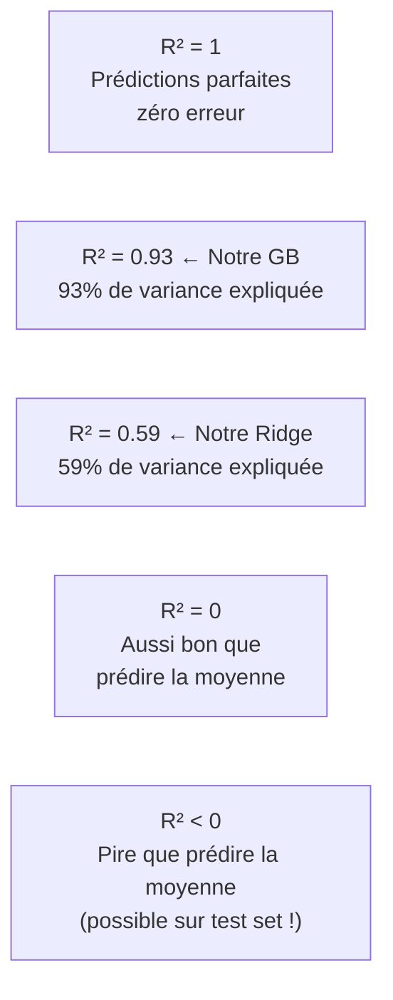

# Fiche 02 — Métriques de Régression

> Synthèse 4 — Comment mesure-t-on si un modèle de régression est bon ?

---

## C'est quoi une métrique d'évaluation ?

Une métrique prend les **vraies valeurs** `y` et les **prédictions** `ŷ` du modèle, et retourne un nombre qui résume la qualité des prédictions.

$$\text{Métrique} = f(y_1, \hat{y}_1, y_2, \hat{y}_2, \ldots, y_n, \hat{y}_n) \rightarrow \mathbb{R}$$

---

## MSE — Mean Squared Error (Erreur Quadratique Moyenne)

$$MSE = \frac{1}{n}\sum_{i=1}^n (y_i - \hat{y}_i)^2$$

**Comment ça marche :**
1. Pour chaque observation, calcule l'erreur $(y_i - \hat{y}_i)$
2. Met cette erreur au carré → pénalise fort les grandes erreurs
3. Fait la moyenne

**Unité :** MPa² (unité au carré → peu intuitif pour un ingénieur)

**Pourquoi le carré ?** Deux raisons :
1. **Symétrie** : une erreur de +5 et -5 MPa pèsent pareil
2. **Pénalisation forte** : une erreur de 10 MPa pèse 100× plus qu'une erreur de 1 MPa

**Où on l'utilise :** en interne dans GridSearchCV (`neg_mean_squared_error`) car le MSE est dérivable → compatible avec les algorithmes d'optimisation.

---

## RMSE — Root Mean Squared Error ← Notre Métrique Principale

$$RMSE = \sqrt{MSE} = \sqrt{\frac{1}{n}\sum_{i=1}^n (y_i - \hat{y}_i)^2}$$

**Unité : MPa** — même unité que la target !

**Pourquoi RMSE plutôt que MSE ?**

Un ingénieur civil raisonne en MPa. Dire *"mon modèle se trompe en moyenne de 4.2 MPa"* a du sens. Dire *"il se trompe de 17.6 MPa²"* ne dit rien à personne.

**Nos résultats :**
- Ridge : RMSE = 10.4 MPa → écart typique de ±10.4 MPa sur une résistance réelle
- RF : RMSE = 4.9 MPa
- **GB : RMSE = 4.2 MPa** → sur un béton de 40 MPa, erreur typique ±10.5%

**Propriété clé :** RMSE est sensible aux outliers (grandes erreurs pèsent beaucoup à cause du carré).

---

## R² — Coefficient de Détermination ← Notre Métrique Complémentaire

$$R^2 = 1 - \frac{\sum_{i=1}^n(y_i - \hat{y}_i)^2}{\sum_{i=1}^n(y_i - \bar{y})^2} = 1 - \frac{SSE_{\text{modèle}}}{SSE_{\text{baseline}}}$$

**Comment l'interpréter :**
- Le **numérateur** = erreur de notre modèle (ce qu'on ne prédit pas)
- Le **dénominateur** = erreur d'un modèle nul qui prédit toujours la moyenne $\bar{y}$
- R² mesure donc : **combien on fait mieux que de prédire la moyenne ?**



**Nos résultats :**
- Ridge : R² = 0.59 → modèle explique 59% de la variance (médiocre)
- RF : R² = 0.91
- **GB : R² = 0.932** → modèle explique 93.2% de la variance ✅

**Attention :** R² peut être **négatif** sur un set de test (jamais sur le train set). Cela signifie que le modèle est pire qu'un modèle constant.

---

## MAE — Mean Absolute Error (pour info)

$$MAE = \frac{1}{n}\sum_{i=1}^n |y_i - \hat{y}_i|$$

**Avantage :** robuste aux outliers (erreur linéaire, pas quadratique).
**Inconvénient :** non différentiable en 0 → moins pratique pour certains optimiseurs.
**On ne l'utilise pas** dans notre projet, mais c'est une bonne alternative si on a beaucoup d'outliers.

---

## Comparaison des Métriques

| Métrique | Unité | Outliers | Quand l'utiliser |
|---|---|---|---|
| MSE | MPa² | ⚠️ Très sensible | Optimisation interne (GridSearchCV) |
| **RMSE** | **MPa** | ⚠️ Sensible | **Résultats reportés (interprétable)** |
| MAE | MPa | ✅ Robuste | Si beaucoup d'outliers |
| **R²** | Sans unité [0,1] | ⚠️ Sensible | **Comparaison relative entre modèles** |

---

## Le Problème du neg_MSE dans GridSearchCV

**Pourquoi `neg_mean_squared_error` et pas `mean_squared_error` ?**

sklearn a une convention : toutes les métriques dans `scoring=` sont à **maximiser**. Donc :
- `accuracy` → on veut le **max** → ✅ logique
- `mean_squared_error` → on veut le **min** → ❌ convention inversée

Solution sklearn : `neg_mean_squared_error` = `-MSE`. En **maximisant** -MSE, on **minimise** MSE.

```python
# Dans le code :
inner_cv = KFold(n_splits=5, shuffle=True, random_state=42)
search = GridSearchCV(pipe, param_grid, cv=inner_cv,
                      scoring='neg_mean_squared_error')  # ← -MSE

# Après CV, pour récupérer le RMSE lisible :
rmse_scores = np.sqrt(-outer_scores)  # ← on réinverse le signe
```

---

## Biais Pessimiste de nos RMSE

Nos RMSE outer CV sont calculés sur des modèles entraînés sur **80% des données** (4 folds sur 5 en 5-fold CV).

$$\mathbb{E}[\widehat{GE}_{CV}] \approx GE(\mathcal{I}, n_{\text{train}}) \geq GE(\mathcal{I}, n)$$

Le modèle final — entraîné sur **100%** des données avec les meilleurs HPs — serait **légèrement meilleur** (erreur légèrement plus basse). Nos chiffres sont donc **légèrement conservateurs**.

---

## À retenir pour l'oral

> *"On reporte le RMSE en MPa car c'est directement interprétable : notre GB se trompe en moyenne de 4.2 MPa. On utilise neg_MSE en interne dans GridSearchCV car sklearn maximise les scores — maximiser -MSE revient à minimiser MSE. Le R² de 0.932 signifie que notre modèle explique 93.2% de la variance de la résistance. Le RMSE de Ridge (10.4 MPa) vs GB (4.2 MPa) confirme quantitativement que les relations physiques du béton sont fortement non-linéaires."*
