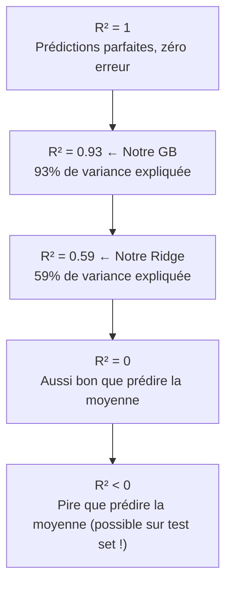

# Fiche 02 — Métriques de Régression

> Synthèse 4 — Comment mesure-t-on si un modèle de régression est bon ?

---

## C'est quoi une métrique d'évaluation ?

Une métrique prend les **vraies valeurs** `y` et les **prédictions** `ŷ` du modèle, et retourne un nombre qui résume la qualité des prédictions.

$$\text{Métrique} = f(y_1, \hat{y}_1, y_2, \hat{y}_2, \ldots, y_n, \hat{y}_n) \rightarrow \mathbb{R}$$

---

## MSE — Mean Squared Error (Erreur Quadratique Moyenne)

$$MSE = \frac{1}{n}\sum_{i=1}^n (y_i - \hat{y}_i)^2$$

**Comment ça marche :**
1. Pour chaque observation, calcule l'erreur $(y_i - \hat{y}_i)$
2. Met cette erreur au carré → pénalise fort les grandes erreurs
3. Fait la moyenne

**Unité :** MPa² (unité au carré → peu intuitif pour un ingénieur)

**Pourquoi le carré ?** Deux raisons :
1. **Symétrie** : une erreur de +5 et -5 MPa pèsent pareil
2. **Pénalisation forte** : une erreur de 10 MPa pèse 100× plus qu'une erreur de 1 MPa

**Où on l'utilise :** en interne dans GridSearchCV (`neg_mean_squared_error`) car le MSE est dérivable → compatible avec les algorithmes d'optimisation.

---

## RMSE — Root Mean Squared Error ← Notre Métrique Principale

$$RMSE = \sqrt{MSE} = \sqrt{\frac{1}{n}\sum_{i=1}^n (y_i - \hat{y}_i)^2}$$

**Unité : MPa** — même unité que la target !

**Pourquoi RMSE plutôt que MSE ?**

Un ingénieur civil raisonne en MPa. Dire *"mon modèle se trompe en moyenne de 4.2 MPa"* a du sens. Dire *"il se trompe de 17.6 MPa²"* ne dit rien à personne.

**Nos résultats :**
- Ridge : RMSE = 10.4 MPa → écart typique de ±10.4 MPa sur une résistance réelle
- RF : RMSE = 4.9 MPa
- **GB : RMSE = 4.2 MPa** → sur un béton de 40 MPa, erreur typique ±10.5%

**Propriété clé :** RMSE est sensible aux outliers (grandes erreurs pèsent beaucoup à cause du carré).

---

## R² — Coefficient de Détermination ← Notre Métrique Complémentaire

$$R^2 = 1 - \frac{\sum_{i=1}^n(y_i - \hat{y}_i)^2}{\sum_{i=1}^n(y_i - \bar{y})^2} = 1 - \frac{SSE_{\text{modèle}}}{SSE_{\text{baseline}}}$$

**Comment l'interpréter :**
- Le **numérateur** = erreur de notre modèle (ce qu'on ne prédit pas)
- Le **dénominateur** = erreur d'un modèle nul qui prédit toujours la moyenne $\bar{y}$
- R² mesure donc : **combien on fait mieux que de prédire la moyenne ?**



**Nos résultats :**
- Ridge : R² = 0.59 → modèle explique 59% de la variance (médiocre)
- RF : R² = 0.91
- **GB : R² = 0.932** → modèle explique 93.2% de la variance ✅

**Attention :** R² peut être **négatif** sur un set de test (jamais sur le train set). Cela signifie que le modèle est pire qu'un modèle constant.

---

## MAE — Mean Absolute Error (pour info)

$$MAE = \frac{1}{n}\sum_{i=1}^n |y_i - \hat{y}_i|$$

**Avantage :** robuste aux outliers (erreur linéaire, pas quadratique).
**Inconvénient :** non différentiable en 0 → moins pratique pour certains optimiseurs.
**On ne l'utilise pas** dans notre projet, mais c'est une bonne alternative si on a beaucoup d'outliers.

### Pourquoi on n'en a pas eu besoin — preuve par l'analyse IQR

Dans le **Notebook 1** (`01_eda_data_cleaning.ipynb`), on a quantifié les outliers avec la **méthode IQR** : une valeur est outlier si elle sort de $[Q1 - 1.5 \times IQR,\ Q3 + 1.5 \times IQR]$.

| Variable | Outliers | % |
|---|---|---|
| cement | 0 | 0.0% |
| slag | 2 | 0.2% |
| fly_ash | 0 | 0.0% |
| water | 15 | 1.5% |
| superplasticizer | 10 | 1.0% |
| coarse_agg | 0 | 0.0% |
| fine_agg | 5 | 0.5% |
| age | 59 | 5.9% |
| **strength** (target) | **8** | **0.8%** |

**Ce qui compte pour le choix RMSE vs MAE, c'est surtout les outliers sur la TARGET** (`strength`), car c'est elle que RMSE pénalise au carré. Ici, seulement **0.8%** des observations (8 sur 1005) sont des outliers de target → trop peu pour que la sensibilité de RMSE aux grandes erreurs pose un vrai problème.

`age` a 5.9% d'outliers, mais ce sont des bétons testés à 365 jours — des valeurs **physiquement valides**, pas des erreurs de mesure (voir Notebook 1, décision : on ne supprime aucun outlier).

> ⚠️ **Nuance pour l'oral** : ce n'est pas la raison *a priori* du choix de RMSE (RMSE a été choisi dès le départ pour son interprétabilité en MPa). Mais c'est un bon argument *a posteriori* si on vous demande "et si vous aviez eu beaucoup d'outliers, MAE aurait été pertinent ?" → vous pouvez répondre avec ces chiffres précis : non, ~1% d'outliers sur la target, RMSE reste justifié.

---

## Comparaison des Métriques

| Métrique | Unité | Outliers | Quand l'utiliser |
|---|---|---|---|
| MSE | MPa² | ⚠️ Très sensible | Optimisation interne (GridSearchCV) |
| **RMSE** | **MPa** | ⚠️ Sensible | **Résultats reportés (interprétable)** |
| MAE | MPa | ✅ Robuste | Si beaucoup d'outliers |
| **R²** | Sans unité [0,1] | ⚠️ Sensible | **Comparaison relative entre modèles** |

---

## Pourquoi neg_MSE pendant le tuning, mais RMSE dans les résultats ?

C'est la question piège la plus fréquente — voici la réponse en deux temps.

### 1. Minimiser MSE ou RMSE revient EXACTEMENT au même

$$RMSE = \sqrt{MSE}$$

La fonction racine carrée $\sqrt{\cdot}$ est **strictement croissante** : si $MSE_A < MSE_B$, alors forcément $\sqrt{MSE_A} < \sqrt{MSE_B}$, donc $RMSE_A < RMSE_B$. **L'ordre ne change jamais.**

Conséquence concrète : la combinaison d'hyperparamètres qui **minimise le MSE** est **exactement la même** que celle qui **minimise le RMSE**. GridSearchCV obtiendrait le **même gagnant**, qu'on lui donne MSE ou RMSE comme critère.

→ **Le choix MSE vs RMSE pour le tuning n'a donc AUCUN impact sur le résultat (les meilleurs HPs trouvés).** C'est juste une question de commodité de calcul.

### 2. Pourquoi MSE est plus pratique en interne

- **Différentiable partout** (utile pour les algorithmes basés sur le gradient — pas notre cas direct ici avec GridSearch, mais c'est la convention historique de sklearn)
- **Pas besoin de calculer une racine carrée** à chaque évaluation de fold × combinaison d'HPs (ex: 72 combinaisons × 5 folds inner × 5 folds outer = 1800 évaluations) — un micro-gain de calcul
- C'est le **scorer standard** de sklearn pour la régression

### 3. `neg_mean_squared_error` : pourquoi le signe "moins" ?

sklearn a une convention : toutes les métriques dans `scoring=` sont à **maximiser** par GridSearchCV. Or on veut **minimiser** le MSE (moins d'erreur = mieux). Conflit de convention !

Solution sklearn : `neg_mean_squared_error` = $-MSE$. **Maximiser $-MSE$** ⟺ **minimiser $MSE$**. C'est juste un changement de signe pour respecter la convention "scoring = à maximiser".

### 4. Donc, qui sert à quoi ?

| Étape | Métrique utilisée | Pourquoi |
|---|---|---|
| **GridSearchCV (inner loop)** | `neg_mean_squared_error` | Sélectionner les meilleurs HPs — équivalent à RMSE pour ce choix, mais convention sklearn (signe + pas de racine) |
| **Résultats reportés (outer loop)** | RMSE (= $\sqrt{-\text{score}}$) | Pour que ce soit **interprétable en MPa** par un humain |

```python
# Dans le code :
inner_cv = KFold(n_splits=5, shuffle=True, random_state=42)
search = GridSearchCV(pipe, param_grid, cv=inner_cv,
                      scoring='neg_mean_squared_error')  # ← sélection des HPs

# Après la outer CV, pour récupérer le RMSE lisible :
rmse_scores = np.sqrt(-outer_scores)  # ← on annule le signe, puis racine carrée
```

**En une phrase :** *"On utilise neg_MSE pendant le tuning parce que c'est le scorer standard de sklearn et qu'il sélectionne EXACTEMENT les mêmes hyperparamètres que RMSE (la racine carrée ne change pas l'ordre des valeurs) — mais on convertit en RMSE pour présenter les résultats finaux, car le MPa est l'unité que comprend un ingénieur, pas le MPa²."*

---

## Biais Pessimiste de nos RMSE

Nos RMSE outer CV sont calculés sur des modèles entraînés sur **80% des données** (4 folds sur 5 en 5-fold CV).

$$\mathbb{E}[\widehat{GE}_{CV}] \approx GE(\mathcal{I}, n_{\text{train}}) \geq GE(\mathcal{I}, n)$$

Le modèle final — entraîné sur **100%** des données avec les meilleurs HPs — serait **légèrement meilleur** (erreur légèrement plus basse). Nos chiffres sont donc **légèrement conservateurs**.

---

## À retenir pour l'oral

> *"On reporte le RMSE en MPa car c'est directement interprétable : notre GB se trompe en moyenne de 4.2 MPa. On utilise neg_MSE en interne dans GridSearchCV car sklearn maximise les scores — maximiser -MSE revient à minimiser MSE. Le R² de 0.932 signifie que notre modèle explique 93.2% de la variance de la résistance. Le RMSE de Ridge (10.4 MPa) vs GB (4.2 MPa) confirme quantitativement que les relations physiques du béton sont fortement non-linéaires."*
