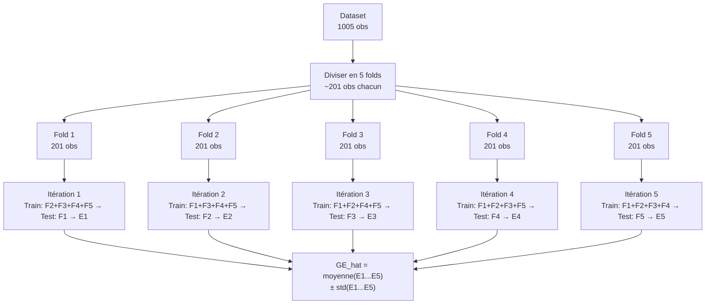

# Fiche 03 — Cross-Validation

> Synthèse 4 — Comment estimer l'erreur de généralisation quand on n'a pas de données infinies ?

---

## Le Problème : Un Seul Split, c'est Insuffisant

Imagine qu'on coupe le dataset en 80% train / 20% test une seule fois. Problème :

- Avec 1005 observations → 201 en test
- **Ce RMSE dépend beaucoup du tirage aléatoire** : une "mauvaise chance" dans le split peut faire varier le RMSE de plusieurs MPa
- On ne sait pas si nos résultats viennent du modèle ou de la partition

**Solution :** tester sur toutes les partitions possibles → **K-Fold Cross-Validation**.

---

## K-Fold Cross-Validation — Mécanisme

**Idée :** diviser le dataset en K groupes ("folds"), puis répéter K fois : utiliser K-1 folds pour entraîner, 1 fold pour tester.



**Propriétés clés :**
- Chaque observation est utilisée exactement **une fois** en test
- Les 5 modèles intermédiaires sont **jetés** — seul le RMSE moyen compte
- Le **modèle final** est entraîné sur **100%** des données avec les meilleurs HPs

---

## Pourquoi 5-fold dans notre projet ?

Règle empirique (Synthèse 4) :

| Taille dataset | Méthode recommandée |
|---|---|
| n < 200 | LOO (Leave-One-Out) ou CV répétée |
| **200 ≤ n ≤ 100 000** | **5-fold ou 10-fold ← notre cas (n=1005)** |
| n > 100 000 | Hold-out simple (assez de données) |

**5-fold :** bon compromis entre :
- **Biais faible** : 80% de données pour l'entraînement (proche de n=1005)
- **Variance faible** : 5 mesures = estimation stable
- **Coût raisonnable** : 5 entraînements au lieu de 1005 (LOO)

---

## Le Biais Pessimiste — Propriété Fondamentale

$$\mathbb{E}[\widehat{GE}_{CV}] \approx GE(\mathcal{I}, n_{\text{train}}) \geq GE(\mathcal{I}, n)$$

**Explication :**
- En 5-fold, chaque modèle est entraîné sur **80%** des données (4/5)
- Or, plus on donne de données à un modèle, généralement **mieux il apprend**
- Donc le modèle final (100% des données) est légèrement **meilleur** que les 5 modèles intermédiaires
- → Notre estimation de RMSE est **légèrement trop élevée** (pessimiste)

**C'est une propriété SOUHAITABLE :** on préfère une estimation prudente plutôt qu'optimiste. On ne sur-vend pas nos performances.

---

## Pourquoi `shuffle=True` est Essentiel

```python
outer_cv = KFold(n_splits=5, shuffle=True, random_state=0)
```

**Problème sans shuffle :** le dataset UCI Concrete est ordonné par formulation, pas aléatoirement. Sans mélange :
- Fold 1 = observations 1-201 (une gamme de formulations)
- Fold 2 = observations 202-402 (une autre gamme)
- → Les folds ne sont **pas représentatifs** de la distribution globale

**Avec shuffle :** chaque fold contient un mélange de toutes les formulations → distribution représentative → estimation robuste.

---

## Pourquoi des Seeds Différents (inner / outer) ?

```python
inner_cv = KFold(n_splits=5, shuffle=True, random_state=42)  # tuning HP
outer_cv  = KFold(n_splits=5, shuffle=True, random_state=0)   # estimation GE
```

Si inner et outer utilisaient le même seed, ils créeraient des partitions structurellement identiques → les folds internes et externes pourraient se chevaucher → **biais subtil dans l'estimation**.

Seeds différents = partitions indépendantes = estimation plus robuste.

---

## Non-indépendance des Folds (Subtilité Théorique)

Les 5 erreurs CV (E1, E2, E3, E4, E5) ne sont **pas indépendantes** — les train sets se chevauchent (4 folds en commun sur 5).

**Conséquence :** faire un t-test classique sur ces 5 valeurs pour comparer deux modèles est **statistiquement invalide** (Bengio & Grandvalet, 2004).

**Dans notre projet :** on compare les modèles sur la **moyenne du RMSE outer** sans test statistique formel. C'est la norme en pratique.

---

## La CV dans notre Code

```python
from sklearn.model_selection import KFold, cross_val_score

# Configuration des boucles
inner_cv = KFold(n_splits=5, shuffle=True, random_state=42)
outer_cv  = KFold(n_splits=5, shuffle=True, random_state=0)

# Outer loop : estimation GE (scoring=neg_MSE car sklearn maximise)
outer_scores = cross_val_score(
    search,          # GridSearchCV = learner + tuner
    X, y,
    cv=outer_cv,
    scoring='neg_mean_squared_error'
)

rmse_outer = np.sqrt(-outer_scores)  # → [4.1, 4.3, 4.2, 4.0, 4.5] MPa
print(f"RMSE: {rmse_outer.mean():.3f} ± {rmse_outer.std():.3f} MPa")
```

---

## À retenir pour l'oral

> *"On utilise une 5-fold CV car c'est le standard pour n entre 200 et 100 000. Le principe : diviser le dataset en 5 folds, répéter 5 fois (train sur 4, test sur 1), moyenner les 5 RMSE. On a shuffle=True car le dataset UCI est ordonné — sans ça, nos folds ne seraient pas représentatifs. Le RMSE obtenu est légèrement pessimiste car chaque modèle intermédiaire n'a vu que 80% des données — le modèle final sur 100% est un peu meilleur. C'est souhaitable : on ne sur-estime pas nos performances."*
