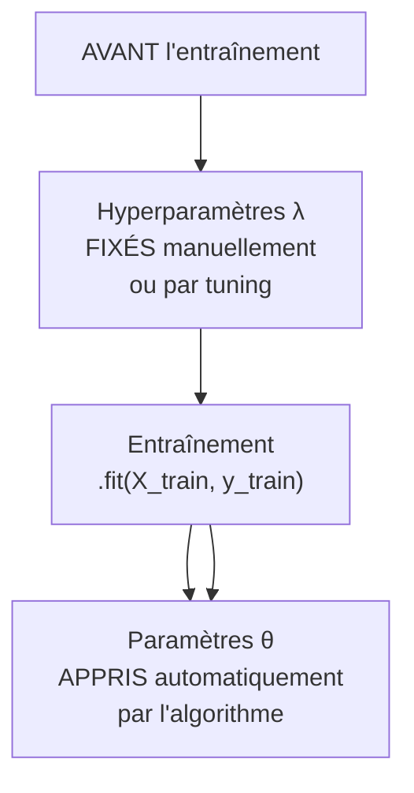
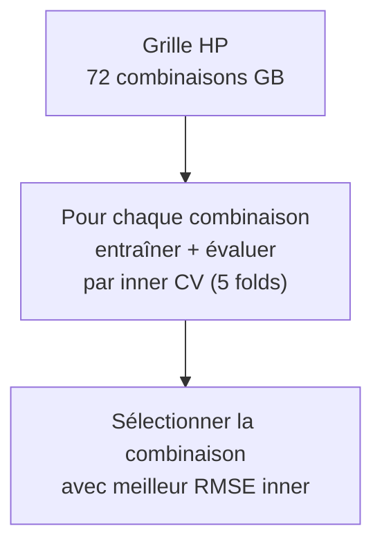

# Fiche 04 — Hyperparamètres & Tuning

> Synthèse 9 — Comment trouver les bons réglages d'un algorithme ?

---

## Paramètres θ vs Hyperparamètres λ — La Distinction Fondamentale



| | Paramètres θ | Hyperparamètres λ |
|---|---|---|
| **Quand ?** | Pendant l'entraînement | **Avant** l'entraînement |
| **Comment ?** | Minimisation automatique de la loss | Tuning (GridSearch, RandomSearch) |
| **Exemples Ridge** | Coefficients `w₁, w₂, ..., w₈` | `alpha` (force de régularisation) |
| **Exemples RF** | Seuils des splits dans chaque arbre | `n_estimators`, `max_depth` |
| **Exemples GB** | Valeurs des feuilles | `learning_rate`, `max_depth`, `n_estimators` |
| **Dans sklearn** | Appris par `.fit()` | Passés au constructeur `Ridge(alpha=1)` |

**Analogie :** les paramètres = les muscles d'un sportif (développés à l'entraînement). Les hyperparamètres = le programme d'entraînement (réglé par le coach avant de commencer).

---

## Pourquoi le Tuning est Difficile ?

4 propriétés qui rendent le tuning hard :

| Propriété | Problème concret |
|---|---|
| **Boîte noire** | Pas de gradient $\nabla_\lambda$ disponible → pas de descente de gradient sur λ |
| **Coût élevé** | Tester 1 configuration = entraîner le modèle entier (parfois plusieurs minutes) |
| **Stochasticité** | Le score varie selon la partition aléatoire du resampling |
| **Dépendances** | Les HPs sont liés entre eux (ex: si `learning_rate` petit → besoin de plus de `n_estimators`) |

---

## Grid Search — Exhaustif sur une Grille

**Principe :** on définit une grille discrète de valeurs pour chaque HP, et on teste **toutes les combinaisons**.

```python
param_grid_gb = {
    'model__n_estimators': [100, 200, 300],          # 3 valeurs
    'model__learning_rate': [0.01, 0.05, 0.1, 0.2],  # 4 valeurs
    'model__max_depth': [3, 4, 5],                    # 3 valeurs
    'model__subsample': [0.8, 1.0]                    # 2 valeurs
}
# Total : 3 × 4 × 3 × 2 = 72 combinaisons
```



**Coût total :** 72 combinaisons × 5 folds inner = **360 entraînements** par outer fold.

**Avantage :** explore exhaustivement toute la grille, résultats reproductibles.

**Limite :** exponentiel en nombre de HPs. 10 HPs avec 3 valeurs chacun = 3¹⁰ = 59 049 combos.

---

## Random Search — Pour de Grandes Grilles

**Principe :** au lieu de tester toutes les combinaisons, on tire aléatoirement `n_iter` configurations.

**Avantage clé :** si seul 1 HP influence vraiment la performance :
- Grid 5×5 → teste seulement **5 valeurs distinctes** du HP important
- Random 25 → teste **25 valeurs distinctes** du HP important

On a choisi **Grid Search** car nos grilles sont compactes (≤ 72 combos) → exploration exhaustive possible en temps raisonnable.

---

## Nos Hyperparamètres — Justification Physique et Théorique

### Ridge — `alpha`
```python
'model__alpha': [0.001, 0.01, 0.1, 1, 10, 100, 1000]
```

`alpha` contrôle la **force de régularisation L2** :
- `alpha` → 0 : pas de pénalité → OLS pur → risque d'overfitting avec multicolinéarité
- `alpha` → ∞ : tous les coefficients → 0 → modèle constant → underfitting

**Meilleur alpha = 1** : régularisation modérée standard.

---

### Random Forest — 4 HPs
```python
'model__n_estimators': [100, 200, 300]     # Nombre d'arbres
'model__max_depth': [None, 10, 20, 30]     # Profondeur max de chaque arbre  
'model__min_samples_split': [2, 5, 10]     # Nb min d'obs pour splitter un nœud
'model__min_samples_leaf': [1, 2]          # Nb min d'obs dans une feuille
```

| HP | Rôle | Meilleur |
|---|---|---|
| `n_estimators` | Plus = plus stable, mais diminishing returns | **300** |
| `max_depth` | `None` = arbres complets (OK car bagging compense) | **20** |
| `min_samples_split` | Régularisation douce | **2** |
| `min_samples_leaf` | Régularisation douce | **1** |

**Meilleur RF : max_depth=20, n_estimators=300, min_samples_leaf=1, min_samples_split=2**

---

### Gradient Boosting — 4 HPs
```python
'model__n_estimators': [100, 200, 300]          # Nombre d'arbres séquentiels
'model__learning_rate': [0.01, 0.05, 0.1, 0.2]  # Contribution de chaque arbre
'model__max_depth': [3, 4, 5]                    # Arbres courts = "apprenants faibles"
'model__subsample': [0.8, 1.0]                   # Fraction données par arbre (stochastic GB)
```

| HP | Rôle | Meilleur |
|---|---|---|
| `n_estimators` | Nombre d'étapes de boosting | **300** |
| `learning_rate` | Combien chaque arbre corrige (petit = plus conservateur) | **0.2** |
| `max_depth` | GB recommande des arbres courts (3-5) | **4** |
| `subsample` | Stochastic GB (variance ↓) | **1.0** (pas de subsampling) |

**Règle learning_rate / n_estimators :** ces deux HPs sont liés.
- `learning_rate` petit (0.01) → besoin de beaucoup d'arbres (>500) pour converger → lent
- `learning_rate=0.2` (élevé) + 300 arbres = bon compromis vitesse/performance

**Meilleur GB : learning_rate=0.2, max_depth=4, n_estimators=300, subsample=1.0**

---

## Le Préfixe `model__` — Obligatoire dans un Pipeline

Quand on utilise un `sklearn.pipeline.Pipeline`, chaque étape a un nom (`scaler`, `model`, etc.). Pour passer des HPs à GridSearchCV, il faut préciser **à quelle étape** appartient chaque HP :

```python
# Pipeline :
pipe = Pipeline([('scaler', StandardScaler()), ('model', GradientBoostingRegressor())])

# ❌ Sans préfixe → ERREUR (GridSearch ne sait pas où mettre n_estimators)
param_grid = {'n_estimators': [100, 300]}

# ✅ Avec préfixe → correct
param_grid = {'model__n_estimators': [100, 300],
              'model__learning_rate': [0.1, 0.2]}
# Format : 'nom_etape__nom_parametre'
```

---

## Le Problème de l'Overtuning (Preview Fiche 05)

**Cause :** si on tune sur les mêmes données qu'on évalue, on sélectionne le **minimum par chance** dans une distribution bruitée.

**Exemple :** un classifieur aléatoire (GE réelle = 50%), si on teste 100 configs → la "meilleure" aura peut-être 38% d'erreur sur ce CV par chance → **on croit avoir un bon modèle**.

**Plus on teste de configs, plus le biais est grand.**

→ Solution : la **Nested Cross-Validation** (Fiche 05).

---

## À retenir pour l'oral

> *"Les hyperparamètres ne sont pas appris par le modèle — on doit les fixer avant l'entraînement. On utilise GridSearchCV car nos grilles sont compactes (≤72 combos). Le préfixe `model__` est obligatoire dans un Pipeline sklearn pour cibler la bonne étape. Pour GB, learning_rate=0.2 et n_estimators=300 sont liés — un learning rate élevé permet de converger en moins d'arbres. Si on tunait sur les mêmes données qu'on évalue, on biaiserait l'estimation (overtuning) — c'est pour ça qu'on utilise une nested CV."*
