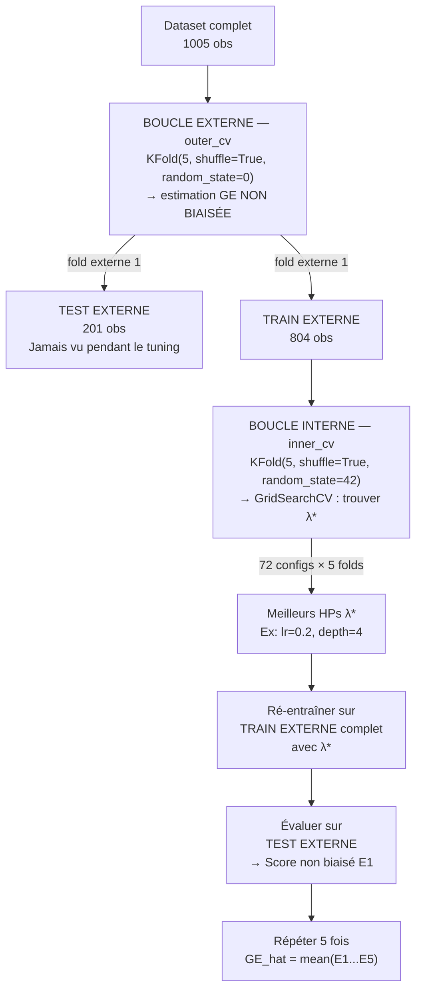

# Fiche 05 — Nested Cross-Validation

> Synthèse 10 — Le problème de l'overtuning et sa solution.

---

## Le Problème : Pourquoi Une Simple CV Ne Suffit Pas ?

Scénario : tu testes 72 combinaisons d'hyperparamètres avec une 5-fold CV. Tu gardes la combinaison avec le meilleur score. Ce score est-il une estimation honnête de la GE réelle ?

**Non. Il est biaisé optimistement.**

**Pourquoi ?** Tu ne prends pas la *moyenne* des 72 scores — tu prends le **minimum**. Le minimum d'une distribution bruitée est *toujours* trop bas par chance.

### Mais pourquoi ces scores sont-ils "bruités" ?

Chaque score (RMSE) d'un fold est calculé sur un **échantillon fini et aléatoire** — pas sur la vraie distribution infinie de bétons possibles. Ce score dépend de :

- **quelles observations précises sont tombées dans ce fold de test** — par hasard, certaines combinaisons de béton sont "plus faciles" à prédire que d'autres
- **du bruit irréductible** ($\sigma^2_\epsilon$, [Fiche 01](01_erreur_generalisation.md)) inhérent aux données — deux gâchées identiques n'ont jamais exactement la même résistance

→ Si tu refais le même découpage avec un `random_state` différent, le score change un peu, **même avec exactement les mêmes hyperparamètres**. Le score observé = **vraie performance de la config ± un peu de hasard d'échantillonnage**.

**Conséquence pour le tuning :** quand GridSearchCV teste 72 configs, chacune reçoit un score = $\text{vraie\_perf}(\text{config}) \pm \text{bruit}$. Si tu choisis le **minimum** parmi 72 valeurs bruitées, tu as de bonnes chances de tomber sur une config dont le bruit était **favorable par hasard** — pas forcément la meilleure config "en vérité". C'est exactement le mécanisme de la loot box ci-dessous.

---

## L'Analogie de la Loot Box (Synthèse 10)

Imagine que tu ouvres **100 loot boxes** dans un jeu. Par chance, une te donne +5% de stats.

Si tu annonces *"ce jeu donne +5% de stats"*, tu **mens** — c'est du cherry-picking sur 100 tirages aléatoires. La vraie valeur attendue est beaucoup moins.

**Tuner sans test set séparé, c'est exactement ça.** Tu ouvres 72 "boîtes" (configurations HP), tu annonces la meilleure par chance.

---

## Preuve par l'Absurde (Synthèse 10)

Prends un **classifieur binaire aléatoire** : il prédit au hasard, donc sa vraie GE = 50% d'erreur. Maintenant :

| Expérience | Score observé | Réalité |
|---|---|---|
| 1 config testée, 5-fold CV | ≈ 50% ✅ | Honnête |
| 100 configs testées, simple CV | ≈ 38% 🚨 | Biaisé de -12 points ! |
| 100 configs testées, **nested CV** | ≈ 50% ✅ | Toujours honnête |

**Loi :** plus on teste de configurations, plus le biais est grand.

---

## La Solution : Deux Boucles Séparées



**Garantie fondamentale :** le TEST EXTERNE n'a **jamais** participé au tuning interne → score non biaisé.

---

## Implémentation sklearn — Une Seule Ligne

```python
from sklearn.model_selection import KFold, GridSearchCV, cross_val_score
from sklearn.pipeline import Pipeline
from sklearn.preprocessing import StandardScaler
from sklearn.ensemble import GradientBoostingRegressor
import numpy as np

# 1. Pipeline : preprocessing + modèle
pipe = Pipeline([
    ('scaler', StandardScaler()),
    ('model', GradientBoostingRegressor(random_state=42))
])

# 2. Grille d'hyperparamètres (préfixe model__ obligatoire)
param_grid = {
    'model__n_estimators': [100, 200, 300],
    'model__learning_rate': [0.01, 0.05, 0.1, 0.2],
    'model__max_depth': [3, 4, 5],
    'model__subsample': [0.8, 1.0]
}

# 3. Boucle interne : tuning HP
inner_cv = KFold(n_splits=5, shuffle=True, random_state=42)
search = GridSearchCV(pipe, param_grid, cv=inner_cv,
                      scoring='neg_mean_squared_error', n_jobs=-1)

# 4. Boucle externe : estimation GE ← UNE SEULE LIGNE
outer_cv = KFold(n_splits=5, shuffle=True, random_state=0)
outer_scores = cross_val_score(search, X, y, cv=outer_cv,
                               scoring='neg_mean_squared_error')

# 5. Conversion en RMSE
rmse = np.sqrt(-outer_scores)
print(f"RMSE: {rmse.mean():.3f} ± {rmse.std():.3f} MPa")
# → GB: 4.208 ± 0.261 MPa
```

**La magie sklearn :** `GridSearchCV` est passé comme **estimateur** à `cross_val_score`. Sklearn comprend qu'il faut refaire le tuning à chaque fold externe → les deux boucles sont gérées automatiquement.

---

## Réinterprétation Architecturale (Synthèse 10)

Le processus `[Run CV interne → sélectionner λ* → ré-entraîner]` est un **algorithme auto-tunant**.
- Ses inputs = les données brutes
- Son output = un modèle optimisé
- Les hyperparamètres ont **disparu de l'interface** — résolus en interne

La boucle externe évalue **cet algorithme complet**, pas juste le modèle final. On mesure : *"si je donne ce dataset à cet algorithme, quelle performance puis-je attendre sur de nouvelles données ?"*

---

## Coût Computationnel : Splits vs Entraînements

**Important : il n'y a qu'UN SEUL processus (la nested CV), pas "une CV puis une nested CV séparée".** L'outer CV n'est pas une étape à part — c'est elle-même une cross-validation (5-fold), à l'intérieur de laquelle on lance une seconde CV (l'inner) pour le tuning. "Nested CV" = le nom du processus complet à deux boucles, pas une étape supplémentaire après une CV simple.

À ne pas confondre :
- **Splits du dataset** (= découpages générés par `KFold(5)`) : il y en a très peu — 5 splits outer + 5 splits inner par fold outer (= 25 splits inner) = **30 splits au total par modèle**, et ces mêmes splits sont **réutilisés** pour toutes les configurations d'hyperparamètres.
- **Entraînements (fits)** : chaque combinaison d'hyperparamètres est entraînée sur chacun de ces splits → c'est ce nombre qui est grand.

$$\text{Entraînements} = 5 \text{ folds outer} \times 5 \text{ folds inner} \times \text{nb combos}$$

| Modèle | Combos testées | Entraînements (5 × 5 × combos) |
|---|---|---|
| Ridge | 7 (`alpha`) | 175 |
| Random Forest | 72 (3×4×3×2) | 1 800 |
| Gradient Boosting | 72 (3×4×3×2) | 1 800 |
| + Refit final GB (sur 100% des données, 5-fold inner) | 72 | 360 |
| **Total** | | **≈ 4 135** |

→ ~4 100 entraînements au total, pas 15 000 — d'où l'utilité de `n_jobs=-1` (parallélisation CPU) et de grilles compactes (≤ 72 combos).

---

## Simple CV vs Nested CV

| Critère | CV Simple | Nested CV |
|---|---|---|
| **Biais GE après tuning** | ❌ Optimiste (croît avec #configs) | ✅ Non biaisé |
| **Datasets petits** | ❌ Biais fort | ✅ Conçu pour ça |
| **Coût** | Faible | ❌ k_outer × k_inner × #configs |
| **Recommandé quand ?** | Exploration rapide | **Évaluation finale publiée** |

---

## À retenir pour l'oral

> *"Une simple CV ne suffit pas pour évaluer un modèle après tuning : on sélectionne le minimum parmi plusieurs évaluations bruitées, ce qui est toujours trop optimiste — comme cherry-picker la meilleure loot box sur 100 tirages. La nested CV résout ce problème avec deux boucles séparées : la boucle interne tune les HPs, la boucle externe évalue la GE sur un test set jamais vu pendant le tuning. Dans sklearn, c'est `cross_val_score(GridSearchCV(...))` — une seule ligne. Coût : 1800 entraînements par modèle (5×5×72) — d'où l'importance de garder des grilles compactes."*
