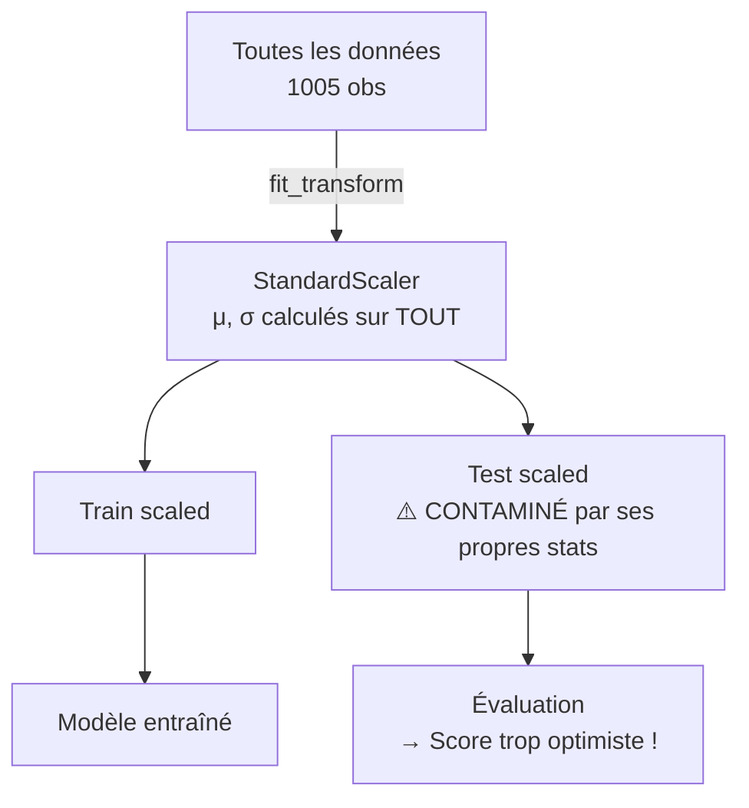
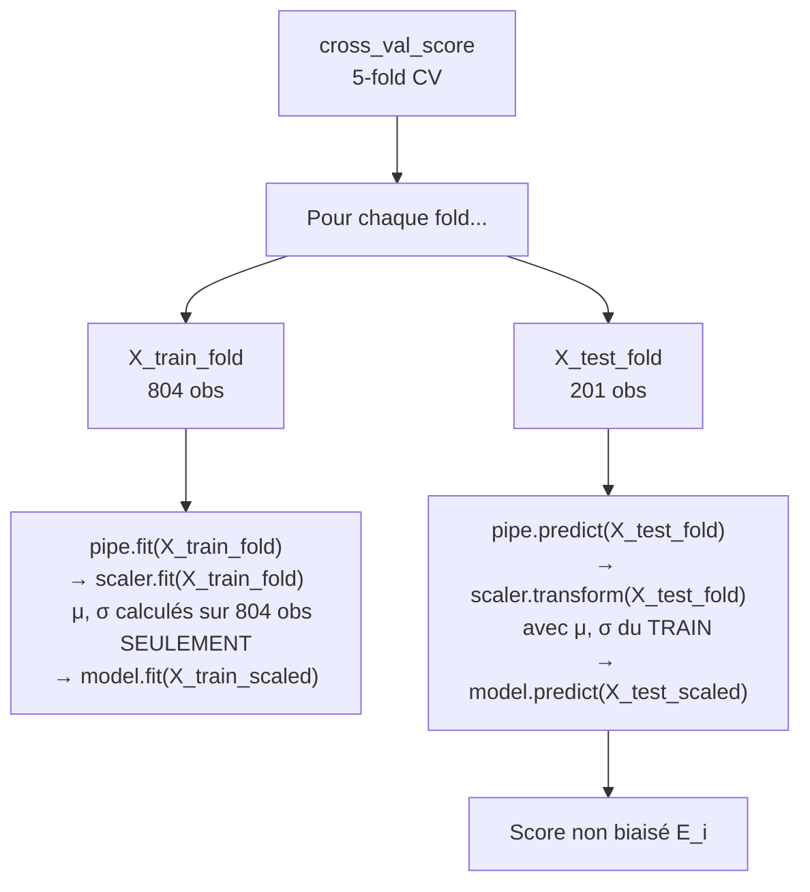

# Fiche 06 — Pipeline sklearn & Data Leakage

> Synthèse 9 — Comment garantir qu'il n'y a aucune contamination entre train et test.

---

## C'est quoi le Data Leakage ?

**Définition :** le modèle "voit" — directement ou indirectement — des informations du test set **pendant l'entraînement ou le preprocessing**.

**Conséquence :** le modèle semble plus performant qu'il ne l'est réellement → fausse évaluation → mauvaises décisions en production.

**Analogie :** c'est comme si un élève avait accès aux réponses de l'examen final pendant ses révisions. Il obtient 20/20, mais ne sait rien en réalité.

---

## Le Piège Classique du StandardScaler

**StandardScaler** normalise les données : pour chaque feature, il soustrait la moyenne et divise par l'écart-type. Ces statistiques (μ, σ) sont **calculées sur les données d'entraînement**.

### ❌ Mauvaise Pratique — Leakage !

```python
# On scale AVANT la CV → LEAKAGE !
scaler = StandardScaler()
X_scaled = scaler.fit_transform(X)  # ← calcule μ, σ sur TOUT X (train + test !)

scores = cross_val_score(Ridge(), X_scaled, y, cv=5)
```

**Pourquoi c'est du leakage :**
`fit_transform(X)` calcule μ et σ sur **toutes les 1005 observations**, y compris celles qui seront dans le fold de test.

Quand on évalue sur le fold test, le scaler a déjà utilisé les moyennes de ce fold pour calibrer sa transformation. Le test set n'est plus "inconnu" pour le preprocessing.



---

### ✅ Bonne Pratique — Pipeline sklearn

```python
from sklearn.pipeline import Pipeline
from sklearn.preprocessing import StandardScaler
from sklearn.linear_model import Ridge

# Encapsuler preprocessing + modèle dans un Pipeline
pipe = Pipeline([
    ('scaler', StandardScaler()),   # Étape 1 : normalisation
    ('model', Ridge())               # Étape 2 : modèle
])

# CV sur le Pipeline entier
scores = cross_val_score(pipe, X, y, cv=5, scoring='neg_mean_squared_error')
```

**Comment sklearn gère ça automatiquement :**



---

## La Règle Fondamentale

> **Tout preprocessing qui "apprend" quelque chose des données doit être DANS le Pipeline, JAMAIS appliqué avant la CV.**

Cela inclut :
- `StandardScaler`, `MinMaxScaler` (calculent μ, σ sur les données)
- Imputation de valeurs manquantes (calcule la médiane/moyenne)
- Encodage basé sur les fréquences
- Sélection de features (sélectionne selon les corrélations)
- PCA (calcule les composantes principales)

---

## Pourquoi StandardScaler même pour RF et GB ?

Les arbres (Random Forest, Gradient Boosting) font des comparaisons binaires (`cement > 300 ?`). Ils sont **mathématiquement invariants au scaling** — peu importe si on divise par 100, le split `cement > 3` donne exactement le même résultat que `cement > 300`.

**Alors pourquoi on garde le scaler dans le Pipeline pour RF et GB ?**

1. **Ridge l'exige absolument** (la pénalité L2 est injuste sans scaling — voir Fiche 07)
2. **Cohérence** : même Pipeline pour tous les modèles → comparaison équitable
3. **Bonne pratique** : Pipeline complet même si certains steps sont neutres pour certains modèles

---

## Le Préfixe `model__` — Accès aux HPs du Pipeline

Quand on passe un Pipeline à GridSearchCV, chaque étape a un nom (`scaler`, `model`). Pour accéder aux hyperparamètres du modèle, il faut le préfixe :

```python
pipe = Pipeline([
    ('scaler', StandardScaler()),
    ('model', GradientBoostingRegressor(random_state=42))
])

# Format : 'nom_étape__nom_paramètre'
param_grid = {
    'model__n_estimators': [100, 200, 300],    # ← 'model' = nom de l'étape
    'model__learning_rate': [0.01, 0.1, 0.2],
    'model__max_depth': [3, 4, 5]
}

search = GridSearchCV(pipe, param_grid, cv=inner_cv, scoring='neg_mean_squared_error')
```

**Pourquoi ce design ?** Le Pipeline peut avoir des HPs à chaque étape :
```python
# HPs du scaler (si on voulait les tuner) :
'scaler__with_mean': [True, False]

# HPs du modèle :
'model__n_estimators': [100, 300]
```

---

## Résumé Visuel : Avec vs Sans Pipeline

| | Sans Pipeline ❌ | Avec Pipeline ✅ |
|---|---|---|
| **Calcul μ, σ** | Sur tout X (train + test) | Sur X_train du fold uniquement |
| **Transform test** | Avec stats de tout X → leak | Avec stats de X_train → correct |
| **GE estimée** | Optimistement biaisée | Non biaisée |
| **Code** | Fragile, erreurs silencieuses | Garanti par construction |

---

## Notre Code Complet Anti-Leakage

```python
# 1. Pipeline : preprocessing encapsulé
pipe = Pipeline([
    ('scaler', StandardScaler()),
    ('model', GradientBoostingRegressor(random_state=42))
])

# 2. Inner loop : GridSearch sur le Pipeline
inner_cv = KFold(n_splits=5, shuffle=True, random_state=42)
search = GridSearchCV(pipe, param_grid, cv=inner_cv,
                      scoring='neg_mean_squared_error', n_jobs=-1)

# 3. Outer loop : estimation GE non biaisée
outer_cv = KFold(n_splits=5, shuffle=True, random_state=0)
scores = cross_val_score(search, X, y, cv=outer_cv,
                         scoring='neg_mean_squared_error')
# À aucun moment le test set ne touche .fit() → zéro leakage
```

---

## À retenir pour l'oral

> *"Sans Pipeline, si on scale avant la CV, le StandardScaler a vu les données de test pendant son `fit()` — c'est du data leakage. Avec Pipeline, sklearn appelle `.fit()` uniquement sur le train de chaque fold, et `.transform()` sur le test avec les stats du train. C'est garanti par construction — on n'a pas à y penser. Le préfixe `model__` permet d'accéder aux HPs du modèle dans le Pipeline malgré l'encapsulation. Notre code n'a aucun preprocessing en dehors du Pipeline."*
