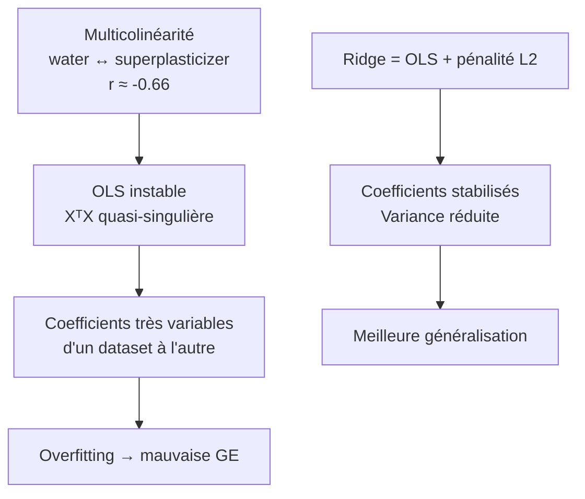
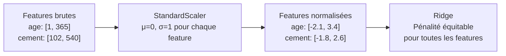

# Fiche 07 — Ridge Regression (Modèle 1 — Baseline)

> Synthèse 2 — La régression linéaire régularisée.

---

## La Régression Linéaire Simple (OLS) — Point de Départ

**Idée fondamentale :** le modèle prédit y comme une **combinaison linéaire** des features :

$$\hat{y} = \theta_0 + \theta_1 x_1 + \theta_2 x_2 + \ldots + \theta_p x_p = \theta^T x$$

Pour notre béton :
$$\hat{\text{strength}} = \theta_0 + \theta_1 \cdot \text{cement} + \theta_2 \cdot \text{slag} + \ldots + \theta_8 \cdot \text{age}$$

**L'apprentissage OLS (Ordinary Least Squares) :** trouver les θ qui minimisent la somme des erreurs au carré :

$$\hat{\theta}_{OLS} = \underset{\theta}{\arg\min} \frac{1}{n}\sum_{i=1}^n (y_i - \theta^T x_i)^2$$

**Solution analytique :** $\hat{\theta}_{OLS} = (X^T X)^{-1} X^T y$ (si $X^T X$ est inversible)

---

## Le Problème : Multicolinéarité

**C'est quoi ?** Deux features sont corrélées entre elles. Dans notre dataset :
- `water` et `superplasticizer` sont corrélés à **r ≈ -0.66** (si on met moins d'eau, on met plus de superplastifiant, et vice-versa)

**Conséquence sur OLS :**
- La matrice $X^T X$ devient quasi-singulière → difficile à inverser
- Les coefficients deviennent **très instables** : changer légèrement les données d'entraînement → coefficients changent énormément
- **Variance élevée** des coefficients → mauvaise généralisation

---

## Ridge = OLS + Pénalité L2

$$\hat{\theta}_{Ridge} = \underset{\theta}{\arg\min} \left[ \underbrace{\frac{1}{n}\sum_{i=1}^n (y_i - \theta^T x_i)^2}_{\text{MSE — fidélité aux données}} + \underbrace{\alpha \sum_{j=1}^p \theta_j^2}_{\text{pénalité L2 — complexité}} \right]$$

**Ce que fait le terme $\alpha \sum \theta_j^2$ :**
- Pénalise les **grands coefficients**
- Force le modèle à garder des coefficients **petits et stables**
- Si un coefficient est incertain (à cause de la multicolinéarité), Ridge le pousse vers 0 plutôt que de le laisser prendre une valeur extrême

**Hyperparamètre `alpha` :**
- `alpha = 0` → OLS pur (pas de régularisation)
- `alpha → ∞` → tous les coefficients → 0 (modèle constant, prédit toujours la moyenne)
- `alpha = 1` ← notre valeur optimale (trouvée par GridSearchCV)

**Solution analytique Ridge :** $\hat{\theta}_{Ridge} = (X^T X + \alpha I)^{-1} X^T y$

L'ajout de $\alpha I$ sur la diagonale garantit que la matrice est toujours inversible, même avec multicolinéarité.

---

## Pourquoi le StandardScaler est OBLIGATOIRE pour Ridge

**Problème sans scaling :**
- `age` varie de 1 à 365 jours → si θ_age = 0.1, l'effet maximum est 36.5 MPa
- `cement` varie de 102 à 540 kg/m³ → si θ_cement = 5, l'effet maximum est 2700 MPa

La pénalité L2 pénalise $\theta^2$. Sans scaling :
- θ_age = 0.1 → pénalité = 0.01 → **presque pas pénalisé**
- θ_cement = 5 → pénalité = 25 → **très pénalisé**

**La pénalité est injuste : les features à grande échelle sont sur-pénalisées.**

**Avec StandardScaler :** toutes les features sont ramenées à moyenne=0, std=1 → les coefficients sont en "unités d'écart-type" → la pénalité est **équitable** pour toutes les features.

---

## Interprétation des Coefficients Standardisés

Grâce au StandardScaler, les coefficients sont directement comparables.

| Feature | Coefficient | Interprétation |
|---|---|---|
| `cement` | **+12.05** | +1 écart-type de ciment ↑ résistance de 12 MPa |
| `slag` | +8.40 | Liant secondaire fort |
| `age` | +7.13 | Hydratation progressive |
| `fly_ash` | +5.35 | Liant tertiaire |
| `superplasticizer` | +1.68 | Effet indirect (réduit l'eau) |
| `fine_agg` | +1.32 | Remplissage → peu d'effet |
| `coarse_agg` | +1.10 | Remplissage → peu d'effet |
| `water` | **-3.37** | Le seul négatif — loi de Féret |
| Intercept | 35.25 MPa | Résistance moyenne de base |

**`cement` domine** (12.05) — cohérent avec la physique.
**`water` est négatif** (-3.37) — cohérent avec la loi de Féret.

**Avantage unique de Ridge :** c'est le seul de nos 3 modèles à donner des coefficients avec **direction (+ ou -)** directement interprétables.

---

## Résultats et Limites

- **RMSE outer CV : 10.385 ± 0.449 MPa** → le moins performant des 3 modèles
- **R² : 0.590** → explique seulement 59% de la variance

**Pourquoi Ridge est moins bon :** les relations béton-résistance sont **non-linéaires** :

| Relation | Vraie forme | Ce que Ridge modélise |
|---|---|---|
| `age` → strength | Logarithmique | Droite → sous-estime |
| `water/cement` → strength | Quadratique (loi Féret) | Droite → simplifie |

**Ridge est notre baseline** : si les modèles non-linéaires ne faisaient pas mieux que 10.4 MPa, cela suggérerait que les relations sont essentiellement linéaires. GB fait 4.2 MPa → **la non-linéarité compte énormément**.

---

## Pourquoi Ridge Comme Premier Modèle ?

**Principe de parcimonie (Ockham) :** "le modèle le plus simple d'abord". On commence par Ridge car :
1. **Interprétabilité maximale** : coefficients directs
2. **Rapidité** : entraînement quasi-instantané
3. **Baseline** : quantifie le gain des modèles non-linéaires
4. **Gestion multicolinéarité** : supérieur à OLS pur sur ce dataset

---

## À retenir pour l'oral

> *"Ridge est notre baseline linéaire. Il ajoute une pénalité L2 à OLS pour gérer la multicolinéarité entre `water` et `superplasticizer` (r ≈ -0.66). Le StandardScaler est obligatoire avant Ridge pour que la pénalité L2 soit équitable entre les features — sinon les features à grande échelle comme `cement` seraient injustement sur-pénalisées. Les coefficients standardisés confirment la physique : `cement` le plus impactant positif (+12.05), `water` le seul négatif (-3.37). Le RMSE de 10.4 MPa confirme que les relations sont fortement non-linéaires — ce que RF et GB capturent bien mieux."*
