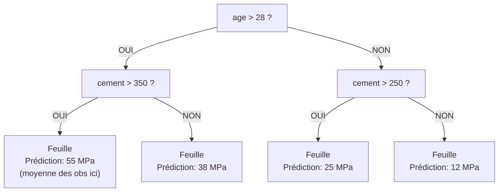
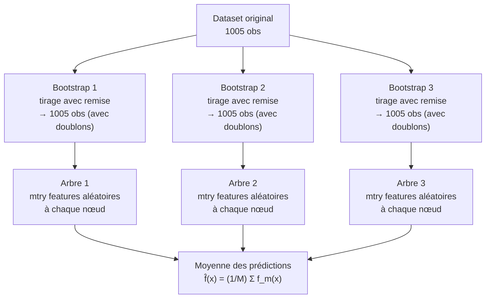
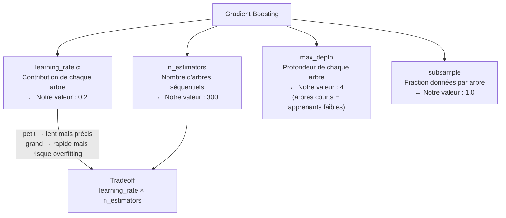
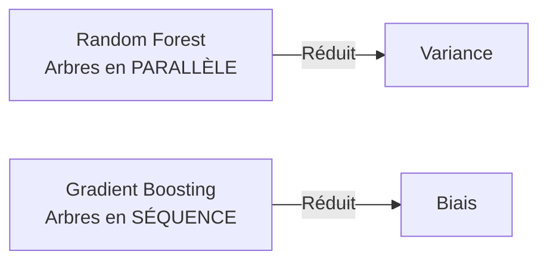
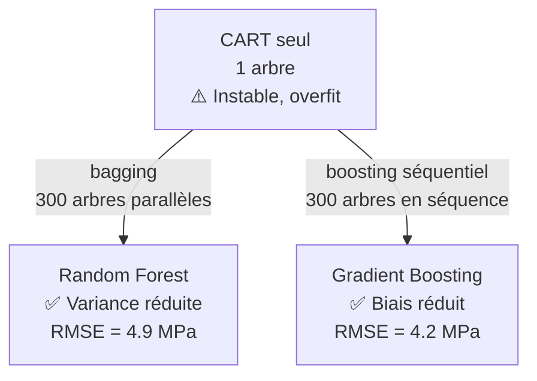

# Fiche 08 — CART, Random Forest & Gradient Boosting

> Synthèses 6, 7 — Des arbres simples aux méthodes d'ensemble.

---

## CART — La Brique de Base

### C'est quoi un arbre de décision ?

Un arbre CART (**C**lassification **A**nd **R**egression **T**rees) divise l'espace des features en régions rectangulaires en posant des **questions binaires** (`cement > 300 ?`, `age > 28 ?`, etc.).



**Formule mathématique :**
$$f(x) = \sum_{m=1}^{M} c_m \cdot \mathbb{1}(x \in Q_m)$$
- $M$ = nombre de feuilles
- $Q_m$ = région rectangulaire de la feuille $m$
- $c_m$ = **moyenne** des observations dans cette région (régression)

---

### Comment l'arbre trouve-t-il les splits ?

**Construction gloutonne (greedy) :** à chaque nœud, l'algorithme cherche le split qui minimise la variance (MSE) dans les deux groupes enfants :

$$\underset{j, t}{\arg\min} \left[\mathcal{R}(\mathcal{N}_1) + \mathcal{R}(\mathcal{N}_2)\right]$$

- Tester **chaque feature** $j$ et **chaque valeur de seuil** $t$ possibles
- Calculer la réduction de MSE pour chaque candidat $(j, t)$
- Choisir le meilleur

**"Glouton" = optimise localement.** À l'étape $N$, l'algorithme ne sait pas si ce split sera le meilleur choix pour l'étape $N+1$. Il pourrait manquer un split médiocre maintenant qui débloquerait un excellent split après (= **effet d'horizon**).

---

### Propriété Clé : Invariance aux Transformations Monotones

Les arbres font des comparaisons (`age > 28 ?`), pas des produits scalaires. Donc `log(age)` et `age` donnent **exactement le même arbre** — seul l'ordre relatif des valeurs compte.

→ **Le StandardScaler ne change rien pour RF et GB.**

---

### Problèmes d'un Seul Arbre

| Problème | Conséquence dans notre projet |
|---|---|
| **Instabilité (haute variance)** | Un seul outlier de composition peut changer tout l'arbre |
| **Extrapolation impossible** | Prédit une constante par feuille → mauvais hors gamme connue |
| **Relations en escaliers** | La relation logarithmique de `age` approximée par des marches |

---

## Random Forest — Réduire la Variance par le Bagging

### L'Idée du Bagging (Bootstrap Aggregating)

Au lieu d'un seul arbre instable, on en construit **M arbres différents** en parallèle et on **moyenne** leurs prédictions.

Chaque arbre est rendu différent des autres par deux sources d'aléatoire :



**1. Bootstrap :** chaque arbre est entraîné sur un tirage **avec remise** de n observations → ~63% des données originales, le reste est l'OOB (Out-Of-Bag).

**2. Feature Sampling (mtry) :** à chaque nœud, seules **mtry features** aléatoires sont candidates pour le split (en régression : mtry ≈ p/3 = 8/3 ≈ 3 features). Cela **découple les arbres** → moins corrélés → plus d'effet de la moyenne.

---

### Pourquoi la Moyenne Réduit la Variance ?

Formule de variance d'une moyenne de M variables corrélées :

$$\text{Var}(\hat{f}) = \underbrace{(1-\rho)}_{\text{effet déco-rélation}} \cdot \frac{\sigma^2}{M} + \underbrace{\rho \sigma^2}_{\text{variance résiduelle}}$$

- **Si $\rho = 1$** (arbres identiques) : Var = $\sigma^2$ → pas de gain
- **Si $\rho \approx 0$** (arbres indépendants) : Var → $\sigma^2/M$ → division par M !

Le feature sampling réduit $\rho$ → la variance est réduite davantage.

**RF réduit la variance sans augmenter le biais.**

---

### Résultats RF dans notre Projet

- **RMSE outer CV : 4.935 ± 0.318 MPa** | **R² : 0.907**
- **Meilleurs HPs :** `max_depth=20, n_estimators=300, min_samples_leaf=1, min_samples_split=2`

---

## Gradient Boosting — Réduire le Biais par le Boosting Séquentiel

### L'Idée : Corriger Itérativement ses Erreurs

Au lieu d'arbres **parallèles et indépendants** (RF), GB entraîne les arbres **en séquence**. Chaque nouvel arbre apprend à corriger les **résidus** (erreurs) du modèle précédent.

**Exemple visuel :**
```
Vraie valeur : 42 MPa

Arbre 1 : prédit 30 MPa → résidu = +12 MPa
Arbre 2 : apprend le résidu +12 → corrige de +8 → total = 38 MPa → résidu = +4
Arbre 3 : apprend le résidu +4 → corrige de +3 → total = 41 MPa → résidu = +1
Arbre 4 : corrige +1 → total ≈ 42 MPa ✅
```

**Formule :**
$$F_{t+1}(x) = F_t(x) + \alpha \cdot h_t(x)$$

- $F_t$ = modèle cumulatif après $t$ arbres
- $h_t$ = arbre entraîné sur les résidus de $F_t$
- $\alpha$ = `learning_rate` (combien on fait confiance à chaque arbre)

C'est la **descente de gradient dans l'espace fonctionnel** : au lieu de descendre dans l'espace des paramètres (Ridge), on "descend" en ajoutant des fonctions (arbres) qui pointent dans la direction du gradient.

---

### Hyperparamètres Clés de GB



| HP | Rôle | Notre Valeur |
|---|---|---|
| `n_estimators` | Nombre d'étapes de boosting | **300** |
| `learning_rate` | Combien chaque arbre contribue (0.01–0.3) | **0.2** |
| `max_depth` | Profondeur (3-5 recommandé pour GB) | **4** |
| `subsample` | Fraction des données par arbre (1.0 = tout) | **1.0** |

**Règle learning_rate / n_estimators :** ces deux HPs sont **liés**. Un `learning_rate` élevé (0.2) converge en moins d'arbres → 300 suffisent. Un `learning_rate` faible (0.01) nécessiterait 2000+ arbres.

---

### Résultats GB dans notre Projet

- **RMSE outer CV : 4.208 ± 0.261 MPa** | **R² : 0.932**
- **Meilleur modèle des 3**

---

## Random Forest vs Gradient Boosting — Le Duel



| Critère | Random Forest | Gradient Boosting |
|---|---|---|
| **Stratégie** | Bagging (parallèle) | Boosting (séquentiel) |
| **Ce qu'il réduit** | Variance | Biais |
| **Sensibilité aux HPs** | Faible | Plus grande |
| **Vitesse** | Parallélisable (rapide) | Séquentiel (plus lent) |
| **Notre RMSE** | 4.935 MPa | **4.208 MPa** |

**Pourquoi GB gagne sur notre dataset ?**
Les relations physiques du béton (logarithmique pour `age`, quadratique pour eau/ciment) ont un **biais résiduel** que GB corrige itérativement. RF réduit la variance mais ne corrige pas ce biais systématique aussi bien.

---

## Vue d'Ensemble : De CART à GB



---

## À retenir pour l'oral

> *"CART seul est instable — un arbre profond overfit. RF résout ça en moyennant 300 arbres bootstrapés et indépendants (réduit la variance). GB va plus loin : au lieu d'arbres parallèles, il entraîne les arbres en séquence pour corriger les erreurs précédentes (réduit le biais). C'est pour ça que GB est légèrement meilleur (4.2 vs 4.9 MPa) — les relations physiques du béton ont un biais résiduel (log(age), loi de Féret) que GB corrige itérativement. Les deux modèles sont invariants au scaling — le StandardScaler dans notre Pipeline est neutre pour eux mais obligatoire pour Ridge."*
