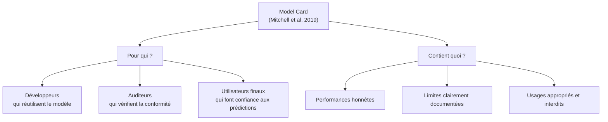

# Fiche 09 — Model Card (Mitchell et al. 2019)

> Framework : https://arxiv.org/abs/1810.03993

---

## C'est quoi une Model Card ?

Une **Model Card** est un document standardisé qui décrit un modèle ML de manière **transparente et honnête**. Créé par Mitchell et al. (2019) chez Google.

**Objectif :** permettre à quelqu'un qui n'a pas construit le modèle de comprendre :
- Ce que le modèle fait (et ce qu'il ne fait **pas**)
- Comment il a été évalué
- Ses limites et risques

**Analogie :** comme la notice d'un médicament — les effets, les contre-indications, la posologie. Un médicament sans notice est dangereux.



---

## Les 9 Sections — Explication Complète

### Section 1 — Model Details (Détails du modèle)

**Quoi :** informations factuelles de base. Qui a fait quoi.

**Contient :** algorithme, version, date, auteurs, framework, hyperparamètres retenus, protocole d'évaluation.

**Notre réponse :**
- Algorithme : `sklearn.ensemble.GradientBoostingRegressor`
- Framework : Python 3.11, sklearn 1.5
- HPs optimaux : `learning_rate=0.2, max_depth=4, n_estimators=300, subsample=1.0`
- Protocole : Nested 5-fold CV, Pipeline anti-leakage
- Auteurs : Arnaud & Tim (I2ML, 2026)

---

### Section 2 — Intended Use (Usage prévu)

**Quoi :** pour quoi le modèle est fait, et pour quoi il **ne l'est pas**. La limite d'usage est aussi importante que l'usage.

**Notre réponse :**

✅ **Usages appropriés :**
- Aide à la formulation (explorer l'espace des formulations)
- Analyse de sensibilité (comment la résistance varie avec les ingrédients)
- Recherche académique

❌ **Usages inappropriés (à documenter explicitement) :**
- Validation réglementaire (norme EN 206) → essais physiques obligatoires
- Bétons spéciaux (fibres, polymères) → hors domaine d'entraînement
- Décision structurelle critique sans validation physique

---

### Section 3 — Factors (Facteurs de variation)

**Quoi :** variables qui font varier les performances du modèle. Où est-il moins fiable ?

**Notre réponse :**
- **Age rare** : peu d'observations hors 28j → extrapolation incertaine pour age=1 ou age=300
- **Adjuvants à zéros** : slag, fly_ash, superplasticizer souvent = 0 → peu de données pour les hautes concentrations
- **Haute résistance** : peu d'observations > 70 MPa → modèle incertain dans cette zone
- **Dataset de laboratoire** : béton réel sur chantier a plus de variabilité (température, humidité, vibrations)

---

### Section 4 — Metrics (Métriques)

**Quoi :** comment on mesure la performance, et **pourquoi ces métriques**.

**Notre réponse :**
- **Métrique principale : RMSE (MPa)** — même unité que la target, directement interprétable par un ingénieur
- **Métrique complémentaire : R²** — mesure relative (0=nul, 1=parfait), utile pour comparaison
- **Métrique interne GridSearchCV : neg_MSE** — convention sklearn (maximiser -MSE = minimiser MSE)

---

### Section 5 — Evaluation Data (Données d'évaluation)

**Quoi :** quel dataset, comment préparé, quel protocole d'évaluation.

**Notre réponse :**
- Dataset : UCI Concrete Compressive Strength (Yeh, 1998)
- 1005 observations après suppression de 25 doublons exacts
- Protocole : Nested 5-fold CV
  - Outer : `KFold(n_splits=5, shuffle=True, random_state=0)`
  - Inner : `KFold(n_splits=5, shuffle=True, random_state=42)`
- Zéro data leakage garanti via sklearn Pipeline

---

### Section 6 — Training Data (Données d'entraînement)

**Quoi :** données utilisées pour le modèle final.

**Notre réponse :** même dataset — le **modèle final** est entraîné sur les **1005 observations** complètes avec les HPs optimaux (`learning_rate=0.2, max_depth=4, n_estimators=300`).

*Note : le modèle final n'a pas de "test set" propre — ses performances sont estimées par la nested CV outer, qui est non biaisée par construction.*

---

### Section 7 — Quantitative Analyses (Analyses quantitatives)

**Quoi :** les vrais chiffres. Par modèle et par sous-groupe.

**Résultats comparatifs :**

| Modèle | RMSE outer CV | ± std | R² |
|---|---|---|---|
| Ridge | 10.385 MPa | ±0.449 | 0.590 |
| Random Forest | 4.935 MPa | ±0.318 | 0.907 |
| **Gradient Boosting** | **4.208 MPa** | **±0.261** | **0.932** |

**Feature Importances GB :**

| Feature | Importance | Cohérence physique |
|---|---|---|
| `age` | ~35% | Hydratation log — relation capturée par les arbres |
| `cement` | ~29% | Liant principal |
| `water` | ~11% | Loi de Féret |
| `slag` | ~8.5% | Liant secondaire |
| `superplasticizer` | ~8.3% | Réducteur d'eau indirect |
| `fine_agg` | ~4.5% | Remplissage |
| `coarse_agg` | ~1.8% | Remplissage |
| `fly_ash` | ~1.2% | Très faible concentration |

**Coefficients Ridge (standardisés) :**
`cement: +12.05`, `slag: +8.40`, `age: +7.13`, `water: -3.37`

---

### Section 8 — Ethical Considerations (Considérations éthiques)

**Quoi :** risques, données sensibles, usages dangereux.

**Notre réponse :**
- **Aucune donnée sensible** : le dataset contient uniquement des mesures physiques (compositions de béton)
- **Risque principal** : décision structurelle critique basée uniquement sur ce modèle → **recommandation : toujours coupler à des essais sur éprouvettes**
- **Risque secondaire** : usage hors domaine (béton > 80 MPa, formulations exotiques) sans avertissement

---

### Section 9 — Caveats and Recommendations (Mises en garde)

**Quoi :** limites honnêtes + pistes d'amélioration.

**Nos 5 limites :**

1. **Extrapolation impossible** : les arbres prédisent une constante en dehors des bornes connues. Exemple : `cement > 540 kg/m³` → le modèle ne peut pas extrapoler, il retourne la valeur de la feuille la plus proche.
2. **Biais pessimiste** : le RMSE de 4.208 MPa est estimé sur des modèles entraînés sur 80% des données — le modèle final sur 100% est légèrement meilleur.
3. **Multicolinéarité** : `water` et `superplasticizer` corrélés → les Feature Importances peuvent être légèrement redistribuées entre eux.
4. **Dataset de laboratoire** : variabilité du béton de chantier (température, humidité, vibrations) non modélisée.
5. **Impurity Importance biaisée** : favorise les features continues à haute cardinalité → `cement` peut être légèrement surévalué par rapport à `fly_ash` (souvent = 0).

**Nos 4 recommandations :**
1. Ajouter le ratio `water/cement` comme feature engineered
2. Collecter des données hors 28 jours pour mieux couvrir l'espace temporel
3. Utiliser Permutation Feature Importance pour comparer aux impurity importances
4. Valider sur un dataset de béton réel de chantier

---

## Pourquoi la Model Card porte sur GB uniquement ?

**La Model Card documente le "best model".** Comment on le détermine ? Sur le **RMSE outer CV** — l'unique estimateur non biaisé (jamais vu pendant le tuning).

```python
best_name = min(model_results, 
                key=lambda k: model_results[k]['rmse_scores'].mean())
# → 'Gradient Boosting'  (4.208 < 4.935 < 10.385)
```

---

## Questions Piège à l'Oral

**Q: Pourquoi pas Ridge si c'est plus interprétable ?**

R: Ridge sacrifie 6 MPa de RMSE (10.4 vs 4.2) pour l'interprétabilité totale. On a quand même de l'interprétabilité via les Feature Importances de GB. Si un audit légal exigeait l'interprétabilité absolue avec direction des effets, on choisirait Ridge et on le justifierait.

**Q: Le modèle peut-il être utilisé en production dans un bureau d'études ?**

R: Non sans validation complémentaire. Dataset de laboratoire, extrapolation impossible (arbres = constante hors plage), pas de certification réglementaire. À utiliser comme outil d'aide à la formulation, pas comme substitut aux essais physiques.

**Q: Vos RMSE sont-ils vraiment non biaisés ?**

R: Oui pour la nested CV outer — le test externe n'a jamais été vu pendant le tuning. Légèrement pessimistes (entraîné sur 80% des données), mais jamais optimistes. C'est la garantie clé de la nested CV.

**Q: Que signifient les 9 sections de Mitchell et al. en un mot chacune ?**

R: Détails, Usage prévu, Facteurs de variation, Métriques, Données test, Données train, Chiffres, Éthique, Limites.

---

## À retenir pour l'oral

> *"Une Model Card documente le modèle de manière transparente — ce qu'il fait, comment il a été évalué, où il échoue. On la fait pour le meilleur modèle (GB, RMSE = 4.2 MPa). Les 9 sections de Mitchell et al. nous forcent à être honnêtes : on documente les limites (extrapolation impossible, dataset de laboratoire, biais pessimiste) autant que les performances. La section Intended Use est critique : ce modèle ne doit pas être utilisé pour une décision structurelle sans essais physiques."*
