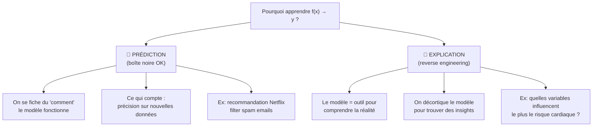
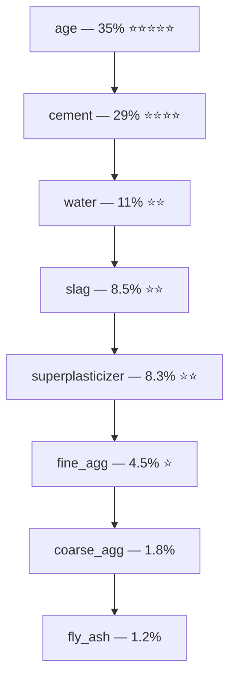

# Fiche 10 — Interprétabilité & Specialized Focus

> Synthèse 1 — Prédiction vs Explication. Pourquoi l'interprétabilité est critique en génie civil.

---

## Prédiction vs Explication — La Distinction Fondamentale



| Objectif | Question posée | Modèle adapté |
|---|---|---|
| **Prédiction** | Quelle résistance pour cette formulation ? | N'importe lequel — même boîte noire |
| **Explication** | Pourquoi cette formulation est-elle résistante ? Quel ingrédient ajuster ? | Modèle interprétable obligatoire |

---

## Dans la Construction, On Veut Les DEUX

Un ingénieur civil ne veut pas juste *"42 MPa"*. Il veut savoir :

> *"Si j'augmente le ciment de 50 kg/m³, est-ce que je compense la réduction d'eau ? Est-ce que le laitier joue vraiment un rôle à 28 jours ou seulement à long terme ?"*

**3 raisons pour lesquelles l'interprétabilité est critique en génie civil :**

1. **Sécurité :** un modèle qu'un ingénieur ne peut pas expliquer à son client ou au bureau de contrôle n'est pas utilisable. La norme EN 206 exige des justifications.
2. **Formulation :** on veut comprendre l'impact de chaque ingrédient pour **optimiser** la formule (réduire les coûts, réduire l'empreinte carbone).
3. **Réglementation :** "notre IA a dit 42 MPa" n'est pas une justification valable pour une décision structurelle.

---

## Pourquoi on a Exclu les Réseaux de Neurones

| Modèle | Interprétabilité | Performance | Décision |
|---|---|---|---|
| Ridge | ✅ Maximale (coefficients directs + / -) | ⚠️ Baseline (10.4 MPa) | ✅ Inclus |
| Random Forest | ⚠️ Feature Importance | ✅ Bonne (4.9 MPa) | ✅ Inclus |
| Gradient Boosting | ⚠️ Feature Importance | ✅ Meilleure (4.2 MPa) | ✅ Inclus |
| **Neural Networks** | ❌ **Boîte noire complète** | ✅✅ (potentiellement meilleur) | **❌ Exclu** |

**On a consciemment sacrifié** quelques points de RMSE potentiels pour maintenir l'interprétabilité.

C'est un **choix justifiable** : dans un contexte de génie civil avec des enjeux de sécurité, un modèle opaque ne peut pas être validé.

---

## Feature Importance (RF et GB) — Comment ça Marche

### Impurity Importance (Méthode utilisée dans notre projet)

**Principe :** à chaque fois qu'une feature est utilisée pour un split dans un arbre, elle réduit la MSE (ou "l'impureté") dans les nœuds enfants. La Feature Importance d'une feature = **somme de toutes ces réductions**, sur tous les nœuds, sur tous les arbres.

$$\text{FI}(j) = \sum_{\text{arbres}} \sum_{\text{nœuds utilisant } j} \Delta \text{MSE}(\text{nœud})$$

Normalisé pour que toutes les importances somment à 1.

**Résultats GB dans notre projet :**



**age + cement = ~64% de l'importance combinée.**

---

### Limite de l'Impurity Importance

> *"Favorise les features continues à haute cardinalité."* (Synthèse 7)

Les features avec beaucoup de valeurs possibles (comme `cement` qui varie de 102 à 540) peuvent être **légèrement surévaluées** par rapport aux features qui ont beaucoup de zéros (comme `fly_ash`).

**Pourquoi ?** Une feature avec beaucoup de valeurs possibles est **candidate à plus de splits** → mécaniquement plus d'occasions de réduire la MSE.

**Solution plus robuste :** Permutation Feature Importance
- On permute aléatoirement les valeurs d'une feature dans le test set
- On mesure la dégradation du score
- Une feature importante → sa permutation dégrade beaucoup le score

---

## Coefficients Ridge — L'Interprétation Directe

Ridge donne quelque chose que RF et GB ne peuvent pas donner : une **direction** (+ ou -) pour chaque feature.

```
cement  = +12.05  → +1 std de ciment ↑ résistance de 12 MPa
slag    = +8.40   → liant secondaire fort
age     = +7.13   → hydratation progressive
fly_ash = +5.35   → liant tertiaire
superplasticizer = +1.68 → effet indirect (réduit l'eau)
fine_agg = +1.32  → remplissage, peu d'effet
coarse_agg = +1.10 → remplissage, peu d'effet
water   = -3.37   → le seul négatif — loi de Féret ✅
Intercept = 35.25 MPa → résistance de base moyenne
```

**Pourquoi ces coefficients sont comparables :** le StandardScaler ramène tout à μ=0, σ=1 → les coefficients sont en "unités d'écart-type" → directement comparables entre features d'échelles différentes.

**Limite de Ridge :** la relation `age` est logarithmique en réalité. Ridge l'approxime par une droite → le coefficient +7.13 **sous-estime** l'impact réel de l'âge aux jeunes âges (< 28 jours) et **surestime** aux vieux âges (> 90 jours).

---

## Le Lien Feature Importance ↔ Physique du Béton

| Feature | Importance GB | Explication Physique |
|---|---|---|
| `age` | **35%** | Hydratation progressive : réaction C+E continue des semaines. Relation non-linéaire **bien capturée** par les arbres. |
| `cement` | **29%** | Liant principal : plus de ciment = plus de réactions = plus de cristaux = plus de résistance. Relation quasi-linéaire. |
| `water` | **11%** | Loi de Féret (1897) : eau en excès → pores → fragilité. Effet non-linéaire (quadratique). |
| `slag` | 8.5% | Liant secondaire lent : faible contribution à 28j, plus important à long terme. |
| `superplasticizer` | 8.3% | Effet indirect : réduit la quantité d'eau nécessaire → résistance ↑. |
| `fine_agg` | 4.5% | Remplissage chimiquement inerte. Peu d'impact sur la résistance. |
| `coarse_agg` | 1.8% | Idem — squelette sans réaction chimique. |
| `fly_ash` | 1.2% | Souvent = 0 dans le dataset → peu de données → faible importance apparente. |

**Conclusion physique :**

> *"Les Feature Importances confirment la physique du béton — ce n'est pas juste un modèle qui marche, c'est un modèle qui a appris des lois physiques réelles."*

**age + cement dominent** → cohérent avec le fait que le béton, c'est fondamentalement de l'eau + du ciment + du temps.

---

## Réponse à "Pourquoi Pas les Réseaux de Neurones ?" (Question Probable)

Structure de réponse en 3 points :

1. **Objectif du projet :** on veut à la fois **prédire** ET **expliquer** (Specialized Focus du cours). Les réseaux de neurones sont des boîtes noires — on ne peut pas expliquer pourquoi ils prédisent 42 MPa.

2. **Contexte applicatif :** en génie civil, un ingénieur doit justifier ses choix de formulation à un bureau de contrôle. "L'IA a dit" n'est pas une justification. Ridge donne des coefficients directs, GB donne des Feature Importances — tous deux exploitables.

3. **Performance vs interprétabilité :** GB (4.2 MPa) est déjà excellent. Le gain potentiel d'un réseau de neurones serait marginal sur 1005 observations — pas suffisant pour justifier la perte d'interprétabilité.

---

## À retenir pour l'oral

> *"On a exclu les réseaux de neurones parce que l'interprétabilité est critique en génie civil — un ingénieur doit pouvoir expliquer ses choix de formulation à un bureau de contrôle. On a Ridge pour l'interprétabilité maximale (coefficients directs avec signe), et Feature Importance pour RF/GB. Le fait que `age` et `cement` dominent à 64% confirme que notre modèle a bien appris les lois physiques de l'hydratation et du dosage — c'est notre 'Specialized Focus' : relier les résultats ML à la physique du béton."*
