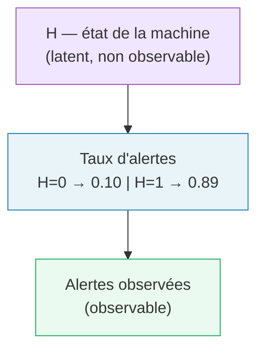
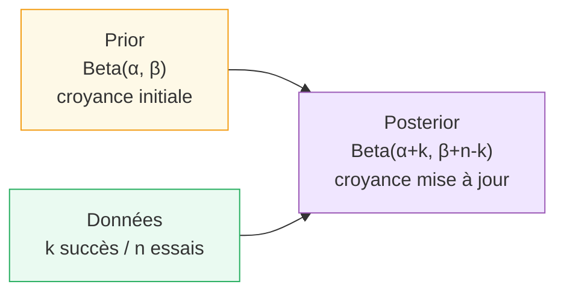
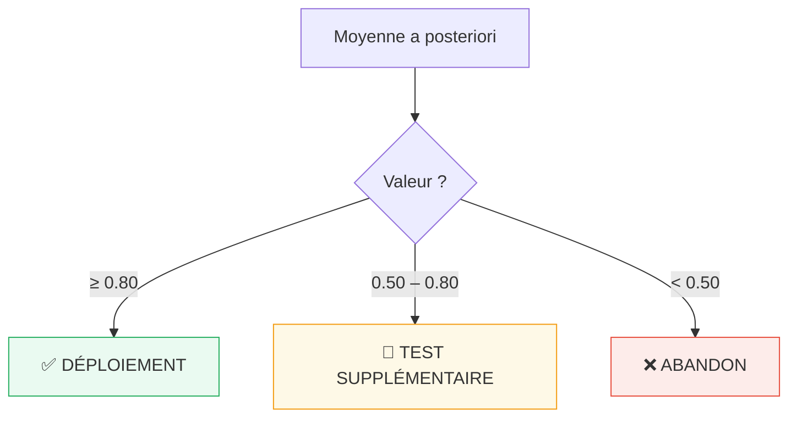
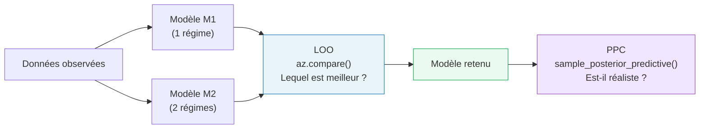

# 📚 Fiche de révision — Théorie Bayésienne

Tous les concepts du cours, exercice par exercice. Pas de code, que de la théorie expliquée simplement.

---

## PARTIE 1 — Fréquence, estimateur et variabilité

### C'est quoi une fréquence empirique ?

Quand on observe des données, la **fréquence empirique** c'est le ratio de fois où un événement s'est produit. Par exemple, 190 observations et 19 pics de pollution → fréquence = 19/190 ≈ 0.10.

### Est-ce que c'est un bon estimateur ?

Oui, pour deux raisons :

**1. Sans biais** : en répétant l'expérience des millions de fois et en moyennant, on tombe exactement sur p. En moyenne, on ne se trompe pas.

**2. Consistant** : plus on a de données, plus on s'approche de la vraie valeur.

> ⚠️ Ça ne veut pas dire que sur *un seul* échantillon on tombe juste — juste qu'il n'y a pas d'erreur systématique.

### Pourquoi deux expériences identiques donnent des résultats différents ?

Chaque tirage est une réalisation indépendante d'une loi de probabilité. La variabilité est **inhérente au processus stochastique**. La seed contrôle la reproductibilité, elle ne supprime pas la variabilité.

### Impact de n sur la précision

| n | Écart-type | Interprétation |
|---|---|---|
| 20 | ≈ 0.067 | Très étalé, valeurs de 0.00 à 0.30+ |
| 190 | ≈ 0.022 | Correct |
| 500 | ≈ 0.013 | Très concentré autour de 0.10 |

Plus n est grand → distribution plus serrée → **loi des grands nombres**.

---

## PARTIE 2 — Hypothèses discrètes et variable latente

### Le contexte

Un système prédit les pannes de machines industrielles. On ne sait pas si la machine est opérationnelle (H=0) ou en panne (H=1). On cherche à inférer H à partir des alertes.

### Structure causale du modèle



La **cause** c'est H. L'**effet** c'est les alertes. Bayes remonte de l'effet vers la cause.

### Théorème de Bayes appliqué

```
P(H=1 | données) ∝ P(données | H=1) × P(H=1)
```

- **Prior P(H=1)** : croyance avant les données → 0.5 si on ne sait pas
- **Vraisemblance P(données | H=1)** : "si machine en panne, proba d'observer autant d'alertes ?"
- **Posterior P(H=1 | données)** : croyance mise à jour

### Pourquoi le résultat est proche de 0 ici ?

Les deux hypothèses génèrent des taux très différents (0.10 vs 0.89). Avec n=280, si les alertes observées sont proches de 10%, les données tranchent clairement pour H=0 — la machine est opérationnelle.

---

## PARTIE 3 — Inférence bayésienne et décision

### Le cycle Bayésien



**Conjugaison Beta-Binomiale** : Prior Beta + Vraisemblance Binomiale = Posterior Beta (formule directe, pas de calcul numérique).

### Calcul du posterior (à connaître par cœur)

```
Posterior = Beta(α + k,  β + n - k)
Moyenne   = (α + k) / (α + k + β + n - k)  =  (α + k) / (α + β + n)
```

**Exemple** — 27 succès sur 40, prior Beta(1,1) :
```
Posterior = Beta(28, 14)
Moyenne   = 28/42 ≈ 0.667
```

### Prior non-informatif vs informatif

| Prior | Signification | Moyenne |
|---|---|---|
| Beta(1,1) | Uniforme — on ne sait rien | 0.50 |
| Beta(2,8) | Pessimiste | 0.20 |
| Beta(6,2) | Optimiste | 0.75 |

**Influence du prior** = (α+β) / (α+β+n)
→ Beta(2,8) sur n=40 : 10/50 = **20%** d'influence.
→ Sur n=4000 : 10/4010 = **0.25%**.

### Règle de décision



Exemple : moyenne = 0.667 → zone 0.50–0.80 → **test supplémentaire**.

---

## PARTIE 4 — Comparaison de modèles et validation

### Pipeline complet



### LOO (Leave-One-Out)

- **Score plus élevé (moins négatif) = meilleur modèle**
- `elpd_diff` grand + `dse` petit → différence significative
- ⚠️ **Relatif** : le gagnant peut quand même être mauvais

### Posterior Predictive Check (PPC)

> Si le modèle est bon, il doit générer des données qui ressemblent aux vraies.

1. Estimer les paramètres sur les données réelles
2. Simuler de nouvelles données depuis le posterior
3. Comparer simulations et observations

Simulations ≈ données réelles → modèle crédible ✅
Simulations à côté → modèle mal spécifié ❌

### Pourquoi deux régimes ici ?

Données : `[72, 74, 71, 73, 45, 43, 46, 44, 72, 44]`

Deux clusters nets : {71–74} et {43–46}, variance interne ≈ 1, écart entre groupes ≈ 28. Une seule normale (µ≈58) produirait des valeurs autour de 55–60 qui **n'existent pas** dans les données.

---

## PARTIE 5 — Récap des concepts clés

### Le théorème de Bayes

```
P(paramètre | données)  ∝  P(données | paramètre)  ×  P(paramètre)
      posterior                  vraisemblance              prior
```

### La loi Beta — à connaître par cœur

| Grandeur | Formule |
|---|---|
| Moyenne | α / (α + β) |
| MAP | (α − 1) / (α + β − 2) |
| Influence prior | (α + β) / (α + β + n) |
| Confiance | Plus α+β est grand → distribution plus étroite |

### Variable latente — quand en a-t-on besoin ?

- Une cause importante **n'est pas observable**
- Les données viennent de **plusieurs mécanismes** (mélange)
- On veut expliquer *pourquoi* on observe, pas juste *quoi*

---

## 🎯 Aide-mémoire exam

| Question fréquente | Ce qu'il faut dire |
|---|---|
| "Justifier le prior" | Beta(1,1) si aucune info. Informatif si expertise ou données passées. Toujours expliquer. |
| "Structure causale" | Dessiner la chaîne. Identifier observable vs latent. |
| "Interpréter le posterior" | Moyenne + P(p > seuil) + décision. |
| "Pourquoi deux modèles ?" | Regarder si les données forment des groupes distincts. |
| "Interpréter le PPC" | Simulations ≈ données → OK. À côté → revoir le modèle. |

### Pièges à éviter

❌ Penser qu'un bon LOO = bon modèle (c'est relatif, pas absolu)  
❌ Oublier de justifier le prior  
❌ Regarder seulement la moyenne du posterior (ignorer l'écart-type et les intervalles)  
❌ Confondre seed (reproductibilité) et variabilité (inhérente au hasard)

---

## 🏆 Réponses parfaites (courtes)

### EX 1 — Simulation

**Q1. La fréquence est-elle un bon estimateur ?**
Oui — estimateur **sans biais** : en répétant, la moyenne converge vers p=0.10. Sur un seul échantillon on peut s'éloigner de p, mais pas d'erreur systématique.

**Q2. Différences n=20 vs n=500 ?**
n=20 : std ≈ 0.067, très étalé. n=500 : std ≈ 0.013, très concentré. Plus n est grand, plus l'estimateur est précis — **loi des grands nombres**.

**Q3. Pourquoi deux expériences identiques diffèrent ?**
Variabilité **inhérente au hasard** — chaque tirage est une réalisation indépendante. La seed contrôle la reproductibilité, elle ne supprime pas la variabilité.

---

### EX 2 — Hypothèses discrètes

**Q1. Structure causale ?**
`H → taux d'alertes → alertes observées`. H est la cause latente, les alertes sont l'effet. Bayes remonte de l'effet vers la cause.

**Q2. Pourquoi une variable latente ?**
H n'est pas observable — on voit les alertes, pas l'état de la machine. Sans H, impossible de distinguer vraie détection et faux positif.

**Q3. Interpréter P(H=1|data) ≈ 0 ?**
Les données favorisent clairement H=0. Les taux d'alertes sont très différents (0.10 vs 0.89) — un compte proche de 10% conclut sans ambiguïté : machine opérationnelle.

---

### EX 3 — Inférence & décision

**Q1. Quelle décision ?**
Beta(1,1) → Beta(28,14), moyenne ≈ **0.667**. Zone 0.50–0.80 → **test supplémentaire**.

**Q2. Comparaison avec Beta(2,8) ?**
Prior pessimiste (µ=0.20) → Beta(29,21), moyenne = 0.58. Même décision, plus proche de l'abandon. Impact fort du prior avec seulement n=40.

**Q3. Pourquoi le prior pèse plus avec peu de données ?**
Beta(2,8) = 10 pseudo-observations sur 40 vraies → **20% d'influence**. Sur 4000 observations → 0.25%.

---

### EX 4 — Modélisation & validation

**Q1. Quel modèle ?**
**M2**. M1 estime µ≈58, aucune observation n'est proche. LOO : M2 (≈−24) >> M1 (≈−44).

**Q2. Pourquoi deux régimes ?**
Deux clusters {71–74} et {43–46}, variance interne ≈ 1, écart ≈ 28. Une seule normale couvrirait des valeurs inexistantes dans les données.

**Q3. Bon LOO = bon modèle ?**
Non. LOO = moins mauvais des deux. Toujours valider avec le **PPC**.

**Q4. M2 est-il crédible ?**
Oui. PPC concentré autour de 72 et 44, correspondant aux vraies observations. Physiquement : bonne nuit vs mauvaise nuit de sommeil.
