# 1 - ML Basics

Date de création: 12 février 2026 13:53
Cours: Machine Learning
Quadrimestre: Q2
État: Terminé

# 1 — C’est quoi le Machine Learning ?

---

## Définition intuitive

> Le Machine Learning, c’est apprendre à partir des données plutôt que programmer des règles à la main.
> 

Le Machine Learning (ML) est un sous-domaine de l'Intelligence Artificielle.

Au lieu d’écrire `if température > 30 then été`, on montre des millions d’exemples à un algorithme, et **il découvre lui-même les règles**.

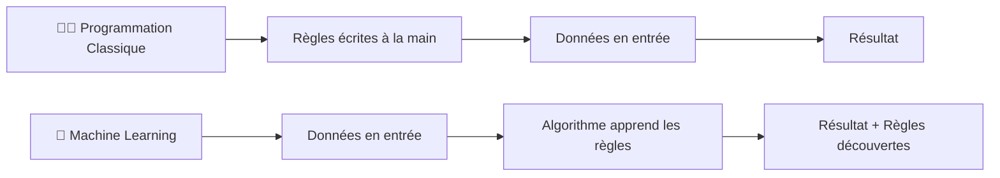

## Applications concrètes

| Domaine | Application |
| --- | --- |
| E-commerce | Recommandation de produits / films |
| Finance | Trading automatique, détection de fraudes |
| Langues | Traduction automatique (Google Translate) |
| Jeux | AlphaGo (a battu les meilleurs joueurs humains au Go) |
| Médecine | Diagnostic à partir d’images médicales |

---

## Les 3 grands paradigmes d’apprentissage

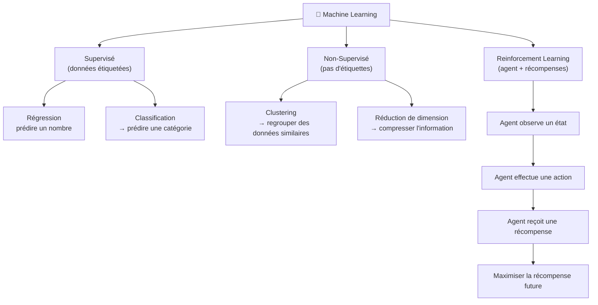

---

### 🏷️ Supervisé

Le modèle apprend à partir de données **étiquetées** : chaque exemple a une réponse connue.

$$
\text{Données} = \{(x_1, y_1), (x_2, y_2), \ldots, (x_n, y_n)\}
$$

**Exemples :** prédire le prix d’une maison, classifier un email comme spam/non-spam.

---

### 🔍 Non-Supervisé

Pas d’étiquette $y$. L’algorithme cherche des **structures cachées** dans les données.

**Exemple :** regrouper des clients par comportement d’achat (clustering).

---

### 🎮 Reinforcement Learning

Un **agent** interagit avec un **environnement** :

- Il observe un **état** $s$
- Il choisit une **action** $a$
- Il reçoit une **récompense** $r$
- Son but : **maximiser la récompense cumulée** sur le long terme (pas juste le gain immédiat)

<aside>
💡

**C’est comme dresser un chien,** on ne lui dit pas quoi faire step by step, on le récompense quand il fait bien.

</aside>

---

# 2 — Les Données

---

## Features & Target

$$
\underbrace{x}_{\text{Features (entrées)}} \xrightarrow{\text{modèle}} \underbrace{y}_{\text{Target (sortie)}}
$$

| Concept | Définition | Exemple |
| --- | --- | --- |
| **Feature** $x$ | Variable d’entrée qui décrit un objet | Superficie, nb de pièces, quartier |
| **Target** $y$ | Variable qu’on cherche à prédire | Prix de la maison |

Un exemple d’apprentissage est un couple $(x, y)$ :

$$
\text{Exemple} = \left(\underbrace{[120\text{m}^2, 3\text{ pièces, Paris}]}_{\text{features } x},\ \underbrace{450\,000€}_{\text{target } y}\right)
$$

---

## Régression vs Classification

|  | Régression | Classification |
| --- | --- | --- |
| **Type de $y$** | Valeur numérique continue | Catégorie / classe |
| **Exemple de $y$** | Prix, température, salaire | Spam/non-spam, malade/sain |
| **Sortie du modèle** | Un nombre réel | Une classe (ou probabilité par classe) |

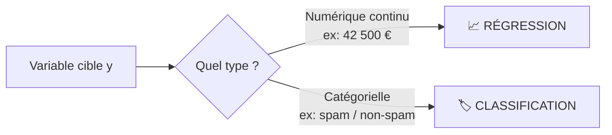

---

## L’encodage des variables catégorielles

Les algorithmes ne comprennent que des **nombres**. Il faut donc convertir les catégories.

### One-Hot Encoding

Pour une variable avec $k$ catégories → on crée $k$ nouvelles colonnes binaires.

| Couleur | Rouge | Vert | Bleu |
| --- | --- | --- | --- |
| Rouge | **1** | 0 | 0 |
| Vert | 0 | **1** | 0 |
| Bleu | 0 | 0 | **1** |

### Dummy Encoding

Identique mais on crée seulement $k-1$ colonnes (on supprime une colonne redondante).

> ⚠️ **Pourquoi $k-1$ ?** Si on sait que Rouge=0 et Vert=0, on déduit automatiquement Bleu=1. La dernière colonne est inutile. Certains modèles (régression linéaire) **exigent** de supprimer cette redondance pour éviter des problèmes de matrice singulière.
> 

---

# 3 — Le Processus Générateur de Données

---

## L’hypothèse fondamentale du ML

On suppose que les données observées ont été générées par un **processus sous-jacent inconnu**, caractérisé par une distribution de probabilité :

$$
\mathcal{P}_{xy} \sim \theta
$$

où $\theta$ est un vecteur de paramètres inconnus.

## Hypothèse i.i.d.

> **i.i.d.** = **i**ndépendantes et **i**dentiquement **d**istribuées
> 

C’est l’hypothèse centrale du ML classique :

$$
x_1, x_2, \ldots, x_n \overset{\text{i.i.d.}}{\sim} \mathcal{P}_{xy}
$$

- **Identiquement distribuées** : toutes les observations viennent de la même distribution
- **Indépendantes** : l’observation $n$ ne dépend **pas** des observations précédentes

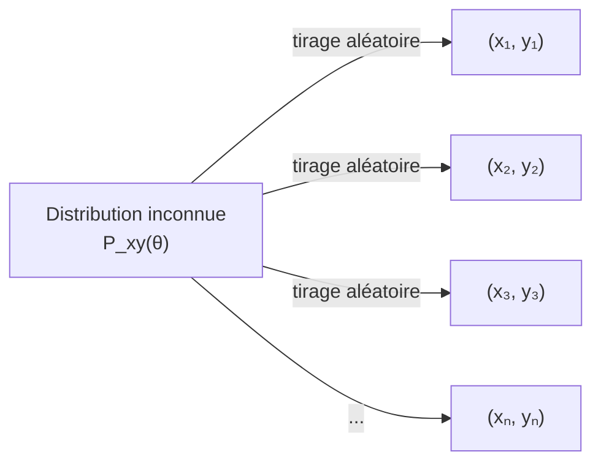

> 💡 Les séries temporelles (données financières, météo) **violent** cette hypothèse car les observations dépendent du passé. C’est un cas plus complexe.
> 

---

# 4 — Prédiction vs Explication

**Apprendre à prédire :** On se fiche un peu de savoir comment le modèle fonctionne à l'intérieur (effet boîte noire). Ce qui compte, c'est d'avoir un prédicteur très précis pour de nouvelles données.

**Apprendre à expliquer (Reverse Engineering) :** Le modèle sert de moyen pour mieux comprendre la relation inhérente cachée dans les données. On décortique le modèle pour en tirer des implications scientifiques ou sociales (comprendre *pourquoi* une variable influence la cible).

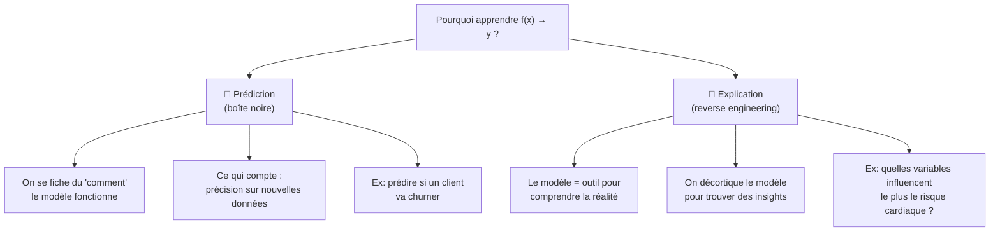

|  | Prédiction | Explication |
| --- | --- | --- |
| **Objectif** | Être le plus précis possible | Comprendre les mécanismes |
| **Interprétabilité** | Pas nécessaire | Essentielle |
| **Modèles typiques** | Réseaux de neurones, XGBoost | Régression linéaire, Arbres de décision |
| **Exemple** | Recommandation Netflix | Étude scientifique sur les facteurs de risque |

---

# 5 — Le Modèle

## Définition

Un modèle est une **fonction mathématique** $f$ qui mappe les features vers la target :

$$
f : \mathcal{X} \rightarrow \mathbb{R}^g
$$

$$
\hat{y} = f(x)
$$

## La notation “chapeau” :  $\hat{}$

| Symbole | Signification |
| --- | --- |
| $y$ | La vraie valeur (inconnue sur nouvelles données) |
| $\hat{y}$ | La valeur **prédite** par le modèle |
| $\theta$ | Les vrais paramètres (du processus générateur) |
| $\hat{\theta}$ | Les paramètres **estimés** / appris par l’algorithme |

---

## L’Espace d’Hypothèses $\mathcal{H}$

C’est l’ensemble de **toutes les fonctions** parmi lesquelles on va chercher notre modèle.

$$
\mathcal{H} = \{f_1, f_2, f_3, \ldots\}
$$

Différentes familles de fonctions possibles :

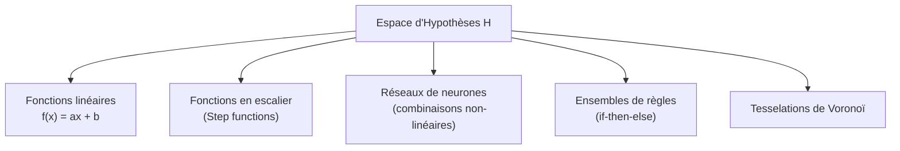

<aside>
💡

Le choix de $\mathcal{H}$ est crucial : il définit ce que le modèle **peut** et **ne peut pas** apprendre. Un espace trop simple → underfitting. Un espace trop complexe → overfitting.

</aside>

---

# 6 — Le Learner

### Vue d’ensemble

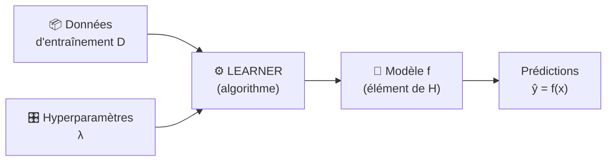

Formellement :

$$
\mathcal{I} : D \times \Lambda \rightarrow \mathcal{H}
$$

Le learner prend en entrée **des données + des hyperparamètres**, et **retourne un modèle.**

---

## Learner vs Apprentissage Supervisé

| Concept | Rôle | Analogie |
| --- | --- | --- |
| **Apprentissage supervisé** | Le cadre de travail | Le chantier |
| **Learner** | L’outil qui apprend | L’ouvrier |

---

## Paramètres vs Hyperparamètres

|  | Paramètres $\theta$ | Hyperparamètres $\lambda$ |
| --- | --- | --- |
| **Définis quand ?** | **Pendant** l’entraînement | **Avant** l’entraînement |
| **Appris automatiquement ?** | ✅ Oui | ❌ Non (fixés par le développeur) |
| **Exemples** | Coefficients de régression, poids d’un réseau | Taux d’apprentissage, profondeur d’un arbre |
| **Rôle** | Définissent le modèle | Contrôlent le processus d’apprentissage |

<aside>
💡

Les hyperparamètres servent souvent à éviter l’**overfitting** (modèle trop collé aux données d’entraînement, mauvais sur de nouvelles données).

</aside>

---

## Adaptation à la tâche

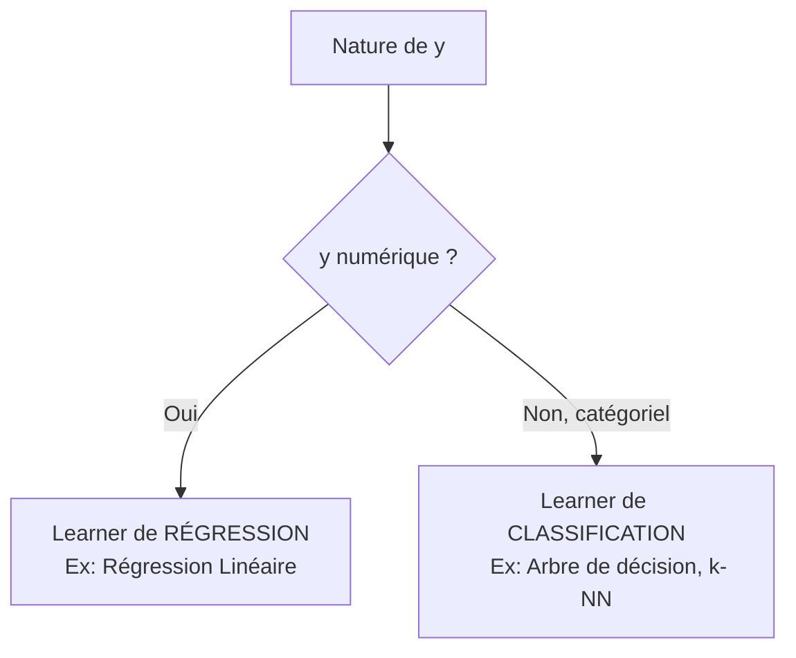

---

# 7 — Pertes & Minimisation des Risques

## La fonction de perte (Loss)

La perte mesure **l’erreur du modèle sur un exemple unique** :

$$
L\bigl(y,\ \hat{y}\bigr) = \text{écart entre la vraie valeur et la prédiction}
$$

### Exemples de fonctions de perte courantes

| Nom | Formule | Usage |
| --- | --- | --- |
| **Erreur quadratique (MSE)** | $L = (y - \hat{y})^2$ | Régression |
| **Valeur absolue (MAE)** | $L = \|y - \hat{y}\|$ | Régression robuste |
| **Log-loss** | $L = -y\log(\hat{p}) - (1-y)\log(1-\hat{p})$ | Classification binaire |
| **0-1 Loss** | $L = \mathbb{1}[y \neq \hat{y}]$ | Classification (théorique) |

---

## Le Risque Empirique $\mathcal{R}_{emp}$

C’est la **moyenne des pertes** sur l’ensemble des données d’entraînement :

$$
\mathcal{R}_{emp}(f) = \frac{1}{n} \sum_{i=1}^{n} L\bigl(y_i,\ f(x_i)\bigr)
$$

> C’est le **score de qualité** du modèle : plus il est bas, mieux le modèle colle aux données.
> 

---

## Empirical Risk Minimization (ERM)

L’objectif du ML supervisé est de trouver le modèle $\hat{f}$ qui **minimise** ce risque :

$$
\hat{f} = \underset{f \in \mathcal{H}}{\arg\min}\ \mathcal{R}_{emp}(f) = \underset{f \in \mathcal{H}}{\arg\min}\ \frac{1}{n} \sum_{i=1}^{n} L\bigl(y_i,\ f(x_i)\bigr)
$$

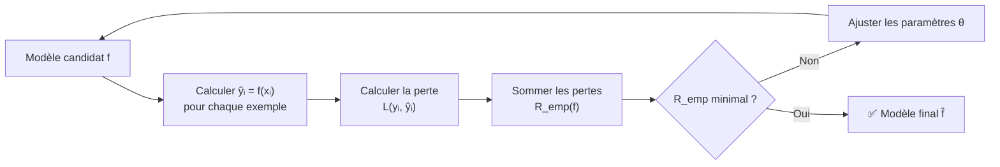

---

# 8 — Optimisation

## Pourquoi optimiser ?

L’espace d’hypothèses $\mathcal{H}$ est souvent **infini** → impossible de tout tester. On transforme l’apprentissage en un **problème d’optimisation numérique** : trouver les paramètres $\hat{\theta}$ qui minimisent le risque empirique.

---

## La surface d’erreur

Imagine une montagne inversée (une vallée) : chaque point représente un jeu de paramètres $\theta$, et l’altitude représente l’erreur $\mathcal{R}_{emp}(\theta)$. On cherche le **point le plus bas**.

$$
\hat{\theta} = \underset{\theta}{\arg\min}\ \mathcal{R}_{emp}(\theta)
$$

## La Descente de Gradient

L’algorithme le plus célèbre pour descendre cette vallée :

$$
\theta^{(t+1)} = \theta^{(t)} - \underbrace{\eta}_{\text{learning rate}} \cdot \underbrace{\nabla_\theta \mathcal{R}_{emp}(\theta^{(t)})}_{\text{gradient (direction de la pente)}}
$$

| Paramètre | Rôle |
| --- | --- |
| $\theta^{(t)}$ | Paramètres à l’itération $t$ |
| $\eta$ (learning rate) | Taille du pas (petit = lent mais précis, grand = rapide mais risqué) |
| $\nabla_\theta \mathcal{R}_{emp}$ | Gradient = direction de montée → on va dans le sens opposé |

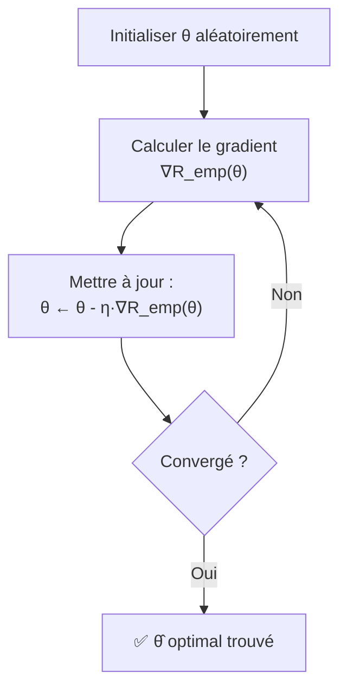

<aside>
💡

Imagine que tu es dans le brouillard sur une montagne et que tu veux atteindre la vallée. Tu regardes juste sous tes pieds (le gradient) pour savoir de quel côté descendre, et tu fais un petit pas dans cette direction.

</aside>

---

# 9 — Récapitulatif : Les 3 Composantes d’un Learner

Un algorithme d’apprentissage supervisé est toujours composé de **3 blocs fondamentaux** :

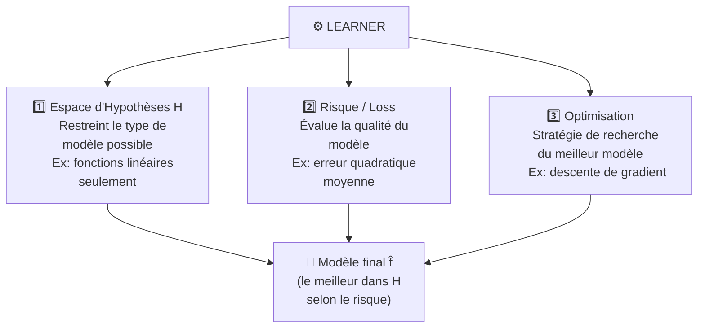

| Composante | Rôle | Exemples |
| --- | --- | --- |
| **Espace d’Hypothèses $\mathcal{H}$** | Définit *ce que* le modèle peut apprendre | Linéaire, neurones, arbres… |
| **Risque / Loss** | Définit *comment* mesurer la qualité | MSE, Cross-Entropy, MAE… |
| **Optimisation** | Définit *comment* chercher le meilleur modèle | Gradient descent, analytique… |

---

# 🗺️ Carte Mentale Globale

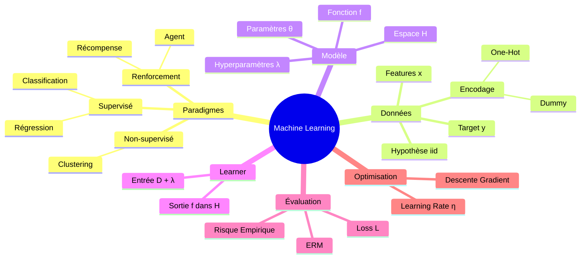

---

# Résumé des Formules Clés

$$
\boxed{\text{Données étiquetées :}\ \mathcal{D} = \{(x_i, y_i)\}_{i=1}^n}
$$

$$
\boxed{\text{Modèle :}\ \hat{y} = f_{\hat{\theta}}(x)}
$$

$$
\boxed{\text{Risque Empirique :}\ \mathcal{R}_{emp}(f) = \frac{1}{n}\sum_{i=1}^n L(y_i, f(x_i))}
$$

$$
\boxed{\text{ERM :}\ \hat{f} = \underset{f \in \mathcal{H}}{\arg\min}\ \mathcal{R}_{emp}(f)}
$$

$$
\boxed{\text{Descente de Gradient :}\ \theta \leftarrow \theta - \eta \cdot \nabla_\theta \mathcal{R}_{emp}(\theta)}
$$