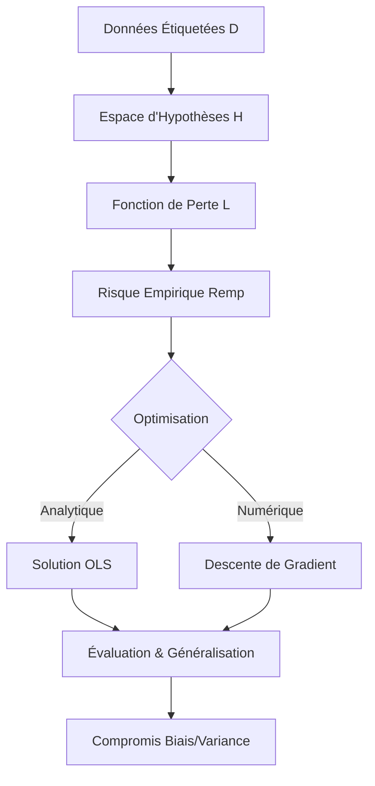

# 2 - Régression Supervisé

Date de création: 20 février 2026 13:36
Cours: Machine Learning
Quadrimestre: Q2
État: Terminé

# Introduction

**L’étude du cerveau humain** en tant que **système de traitement de l’information** a radicalement évolué sous l’influence des sciences de l’apprentissage automatique. 
La neurobiologie contemporaine suggère que le cerveau n’est pas un simple récepteur passif de stimuli, mais un agent prédictif actif qui cherche constamment à minimiser l’écart entre ses attentes et la réalité sensorielle. 

Ce cadre, connu sous le nom de **codage prédictif**, trouve une résonance directe dans les principes de la régression supervisée. **La régression supervisée**, dans son essence mathématique, **consiste à apprendre une fonction capable de prédire une variable cible continue à partir de caractéristiques d'entrée**, en ajustant des paramètres internes pour réduire une fonction de perte. Cet impératif d'ajustement n'est pas seulement une abstraction informatique ; il constitue le moteur même de la **plasticité synaptique** et de la **régulation homéostatique**.

---

## Le "Pourquoi" 🎯

L'enjeu central est de modéliser une relation mathématique entre des variables d'entrée ($X$) et une cible ($Y$). **On veut transformer un historique de données en un moteur capable de "deviner" l'avenir.**

---

## Indice Visuel de Dépendance 🗺️

---

# Le Modèle Linéaire

---

## Qu'est-ce qu'un modèle linéaire ?

C'est une approximation mathématique qui suppose que la sortie est **le résultat d'une addition pondérée des entrées**. On parle de **combinaison linéaire** car chaque caractéristique ($x$) est multipliée par un poids ($\omega$) avant d'être sommée.

## **Pourquoi cette structure ?**

1. **Simplicité** : C'est le modèle le plus efficace pour comprendre quelles variables influencent le résultat.
2. **Interprétabilité** : Si un poids $\omega$ est élevé, on sait immédiatement que cette variable est cruciale.
3. **Calcul** : Les opérations mathématiques (additions et multiplications) sont extrêmement rapides pour les processeurs (et les neurones).

**Définition mathématique** : Prédire $y$ via :

$$
f(x) = \omega^T x = \omega_0 + \sum_{j=1}^{p} \omega_j x_j
$$

$$
f(x) = \omega^T x = \omega_0 + \omega_1 x_1 + \omega_2 x_2 + \dots + \omega_p x_p
$$

> Ce modèle permet de projeter un score continu (ex: prix, température, probabilité) en pondérant l'importance de chaque facteur d'entrée. C'est la base de toute prédiction quantitative.
> 

---

## Analogie : Le DJ

Pour comprendre la **combinaison linéaire**, imaginez un DJ devant sa console :

$$
\text{Ambiance} = \omega_0 + \omega_1(\text{Heure}) + \omega_2(\text{Lumière}) + \omega_3(\text{Style})
$$

**Sa mission** est de prédire exactement "l'ambiance" ($y$) nécessaire pour que tout le monde danse.

- **Les entrées (**$x_j$**)** : Ce sont les données de l'environnement (ex: $x_1$ = heure de la soirée, $x_2$ = intensité de l'éclairage, $x_3$ = style de la foule).
- **Les poids (**$\omega_j$**)** : Ce sont les réglages que le DJ applique à chaque bouton. Si le DJ monte le curseur $\omega_3$ à fond, il décide que le "Style de musique" est le facteur qui dicte tout. S'il met $\omega_2$ à zéro, il ignore la lumière.
- **Le biais (**$\omega_0$**)** : C'est le niveau sonore de base de la salle, même si tous les autres boutons sont à zéro.
- **La prédiction (**$\hat{y}$**)** : C'est le morceau et le mix qu'il choisit de lancer.
- **Le résidu (**$r$**)** : C'est le "ressenti" du public. Si le DJ lance un morceau ultra-rapide alors que les gens sont fatigués, l'écart entre l'énergie du public ($y$) et sa musique ($\hat{y}$) est énorme. Ce signal indique au DJ qu'il doit ajuster ses boutons ($\omega_j$) pour corriger le tir.
    
    **La différence** entre la valeur observée $y$ et la valeur prédite $\hat{y} = f(x)$, soit $r = y - f(x)$
    

<aside>
🧠

**Le lien Neuro** : Dans le cerveau, ce calcul d'erreur locale est porté par les neurones dopaminergiques. Ils codent l'**erreur de prédiction de récompense (RPE)**. 

- **Meilleur que prévu ?** Boost de dopamine (résidu positif).
- **Moins bon ?** Chute de dopamine (résidu négatif).

Ce signal modifie la force des connexions synaptiques (vos $\omega$).

</aside>

---

## **Analogie : Le Jeu Vidéo (FPS)**

Votre cerveau calcule des résidus à chaque milliseconde. Si vous visez un ennemi et que votre balle passe à côté :

> En Machine Learning, on utilise souvent la lettre grecque $\theta$ **(theta)** pour désigner l'ensemble des poids ($\omega_0, \omega_1, \dots$). C'est le "cerveau" du modèle.
> 
- **Entrées (**$x$**)** : Position de l'ennemi, vent, vitesse de déplacement.
- **Paramètres (**$\theta$**)** : C'est votre configuration interne. C'est l'ensemble des réglages de la tension de vos muscles et de votre sensibilité de visée.
- **Résidu (**$r$**)** : Écart entre le réticule et la cible.
- **Action** : Votre système visuel traite ce résidu pour ajuster immédiatement la tension musculaire ($\theta$) lors de la prochaine tentative.

<aside>
💡

Les résidus ne sont pas de simples déchets de calcul ; ils constituent l'information la plus précieuse pour le système. **Sans résidu, il n'y a pas d'apprentissage.**

</aside>

---

# **Les Métriques de l'Erreur**

Une fois le résidu calculé, le système doit décider de l'importance à lui accorder via une **Fonction de Perte (Loss)**.

## 1. L1 vs L2

| Caractéristique | Perte L2 (Quadratique / **MSE**) | Perte L1 (Absolue / MAE) |
| --- | --- | --- |
| **Formule** | $L(r) = r^2$ | $L(r) = |r|$ |
| Usage | Précision maximale sur données propres | Robustesse face aux bugs/outliers |
| **Sensibilité** | ⚠️ Déteste les **outliers** | ✅ Tolère les **outliers** |
| **Optimisation** | Analytique (Rapide/Dérivable partout) | Numérique (Plus lente/Non-dérivable en 0) |
| **Philosophie** | "L'erreur est un crime" | "L'erreur est humaine" |

---

### **L'explication simpliste :**

- **Perte L2** : C'est un coach ultra-sévère. Si vous ratez votre tir de 10cm, il crie un peu. Si vous le ratez d'un mètre, il vous fait faire 100 pompes d'un coup ! Il punit les grosses bêtises beaucoup plus fort que les petites.
- **Perte L1** : C'est un coach zen. Que vous ratiez de 10cm ou de 1m, il vous punit de façon proportionnelle. Si un élève fait n'importe quoi (un outlier), il l'ignore pour ne pas gâcher le cours des autres.

---

## 2. RMSE (Root Mean Squared Error)

C'est la racine carrée de la MSE.

- **Formule** : $\text{RMSE} = \sqrt{\frac{1}{n} \sum_{i=1}^{n} (y^{(i)} - \hat{y}^{(i)})^2}$
- **Utilité** : Elle ramène l'erreur à l'unité d'origine de $Y$. Si tu prédis des prix en €, la MSE est en €² (abstrait). La RMSE te redonne une erreur moyenne en €.

<aside>
💡

Si vous mesurez votre erreur en tirant à l'arc, la MSE calcule une "surface d'erreur" bizarre. La RMSE, c'est juste ta **règle** qui te dit : "En moyenne, vous ratez la cible de 5 cm".

</aside>

---

## **3. Le Compromis : Huber Loss**

La perte de **Huber** est une fonction hybride : elle est quadratique (L2) pour les petites erreurs et linéaire (L1) pour les grandes.

**Formule** :

$$
L_{\delta}(r) = \begin{cases} \frac{1}{2}r^2 & \text{si } |r| \le \delta \\ \delta(|r| - \frac{1}{2}\delta) & \text{sinon} \end{cases}
$$

> **Huber** est le coach parfait : il exige de la précision sur tes tirs normaux, mais ignore un "lag" passager.
> 

---

<aside>
🧠

Le cerveau jongle entre ces pertes selon ses besoins. Dans les systèmes sensoriels, comme la vision (V1) ou l'audition, **la robustesse est primordiale**. Le cerveau utilise souvent des principes de **"codage épars"** qui s'apparentent à **la régularisation L1**.

**Puisque l'activation des neurones consomme une énergie métabolique** considérable sous forme d'ATP, **le cerveau cherche à minimiser le nombre de neurones actifs** pour représenter une information. Cette parcimonie (sparsity) est induite par **une perte de type L1**, qui a la propriété mathématique de mettre certains paramètres exactement à zéro, "éteignant" ainsi les connexions inutiles.

</aside>

---

# **Optimisation**

---

## **L'Espace des Paramètres**

Imaginez un paysage 3D où chaque position ($x, y$) représente une combinaison de réglages $\theta$ (ex: pente et biais). La hauteur du sol à cet endroit est la valeur de votre **Perte**. Apprendre, c'est trouver le point le plus bas de cette **surface de perte**.

---

## **La Dérivée**

La dérivée représente le taux de changement. C'est la pente de la ligne tangente. Elle vous dit si ça monte ou si ça descend.

---

## **Descente de Gradient (Iterative Improvement)**

Vous mettez à jour $\theta$ itérativement : $\theta_{next} = \theta - \alpha \nabla L(\theta)$.

- **Le Gradient (**$\nabla L$**)** : Un vecteur de dérivées partielles qui donne la direction de la plus forte pente.
- **Le Learning Rate (**$\alpha$**)** : Le "pas" que vous faites.
    - ⚠️ **Trop élevé** : Vous sautez par-dessus le trou (divergence).
    - ⚠️ **Trop faible** : Vous mettez 100 ans à descendre (stagnation).

---

### Dans le cerveau

**Cette descente de gradient est réalisée par la plasticité synaptique**. Chaque synapse (le pont entre deux neurones) possède un "poids" que le cerveau peut augmenter ou diminuer. L'apprentissage se fait par des règles de "trois facteurs" :

1. L'activité du neurone avant le pont (pré-synaptique).
2. L'activité du neurone après le pont (post-synaptique).
3. Un signal global de récompense ou d'erreur (comme la dopamine).

**Ce troisième facteur est crucial.** C'est le "taux d'apprentissage" ($\eta$) de l'algorithme. Si vous jouez à un nouveau jeu vidéo, au début, votre cerveau a un taux d'apprentissage élevé : chaque erreur provoque un gros changement dans votre façon de jouer. Une fois que vous êtes un expert, ce taux diminue ; vous n'ajustez vos réglages que très finement.

<aside>
🧠

Un concept clé ici est celui de la **"trace d'éligibilité" (eligibility trace)**. Imaginons que vous fassiez une action dans un jeu (appuyer sur un bouton) et que **la récompense n'arrive que 5 secondes plus tard.** 

**Comment votre cerveau sait-il quel bouton a causé la victoire?** 

La trace d'éligibilité est une petite "étiquette" chimique posée sur les synapses qui ont travaillé récemment. Quand la récompense arrive enfin, seules les synapses étiquetées sont modifiées. C'est l'équivalent biologique de l'attribution du mérite (credit assignment) en régression supervisée.

</aside>

---

### **Application de la Descente de Gradient**

- **Scénario** : TikTok doit recommander des vidéos parmi des milliards de possibilités.
- **Fonctionnement** : Inverser une matrice de milliards de lignes est impossible pour un ordinateur (l'OLS plante).
- **Processus** : L'algorithme ajuste les poids $\theta$ petit à petit à chaque fois que tu swipes. Si tu restes sur une vidéo, le gradient dit "descends par là pour réduire l'erreur de prédiction". Le système s'améliore à chaque itération sans jamais calculer la solution globale d'un coup.

---

## OLS (Ordinary Least Squares)

L'une des solutions les plus élégantes de la régression linéaire est **l'estimateur des Moindres Carrés Ordinaires.**

Pour un modèle linéaire $y = X\theta + \epsilon$, il existe une solution analytique qui permet de trouver les paramètres optimaux $\hat{\theta}$ d'un seul coup :

$$
\hat{\theta} = (X^{\top}X)^{-1}X^{\top}y
$$

**C'est une forme de calcul direct qui ne nécessite pas de tâtonnement.**

<aside>
🧠

**En neurosciences,** cette fonction de calcul rapide et automatique est largement attribuée au cervelet. Le cervelet est souvent décrit comme une "machine à apprendre" capable de réaliser des régressions complexes pour coordonner les mouvements. Il reçoit une "copie d'efférence" (une prédiction du mouvement voulu) et la compare au retour sensoriel réel pour calculer l'erreur motrice. 

Cependant, le cerveau ne peut pas toujours utiliser l'OLS, car l'inversion de matrice $(X^{\top}X)^{-1}$ est coûteuse et parfois impossible si les données sont trop corrélées (multicolinéarité).

</aside>

### Application de l'OLS (Le calcul "One-Shot")

- **Scénario** : Une banque veut prédire le solde bancaire ($y$) en fonction de la limite de crédit ($x$).
- **Fonctionnement** : On a un petit dataset propre (1000 clients). On applique la formule OLS. On trouve $\hat{\theta} = 0.19$.
- **Résultat immédiat** : On sait instantanément que si la limite augmente de 1$, le solde augmente de 19 cents. Pas besoin d'itérer, la réponse est géométrique (projection).

---

## **Avantages & Inconvénients**

| Méthode | ✅ Avantages | ❌ Inconvénients |
| --- | --- | --- |
| OLS | Instantané (One-shot). Pas de paramètres à régler. Solution mathématique exacte. | Coûteux en mémoire ($O(p^3)$). **Échoue si les variables sont corrélées.** Impossible sur le Big Data. |
| **Descente de Gradient** | Passe partout (Big Data). Fonctionne même si la matrice n'est pas inversible. | Lent (plusieurs étapes). Demande de régler le Learning Rate ($\alpha$). Risque de divergence. |

---

# **Le Risque Empirique et la quête de l'équilibre**

En apprentissage automatique, le principe de **Minimisation du Risque Empirique** (Empirical Risk Minimization ou ERM) stipule que la meilleure hypothèse est celle qui minimise la perte moyenne sur l'ensemble des données d'entraînement :

$$
\mathcal{R}_{emp}(h) = \frac{1}{n} \sum_{i=1}^n L(y_i, h(x_i))
$$

👉 C'est comme essayer d'être "le meilleur en moyenne" sur tous ses matchs de basket, plutôt que de réussir un seul tir incroyable et rater tous les autres.

<aside>
🧠

Biologiquement, **l'ERM est le fondement de la survie**, un concept appelé **homéostasie**. Votre corps possède des "points de consigne" (température, taux de sucre, hydratation) qu'il doit maintenir pour rester en vie. Chaque écart par rapport à ces points représente un "risque". Le cerveau fonctionne comme un algorithme ERM permanent qui surveille ces variables et déclenche des actions pour minimiser le risque de décès ou de maladie.

</aside>

| **Concept ERM** | **Signification** | **Analogie Réseaux Sociaux** | **Corrélation Homéostasie** |
| --- | --- | --- | --- |
| Risque Vrai | Erreur sur tout le futur | Votre réputation à long terme | Survie de l'organisme |
| Risque Empirique | Erreur sur le passé connu | Historique de vos "likes” | État actuel des jauges (faim, soif) |
| Hypothèse $h$ | Votre modèle du monde | Votre "ligne éditoriale” | Comportement instinctif  |
| Perte $L$ | Coût d'une erreur | Perte d'abonnés / Bad buzz | Douleur / Stress physiologique |

---

### **Allostasis : La prédiction anticipée**

Un développement fascinant est celui de **l'allostasis**, qui est une **"minimisation du risque" anticipée**. Au lieu de réagir quand vous avez déjà soif (réaction homéostatique), votre cerveau prédit que vous allez avoir soif parce que vous faites du sport, et il commence à réguler votre corps **avant** même que l'erreur ne se produise.

**⚠️ Sur les réseaux sociaux,** nous créons des **"bulles de filtres"** qui sont **des zones de risque empirique minimal.** L'algorithme a tellement bien appris nos goûts (minimisation de l'erreur sur nos clics passés) qu'il finit par nous **enfermer dans un contenu ultra-prévisible**. 

C'est l'équivalent biologique d'un organisme qui ne mangerait qu'un seul type de nourriture parfaite pour son métabolisme : **c'est très stable** (faible risque empirique), mais c'est dangereux car **le moindre changement** dans l'environnement (une pénurie) **devient fatal (manque de généralisation)**

---

# **Biais, variance et la courbe de difficulté de l'apprentissage**

Le défi ultime de tout système apprenant est le compromis biais-variance. 

- **Le biais (Underfitting / Biais élevé)** représente l'erreur due à des hypothèses trop simplistes (le modèle est trop rigide)
- **La variance (Overfitting / Variance élevée)** représente l'erreur due à une sensibilité excessive aux fluctuations des données (le modèle est trop flexible).
- **L'Optimal** : C'est quand vous avez compris les **règles du jeu** (généralisation)

---

<aside>
🧠

Biologiquement, **le cerveau gère ce compromis par une structure appelée l'hippocampe**.

**L'hippocampe** doit décider **si une nouvelle information est une simple variante de quelque chose qu'on connaît déjà** (faible variance, on met à jour le souvenir) ou **si c'est un événement totalement nouveau** qui nécessite de créer une nouvelle "catégorie" (réduction du biais).

**Une surprise modérée** (petit résidu) entraîne une mise à jour, mais **une surprise totale** (gros résidu) peut provoquer une "scission d'état" : le cerveau arrête d'utiliser son ancien modèle pour en construire un nouveau.

</aside>

---

## **Courbes d'Apprentissage**

Pour savoir si votre IA apprend bien, on trace la **Courbe d'Apprentissage**.

- **Train Loss qui descend** : Le modèle mémorise ou apprend.
- **Validation Loss qui remonte** : Alerte **Overfitting** (Variance élevée).

---

# **Régression polynomiale & Dendrites**

Parfois, une ligne droite ne suffit pas à décrire la réalité. **La régression polynomiale** permet de créer des courbes en ajoutant des puissances aux caractéristiques ($x^2, x^3, \dots$). Cela augmente la flexibilité du modèle.

<aside>
🧠

Pendant des décennies, les neurosciences ont modélisé l**e neurone comme un simple additionneur linéaire** (le perceptron de Rosenblatt). On pensait que le neurone faisait juste la somme de ses entrées. Cependant, **les découvertes récentes** montrent que **les neurones sont des calculateurs beaucoup plus puissants** grâce à **leurs dendrites**. Les dendrites ne sont pas de simples câbles passifs ; **elles possèdent des mécanismes non-linéaires** (canaux NMDA, pointes de calcium) qui leur permettent de multiplier des signaux ou de les filtrer de manière complexe.

En réalité, **un seul neurone pyramidal** possède **la puissance de calcul d'un réseau de régression polynomiale à plusieurs couches.** 

</aside>

**L'utilisation de la régression polynomiale comporte un risque :** plus le degré du polynôme est élevé, plus le risque d'overfitting est grand. Une courbe trop "souple" va essayer de passer par chaque point de données, même s'il s'agit de bruit.

<aside>
🧠

Le cerveau évite cela grâce à la régularisation physique : les dendrites ont des limites biologiques qui les empêchent de devenir infiniment complexes, agissant comme une "pénalité" naturelle qui maintient le modèle simple et efficace.

</aside>

---

# Formulaires

| Concept | Formule | Application |
| --- | --- | --- |
| **Modèle Linéaire** | $f(x) = \theta^T x$ | Prédire une valeur continue |
| **Résidu** | $r = y - f(x)$ | Signal d'erreur local (Dopamine RPE) |
| **Risque Empirique** | $\mathcal{R}_{emp} = \frac{1}{n}\sum L$ | Objectif de stabilité (Homéostasie) |
| **OLS** | $\hat{\theta} = (X^TX)^{-1}X^Ty$ | Solution directe (Cervelet / Petits datasets) |
| **Gradient** | $\theta = \theta - \alpha \nabla L$ | Apprentissage itératif (Plasticité synaptique) |
| **Huber Loss** | $L_{\delta}(r)$ (L2 si petit, L1 si grand) | Compromis précision / robustesse |
| **RMSE** | $\sqrt{\frac{1}{n}\sum (y - \hat{y})^2}$ | Mesure d'erreur en unité réelle |
| **$R^2$** | $1 - \frac{SS_{res}}{SS_{tot}}$ | Score de qualité (1 = parfait, < 0 = pire que hasard) |
| **Erreur Totale** | $\text{Biais}^2 + \text{Variance} + \text{Bruit}$ | Décomposition du risque de généralisation |