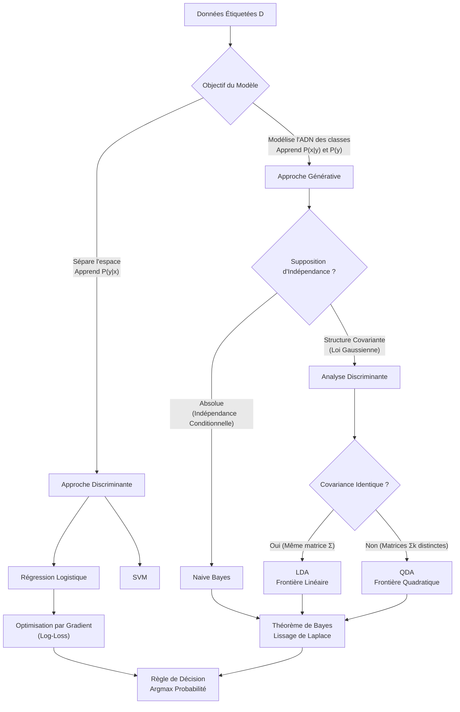

# 3 - Classification Supervisé

Date de création: 11 mars 2026 10:32
Cours: Machine Learning
Quadrimestre: Q2
État: Terminé

# Introduction

L'étude du cerveau humain en tant que système de traitement de l'information a radicalement évolué sous l'influence des sciences de l'apprentissage automatique.

Si la régression supervisée s'apparente à la régulation continue de nos états internes (homéostasie), la classification correspond à la **prise de décision catégorielle, au sens technique, une tâche d'apprentissage supervisé consistant à apprendre une fonction qui associe des étiquettes de classe catégorielles à des vecteurs de caractéristiques (features)**. Face à un stimulus, les ganglions de la base et l'amygdale ne calculent pas une réponse continue, ils forcent un choix exclusif : **fuir ou combattre, ami ou prédateur.** Ce mécanisme de "vainqueur rafle tout" (winner-takes-all) trouve une résonance directe dans les algorithmes de classification, où l'objectif est de projeter une réalité multidimensionnelle complexe vers un ensemble fini et exclusif d'étiquettes, en traçant des frontières de décision nettes dans l'espace des possibles.

---

## Le "Pourquoi"

L'enjeu central est d'**apprendre une fonction capable d'assigner une étiquette catégorielle (discrète) à une observation donnée.** Il s'agit de transformer des caractéristiques continues en probabilités d'appartenance à une classe pour automatiser la ségrégation de l'information et la prise de décision.

---

## Indice Visuel de Dépendance 🗺️

---

# 1. Fondations et Tâches de Classification

---

## Qu'est-ce que la classification ?

L'assignation mathématique d'une observation à une et une seule classe via des données étiquetées en phase d'entraînement.

- **Binaire :** 2 classes (ex: Spam / Non-Spam). $\mathcal{Y} = \{0, 1\}$ ou $\{-1, +1\}$.
- **Multiclasse :** > 2 classes (ex: Type de fleur Iris). Utilisation du **One-Hot Encoding** $o_k(y) = \mathbb{I}(y=k) \in \{0,1\}$.

---

## Mécanique de Décision (Scoring vs Probabilités)

Un modèle de classification ne recrache pas directement le mot final de la catégorie. Le processus se fait par strates.

---

### 1. Les Score Bruts

L'algorithme calcule d'abord une valeur mathématique (un score) pour chaque classe. L'objectif basique est de prédire la classe qui obtient le score maximal.

$$
f(x) \in \mathbb{R}^g
$$

---

### 2. Les probabilités

**Ces scores sont souvent transformés en probabilités** (des valeurs strictement comprises entre 0 et 1). C'est un moyen pour le modèle d'exprimer son degré de certitude.

$$
\pi(x) \in [0,1]
$$

---

### 3. Le seuil (Thresholding)

Pour passer d'une probabilité à une décision stricte (l'étiquette dure), **on définit un seuil**. En général, si la probabilité dépasse $0,5$, on considère que la condition est remplie et on attribue la classe correspondante.

<aside>
🧠

Dans le cerveau, cela correspond au **potentiel d'action** d'un neurone (loi du tout ou rien). Le neurone accumule des signaux électriques (scores $f(x)$) dans son soma. Si la somme dépasse un seuil de dépolarisation précis (le threshold $c$), le neurone "décharge" et envoie un signal (Classe 1). Sinon, il reste silencieux (Classe 0).

</aside>

---

# **2. Séparabilité Linéaire et Géométrie**

Si vous visualisez vos données sous forme de points sur un graphique, l'objectif de l'algorithme est de tracer une ligne pour séparer ces points selon leurs catégories.

> Des données sont linéairement séparables s'il existe une ligne droite (en 2D) ou un plan plat (hyperplan en 3D/nD) capable de diviser parfaitement les classes.
> 
- Les zones du graphique où l'algorithme prédira toujours la classe A ou la classe B s'appellent les **régions de décision**.
- La limite de séparation exacte entre ces régions est la **frontière de décision**.
- Si l'algorithme arrive à séparer les données en utilisant une ligne droite parfaite, on dit que c'est un **Classifieur Linéaire**. Si les données peuvent être séparées par cette ligne sans aucune erreur, elles sont considérées comme **"linéairement séparables"**.

**L'équation d'un hyperplan séparateur :** $w^T x + b = 0$ (où $w$ oriente la frontière et $b$ la déplace).

<aside>
💡

Les *Brackets* d'Esport (ex: *Valorant*). Le système place une frontière nette (hyperplan) sur un score : si votre MMR est supérieur à 1500, vous êtes séparé de la masse et classé "Pro", sinon vous êtes "Amateur".

</aside>

---

# 2. L'Architecture des Classifieurs (Génératif vs Discriminant)

Deux philosophies mathématiques pour tracer la **frontière de décision** (l'hyperplan où les probabilités des classes sont à égalité).

---

## Approche Discriminante

**L'algorithme ne se soucie pas de la forme globale des données**. Il cherche directement à tracer la meilleure ligne de séparation possible en minimisant ses erreurs. La Régression Logistique ou les Réseaux de Neurones utilisent cette approche.

> Optimise $P(y|x)$ via la minimisation du risque empirique (ERM).
> 

**Question :** *"Quelle est la meilleure frontière pour séparer ces points ?"*

---

## Approche Générative

L'algorithme cherche d'abord à **comprendre comment les données de chaque classe sont formées globalement** (leurs distributions statistiques). Ensuite, face à une nouvelle observation, il utilise une règle mathématique appelée **"théorème de Bayes"** pour déduire à quelle classe cette observation a le plus de probabilité d'appartenir. C'est le cas des méthodes comme **Naive Bayes, LDA et QDA.**

> Modélise la densité de probabilité interne de chaque classe $P(x|y)$ et la probabilité a priori $P(y)$.
> 

**Question :** *"Quelle classe produit habituellement ce genre de données ?"*

---

## Tableau de Confrontation

| Caractéristique | Approche Discriminante (LogReg, SVM) | Approche Générative (Naive Bayes, LDA, QDA) |
| --- | --- | --- |
| **Objectif Mathématique** | Apprendre la frontière entre les classes | Apprendre la forme / distribution de chaque classe |
| **Mécanisme mathématique** | Optimisation de Fonction de Perte | Théorème de Bayes |
| **Analogie** | **Matchmaking de jeu vidéo** (Au-dessus de 2000 Elo = Platine). Coupe l'espace en deux. | **Plan de jeu d'un entraîneur :** simule et modélise comment l'équipe adverse "tend à se comporter" globalement. |

<aside>
🧠

Le flux ascendant (*bottom-up*) de la rétine au cortex visuel est **discriminant** (filtre les variations pour identifier l'objet). À l'inverse, les connexions de rétroaction (*top-down*) fonctionnent comme un modèle **génératif** : si vous marchez dans une forêt sombre, votre "Cerveau Bayésien" peut générer l'image d'un ours à partir d'une simple ombre avant même la fin du traitement visuel.

</aside>

---

# **3. Régression Logistique et Log-Loss**

Un classifieur discriminant qui écrase un score linéaire via une fonction sigmoïde pour sortir une probabilité $\pi(x)$.

---

## Régression Logistique (ou **perte de Bernoulli**)

La régression linéaire pure échoue en classification car elle produit des valeurs hors de l'intervalle $[0,1]$. La Régression Logistique résout ce problème en "écrasant" (squashing) un score linéaire à travers une **fonction Sigmoïde**.

<aside>
🧠

**Un neurone a une limite physique de vitesse de décharge.** Même avec une stimulation infinie, sa fréquence sature. **Cette courbe en "S"** (plate, grimpant vite, puis saturant) e**mpêche les signaux de devenir incontrôlables**, assurant une stabilité dynamique.

</aside>

### Score Linéaire

$$
f(x) = \theta^T x
$$

---

### Compression Logistique

$$
\pi(x|\theta) = s(f(x)) = \frac{1}{1+\exp(-\theta^T x)}
$$

Ici, $\theta^T x$ représente la somme pondérée des entrées (le score ou logit). La fonction sigmoïde agit comme un filtre qui transforme un score allant de l'infini négatif à l'infini positif en une valeur de confiance probabiliste.

---

### **Le Logit (L'inverse)**

Les caractéristiques $x$ agissent linéairement sur le logarithme des cotes (log-odds).

$$
\log\left(\frac{\pi}{1-\pi}\right) = \theta^T x
$$

---

👉 **Le "Vibe Score" de l'algorithme *TikTok For You (FYP)*.** 
Il compile vos likes et écrase ce score pour sortir une probabilité : "95% de chances que vous aimiez cette vidéo Cottagecore", déclenchant ou non son affichage.

---

## La Perte : Log-Loss (Cross-Entropy)

Puisque l'utilisation de la sigmoïde rend l'erreur quadratique (MSE) non-convexe, la Régression Logistique utilise la Log-Loss.

### Formule

$$
L(y, \pi(x)) = -y \log(\pi(x)) - (1-y)\log(1-\pi(x))
$$

### **Philosophie**

Elle pénalise de manière exponentielle les erreurs "confiantes". Si vous prédisez une probabilité de $0.99$ pour la classe 1, mais que la réalité est la classe 0, la perte tend vers l'infini.

**Analogie :** Vous jouez à "Chaud ou Froid". Si vous êtes très confiant et criez "C'est ici !" alors que vous êtes glacé, la punition (perte) est énorme pour vous forcer à retenir la leçon.

<aside>
🧠

La Log-Loss est la transcription mathématique exacte du système de **dopamine** (Reward Prediction Error). Si votre cerveau est convaincu à 99% qu'une action va vous apporter une récompense et que vous échouez, la chute de dopamine est vertigineuse, forçant une mise à jour immédiate et drastique de vos poids synaptiques $\theta$. Une erreur sur laquelle vous aviez un doute (probabilité de 50%) cause une correction beaucoup plus douce.

</aside>

---

### Optimisation

Aucune solution analytique (One-shot / OLS) n'existe. L'algorithme doit itérer via la **Descente de Gradient** pour minimiser le risque empirique.

---

## 4. Analyse Discriminante (LDA & QDA)

Ce sont des modèles **génératifs**. Ils utilisent le théorème de Bayes et supposent que, au sein de chaque classe, les données suivent une distribution Normale Multivariée (une cloche gaussienne en plusieurs dimensions).

$$
P(y=k|x) = \frac{p(x|y=k)\pi_k}{\sum_{j=1}^g p(x|y=j)\pi_j}
$$

---

## LDA (Linear Discriminant Analysis)

Cette méthode force toutes les classes à avoir exactement la même forme d'éparpillement (même structure de covariance). Cette règle très stricte garantit que la frontière tracée entre les classes sera toujours une **ligne droite**.

- **Hypothèse :** Toutes les classes partagent exactement la **même matrice de covariance** $\Sigma$. Les "nuages" de points de chaque classe ont la même orientation et la même dispersion.
- **Frontière :** Linéaire. L'égalité des covariances fait s'annuler les termes quadratiques dans les mathématiques.
- **Avantage :** Ultra-robuste en haute dimension car elle nécessite l'estimation de peu de paramètres.

---

## QDA (Quadratic Discriminant Analysis)

C'est une version plus souple. Elle permet à chaque classe d'avoir son propre niveau d'éparpillement. Grâce à cela, la frontière de décision peut prendre des formes **courbes (quadratiques)**. La contrepartie est que le modèle devient plus complexe et demande plus de calculs de paramètres.

- **Hypothèse :** Chaque classe possède sa **propre matrice de covariance** $\Sigma_k$. Les "nuages" de points ont des formes et des tailles différentes.
- **Frontière :** Quadratique (courbée, elliptique, parabolique).
- **Danger :** L'estimation d'une matrice $\Sigma_k$ par classe exige $O(p^2 \times g)$ paramètres. C'est une recette garantie pour l'**overfitting** si votre dataset est petit par rapport au nombre de variables.

---

# 5. Naive Bayes : La simplification extrême

Un algorithme génératif multiclasse qui fait l'hypothèse (souvent fausse, d'où le terme "naïf") de l'**indépendance conditionnelle** : il suppose que toutes les caractéristiques d'une classe n'ont aucune corrélation entre elles.

> Historiquement célèbre pour le filtrage des e-mails indésirables (les spams).
> 

---

## **Pourquoi le qualifier de "Naïf" ?**

L'algorithme fait une supposition extrêmement simpliste pour faciliter ses calculs : il considère que toutes les caractéristiques d'une donnée (par exemple, chaque mot dans un e-mail) sont **totalement indépendantes les unes des autres**. En réalité, c'est faux (le mot "gagner" apparaît souvent avec le mot "argent"), mais malgré ce défaut de logique, l'algorithme est performant en pratique.

---

## Mécanique

L'équation complexe de la distribution conjointe est brisée en une simple multiplication de probabilités univariées :

$$
p(x|y=k) = \prod_{j=1}^p p(x_j|y=k)
$$

- **Variables Numériques :** Modélisées par des Gaussiennes 1D indépendantes. (Similaire à QDA mais avec des matrices de covariance strictement diagonales).
- **Variables Catégorielles :** Modélisées par la fréquence d'apparition (comptage).

---

## Le Lissage de Laplace (Laplace Smoothing)

Si le modèle rencontre une valeur inédite lors de l'évaluation (ex: un mot jamais vu dans un filtre anti-spam), la probabilité de ce mot est de $0$. À cause de la règle de multiplication de Naive Bayes, tout le calcul s'annule (0 multiplié par quoi que ce soit fait 0).

On ajoute donc une constante d'ignorance $\alpha$ (généralement $1$) à chaque comptage pour assurer une probabilité résiduelle :

$$
\rho_{kjm} = \frac{n_{kjm} + \alpha}{n_k + \alpha M_j}
$$

<aside>
🧠

**Naive Bayes**, c'est l'heuristique de survie d'un animal (ou d'un joueur débutant). S'il entend un grognement, il ajoute 50% de probabilité de danger. S'il voit une ombre, il ajoute 50%. Il multiplie les signaux de façon indépendante sans comprendre le contexte global.

</aside>

Le **Lissage de Laplace**, c'est l'instinct de prudence inné. Même si vous n'avez jamais vu un prédateur avec des taches violettes (fréquence de 0 dans votre base de données), votre cerveau n'évalue pas le danger à 0 absolu. Il accorde une probabilité de base minimale ($\alpha$) à l'inconnu, évitant un "crash" mortel de votre système d'évaluation des menaces.