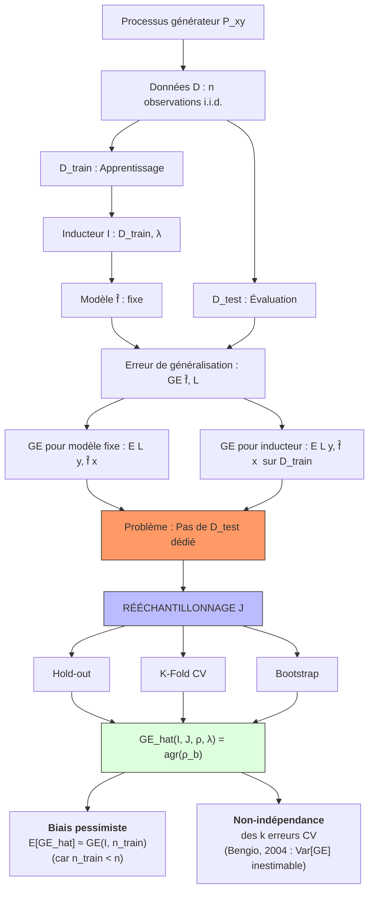

# 4 - Évaluation de performance

Date de création: 11 mars 2026 10:57
Cours: Machine Learning
Quadrimestre: Q2
État: Terminé

# INTRODUCTION

L’évaluation des performances constitue le système nerveux de tout pipeline ML : sans elle, l’optimisation est aveugle et la comparaison d’algorithmes est sans fondement statistique. Ce chapitre couvre la chaîne complète, du **risque de généralisation théorique** jusqu’aux **stratégies pratiques de rééchantillonnage**, en passant par toutes les métriques d’erreur pour la régression et la classification. Il pose les bases rigoureuses qui permettront ensuite d’aborder les courbes ROC, le calcul d’AUC et les métriques multi-classes.

---

## Le Pourquoi 🎯

**Enjeu central :** L’erreur d’entraînement est un estimateur **optimistement biaisé** de la performance future — un modèle qui mémorise le bruit semble parfait sur les données connues mais échoue sur toute donnée nouvelle. Ce chapitre résout ce problème en construisant des estimateurs **non biaisés** (ou à biais maîtrisé) de l’erreur de généralisation réelle.

Ce que le chapitre précédent (Régression) ne pouvait pas résoudre : comment savoir si un modèle *généralise* et pas seulement *mémorise* ? Ici, on répond formellement à cette question.

---

## Visuel



> **Lecture :** Si on ne comprend pas la distinction **GE pour modèle** vs **GE pour inducteur**, on ne peut pas comprendre pourquoi les modèles issus des folds CV sont des résultats intermédiaires à jeter. Si on ne comprend pas le biais pessimiste, on ne peut pas interpréter correctement les scores de cross-validation.
> 

---

# Erreur d’Entraînement (Train Error / Optimistic Bias)

L’**erreur d’entraînement** (a.k.a. erreur de resubstitution ou erreur apparente) est la perte mesurée sur les mêmes données ayant servi à entraîner le modèle :

> L'erreur du modèle sur les données qu'il a utilisées pour s'entraîner.
> 

$$
\mathcal{R}_{\text{emp}}(\hat{f}) = \rho(\mathbf{y}_{\text{train}}, \mathbf{F}_{\text{train}}) = \frac{1}{n}\sum_{i=1}^n L\left(y^{(i)}, \hat{f}\left(x^{(i)}\right)\right)
$$

C’est un estimateur **optimistement biaisé** de l’erreur de généralisation. Le modèle a été ajusté pour minimiser précisément cet objectif → il “connaît” les réponses.

---

## **Optimisme du train error**

$$
\text{Opt} = \text{GE}(\hat{f}) - \mathcal{R}_{\text{emp}}(\hat{f}) \geq 0
$$

**Mathématiquement :** en minimisant l’ERM sur $\mathcal{D}_{\text{train}}$, on choisit $\hat{f}$ dans un espace $\mathcal{H}$ de manière à minimiser $\mathcal{R}_{\text{emp}}$. La corrélation entre $\hat{f}$ et les $y^{(i)}$ d’entraînement crée un biais positif ($\mathcal{R}_{\text{emp}} < \text{GE}$).

### Cas extrême

- **1-NN :** Pour le 1-plus-proche-voisin, chaque point est son propre voisin le plus proche au moment du test → train error = 0 **toujours**, quelle que soit la complexité de la tâche. Cela ne signifie nullement que le modèle est parfait.
- **Interpolateur :** Un modèle suffisamment flexible (spline interpolante, processus gaussien avec noyau adéquat) peut **toujours** atteindre train error = 0 en passant exactement par chaque point de données, y compris les points bruités.
- **Convergence avec $n$ :** Pour la plupart des algorithmes bien spécifiés, $\text{Opt} \to 0$ quand $n \to \infty$ (avec $n_{\text{train}} = n$ fixé). En pratique, sur des KNN avec $k=15$ sur 30K points spirals, le gap train-test devient négligeable (< 0.01 en MCE).
- **Goodness-of-fit classiques** ($R^2$, AIC, BIC, likelihood, deviance) : tous basés sur le train error. Valides seulement pour des modèles de capacité restreinte (ex. LM avec peu de paramètres), sur suffisamment de données, avec les hypothèses distributionnelles respectées. Dans un cadre ML général, **out-of-sample testing is always a good idea**.

---

## Flux étape par étape

1. Entraîner $\hat{f} = \mathcal{I}(\mathcal{D}_{\text{train}})$ via ERM
2. Générer $\mathbf{F}_{\text{train}} = [\hat{f}(x^{(1)}), ..., \hat{f}(x^{(n)})]^T$ sur les **mêmes** données
3. Calculer $\rho(\mathbf{y}_{\text{train}}, \mathbf{F}_{\text{train}})$
4. **Ce qui entre :** données vues. **Ce qui sort :** erreur sous-estimée.
5. **Sous le capot :** le modèle a été spécifiquement ajusté pour ces points → les résidus sont anormalement petits

**Exemple polynomial :** $f(\mathbf{x}|\theta) = \sum_{j=0}^d \theta_j x^j$. 

- Pour $d=9$, MSE train = 0.001 (clairement overfitting).
- Pour $d=3$, MSE train = 0.003 (bonne approximation).
- Pour $d=1$, MSE train = 0.036 (underfitting).

Choisir $d$ sur le seul critère MSE train → toujours sélectionner $d=9$, le modèle le plus complexe.

---

## Hypothèses et Conditions de Validité

- Le train error sous-estime GE **sauf si** le modèle est strictement contraint (capacité VC finie basse) ET les données sont abondantes. Dans le régime Big Data ($n \gg p$) avec LM, le biais peut être négligeable.
- **Interpolateurs :** Pour des splines interpolantes ou des GP avec noyau approprié, train error = 0 par construction, mais le modèle interpole le bruit → GE élevée.
- **Classification** : un classificateur constant qui mémorise les labels d’entraînement aura train error = 0 via la procédure “si $x \in \mathcal{D}_{\text{train}}$, retourner $y$ mémorisé” — train error nul, GE catastrophique.

---

## Streaming / Algorithme TikTok

Le train error d’un algorithme de recommandation TikTok mesuré sur les vidéos déjà vues par l’utilisateur ne prédit **rien** de sa performance sur de nouvelles vidéos. L’algo a ajusté ses poids précisément sur ces interactions passées → biais optimiste garanti. C’est pourquoi TikTok utilise un **holdout set en temps réel** : à chaque déploiement d’une nouvelle version de l’algo, elle est testée sur un sample d’utilisateurs qui n’ont **pas** servi à l’entraîner.

- $\hat{f}$ = modèle de recommandation
- train error = taux de “likes” sur vidéos déjà vues (mémorisées)
- GE = taux d’engagement sur les nouvelles vidéos servies demain

---

<aside>
🧠

Le phénomène d’overfitting biologique est l’**hyperspecificité mnésique**. Après un apprentissage intensif (répétition d’un stimulus identique), certains neurones de l’hippocampe deviennent hyperspécifiques à ce stimulus exact et ne généralisent plus à des variantes. C’est l’équivalent d’un 1-NN biologique : reconnaît parfaitement l’exemple vu, échoue sur des variations. Le **sleeping consolidation** (replay hippocampo-néocortical pendant le sommeil) extrait les régularités générales et réduit cet overfitting biologique, jouant le rôle d’une régularisation naturelle.

</aside>

---

# Erreur de Généralisation (GE)

L’**erreur de généralisation** (GE) est l’erreur attendue d’un modèle $\hat{f}$ sur un nouveau point $(x, y)$ tiré indépendamment du même processus générateur $\mathbb{P}_{xy}$ avec comme l'espérance de la perte $L$ :

> La performance réelle du modèle sur des données infinies qu'il n'a jamais vues
> 

<aside>
💡

La vraie vie. C'est impossible à calculer parfaitement car on n'a pas des données infinies, donc on doit l'estimer.

</aside>

$$
\text{GE}(\hat{f}, L) := \mathbb{E}_{(x,y) \sim \mathbb{P}_{xy}}\left[L\left(y, \hat{f}(x)\right)\right]
$$

> Si on tirait infiniment de nouveaux points de $\mathbb{P}_{xy}$ et qu’on calculait la perte à chaque fois, quelle serait la moyenne ? C’est l’erreur que le modèle ferait *dans la vraie vie*, pas sur des données connues.
> 

---

**GE pour un modèle fixe** (estimateur avec $m$ points de test i.i.d.) :

<aside>
💡

**i.i.d : Indépendantes et Identiquement Distribuées**

C'est l'hypothèse de base que l'on fait sur presque tous les jeux de données : on considère que chaque observation est issue du même "moule" et n'influence pas les autres.

</aside>

$$
\widehat{\text{GE}}(\hat{f}, L) := \frac{1}{m} \sum_{(x,y) \in \mathcal{D}_{\text{test}}} L\left(y, \hat{f}(x)\right)
$$

Chaque terme $L(y^{(i)}, \hat{f}(x^{(i)}))$ est une variable aléatoire i.i.d. (car les points sont i.i.d.). Par la Loi des Grands Nombres, leur moyenne converge vers l’espérance. Donc $\widehat{\text{GE}}$ est un estimateur **non biaisé** de GE : $\mathbb{E}[\widehat{\text{GE}}] = \text{GE}(\hat{f})$.

Sa variance vaut $\frac{1}{m}\mathbb{V}[L(y, \hat{f}(x))]$ — elle décroît **linéairement** avec la taille du test set. Par le TCL, sa distribution est approximativement gaussienne → on peut faire des intervalles de confiance (NHST, CI) sur ce GE.

---

**GE pour l’inducteur** (expectation sur $\mathcal{D}_{\text{train}}$ ET $(x,y)$) :

$$
\text{GE}(\mathcal{I}, \lambda, n_{\text{train}}, \rho) := \lim_{n_{\text{test}} \to \infty} \mathbb{E}\left[\rho\left(\mathbf{y}, F_{\mathcal{D}_{\text{test}}, \mathcal{I}(\mathcal{D}_{\text{train}}, \lambda)}\right)\right]
$$

Ici l’espérance porte simultanément sur l’aléatoire de $\mathcal{D}_{\text{train}}$ (quel dataset on tire) **et** sur $(x,y)$ (quel point on évalue). C’est la vraie performance “en moyenne sur tous les datasets d’entraînement possibles de taille $n_{\text{train}}$”.

**Lien :** $\text{GE}(\hat{f}, L) = \text{GE}(\mathcal{I}, \lambda, n_{\text{train}}, \rho_L | \mathcal{D}_{\text{train}})$ — la GE du modèle est la GE de l’inducteur conditionnée sur un $\mathcal{D}_{\text{train}}$ fixé.

---

## Flux étape par étape

1. **Fixer le processus** : $\mathbb{P}_{xy}$ génère des couples $(x, y)$ i.i.d.
2. **Tirer** $\mathcal{D}_{\text{train}} \sim \mathbb{P}_{xy}^{n_{\text{train}}}$ → entraîner $\hat{f} = \mathcal{I}(\mathcal{D}_{\text{train}}, \lambda)$
3. **Tirer** $\mathcal{D}_{\text{test}} \sim \mathbb{P}_{xy}^m$ **indépendamment** de $\mathcal{D}_{\text{train}}$
4. **Calculer** $\widehat{\text{GE}} = \frac{1}{m}\sum L(y^{(i)}, \hat{f}(x^{(i)}))$
5. **Si** $(x,y) \in \mathcal{D}_{\text{train}}$ → estimateur biaisé vers le bas (overfitting leak)

<aside>
⚠️

**Point de rupture critique** : En pratique, on n’a qu’un seul dataset $\mathcal{D}$ de taille $n$. Le modèle final sera entraîné sur **tout** $\mathcal{D}$. Mais pour l’évaluer, on a besoin de données non vues. C’est la **contradiction fondamentale** de l’évaluation ML → justifie tout le rééchantillonnage.

</aside>

---

### Hypothèses et Conditions de Validité

- **i.i.d.** : $\mathcal{D}_{\text{test}}$ doit être tiré indépendamment de $\mathbb{P}_{xy}$. Violé → estimateur biaisé (ex. données temporelles séquentielles, données groupées par patient).
- **Représentativité** : $\mathcal{D}_{\text{test}}$ doit refléter la distribution cible. Si le train set vient d’une population différente (dataset shift), GE estimé ≠ GE réel.
- **Taille $m$** : trop petit → forte variance de l’estimateur. La distribution empirique de $L(y, \hat{f}(x))$ est souvent unimodale avec queue longue (surtout en L2). Quelques outliers font exploser la variance.
- **Données corrélées** (ex. images du même patient) : utiliser Leave-One-Object-Out, pas une CV standard, pour éviter la mémorisation de “signatures” individuelles.

---

## Analogie : Esport / Matchmaking

Le Generalization Error est **l’ELO réel** d’un joueur de League of Legends — la force vraie qu’il aurait contre n’importe quel adversaire, peu importe le méta ou la map.

- $\mathbb{P}_{xy}$ = le pool infini de toutes les parties possibles (tous les matchups, tous les patchs)
- $\hat{f}$ = le niveau de jeu après un entraînement sur certaines parties
- $L(y, \hat{f}(x))$ = résultat d’une partie spécifique (win=0, loss=1)
- $\widehat{\text{GE}}$ = Votre winrate sur vos 50 dernières parties (estimation sur $m=50$ parties i.i.d.)
- **Biais optimiste (train error)** = jouer contre des bots (tes données d’entraînement) → Vous semblez imbattable mais ça ne reflète rien

---

<aside>
🧠

L’hippocampe encode une représentation statistique de l’environnement (modèle génératif de $\mathbb{P}_{xy}$). Il teste constamment ce modèle sur de nouveaux stimuli via le **pattern completion** et la **pattern separation** (reconnaissance de similarité vs nouveauté). L’erreur de prédiction sur un nouveau stimulus est biologiquement le signal de mise à jour des poids synaptiques par potentiation à long terme (LTP). La capacité de généralisation du cerveau repose sur une représentation **compressée** — il ne mémorise pas chaque stimulus, il en extrait la structure.

</aside>

---

## Application Pratique

**Détection de fraude bancaire (Stripe/Revolut) :** On entraîne sur les transactions frauduleuses des 6 derniers mois. La GE réelle = le taux de faux négatifs sur les *nouvelles* tentatives de fraude (non vues). Si on évalue sur les transactions d’entraînement → on rate toutes les nouvelles techniques de fraude post-entraînement. Le paramètre critique : la taille $m$ du test set doit être suffisante pour capturer la distribution des cas rares (fraudes = <1% des transactions) → stratification nécessaire.

---

# Erreur de Test / Hold-out (Test Error)

L’**erreur de test** (ou erreur hold-out) est la perte mesurée sur un ensemble $\mathcal{D}_{\text{test}}$ **disjoint** de $\mathcal{D}_{\text{train}}$ et non utilisé pendant l’apprentissage :

> L'erreur mesurée sur un sous-ensemble de données (Test Set) qu'on a caché au modèle pendant son entraînement.
> 

$$
\rho(\mathbf{y}_{\text{test}}, \mathbf{F}_{\text{test}}) \quad \text{où} \quad \mathbf{F}_{\text{test}} = [\hat{f}_{\mathcal{D}_{\text{train}}}(x^{(1)}_{\text{test}}), ..., \hat{f}_{\mathcal{D}_{\text{train}}}(x^{(m)}_{\text{test}})]^T
$$

On entraîne sur $\mathcal{D}_{\text{train}}$, on évalue sur $\mathcal{D}_{\text{test}}$ — les deux étant tirés indépendamment. La partition typique : 2/3 train, 1/3 test.

---

## **Propriétés statistiques de l’estimateur de test error**

Puisque $\{(x^{(i)}, y^{(i)})\}_{i \in \mathcal{D}_{\text{test}}}$ sont i.i.d. et indépendants de $\hat{f}$ (qui a été appris sur $\mathcal{D}_{\text{train}}$) :

$$
\mathbb{E}[\widehat{\text{GE}}(\hat{f})] = \text{GE}(\hat{f}) \quad \text{(non biaisé pour GE du modèle)}
$$

$$
\mathbb{V}[\widehat{\text{GE}}(\hat{f})] = \frac{1}{m}\mathbb{V}\left[L(y, \hat{f}(x))\right] \quad \text{(décroît en } \frac{1}{m}\text{)}
$$

**Biais-variance de l’estimateur hold-out** (contrôlé par le ratio $s = n_{\text{train}}/n$) :

$$
s \text{ petit} \Rightarrow n_{\text{train}} \text{ petit} \Rightarrow \text{biais pessimiste fort}
$$

$$
s \text{ grand} \Rightarrow m = (1-s) \cdot n \text{ petit} \Rightarrow \text{variance forte}
$$

### **Résultat empirique**

Sur l’expérience spirals/CART, le MSE de l’estimateur hold-out (MSE de l’estimateur, pas MSE du modèle) est minimisé autour de $s \approx 2/3$ (67% pour l’entraînement). Cette règle des 2/3 est validée dans plusieurs études empiriques.

### **Comportements contraires** :

- Train error **décroît** quand $n_{\text{train}}$ augmente (plus de données = meilleur fit)
- Train error **décroît** quand la complexité du modèle augmente (plus flexible = meilleur fit local)
- Test error **décroît** quand $n_{\text{train}}$ augmente (meilleure généralisation)
- Test error **augmente** quand la complexité dépasse un optimal (overfitting)
- La variance du test error **augmente** avec la complexité du modèle

---

## Flux étape par étape

1. Disposer de $\mathcal{D}$ de taille $n$ i.i.d. depuis $\mathbb{P}_{xy}$
2. **Partitionner** : $\mathcal{D}_{\text{train}}$ ($s \cdot n$ points) + $\mathcal{D}_{\text{test}}$ ($(1-s) \cdot n$ points) — aléatoirement, **une seule fois**
3. Entraîner $\hat{f} = \mathcal{I}(\mathcal{D}_{\text{train}}, \lambda)$
4. Générer les prédictions sur $\mathcal{D}_{\text{test}}$ uniquement
5. Calculer la métrique $\rho$
6. **Résultat :** estimateur non biaisé de GE pour le modèle fixe, mais possiblement à forte variance si $m$ petit

**Limites fondamentales :** Ce procédure estime $\text{GE}(\mathcal{I}, n_{\text{train}})$ (avec $n_{\text{train}} = s \cdot n$) et non $\text{GE}(\mathcal{I}, n)$ (avec toutes les données). On sous-estime donc la performance du modèle final (qui sera entraîné sur tout $\mathcal{D}$).

---

## Hypothèses et Conditions de Validité

- **I.i.d.** : si les données sont ordonnées temporellement, la partition doit respecter l’ordre chronologique (pas de mélange aléatoire) pour éviter le data leakage temporel.
- **Représentativité** : avec peu de données ($n < 200$), une seule partition 2/3-1/3 produit une variance très élevée. Sur le dataset `sonar` ($n=208$), des répétitions 2/3-1/3 donnent des MCE allant de 0.2 à 0.5 — fourchette inutilisable.
- **Test set dédié** : un test set qu’on consulte plusieurs fois pour choisir des hyperparamètres devient un proxy du train set (data leakage de validation). Le test set **final** ne doit être regardé qu’une seule fois.

---

## Esport / Tournois

Le holdout split correspond au **stage** dans un tournoi d’esport. Durant la phase de groupes (entraînement), les équipes étudient les stratégies adverses. Le test set, c’est les matchs de knockout qu’elles n’ont **jamais** joués. La variance du test error correspond à la variabilité intrinsèque d’un seul match : une équipe forte peut perdre sur un “best-of-1” (petit $m$), mais son niveau réel s’estime mieux sur un “best-of-5” (grand $m$).

- $s=0.05$ (5% train, 95% test) = entraînement négligeable, tous les matchs en “qualifier” (train error trop faible → biais pessimiste énorme sur GE)
- $s=0.95$ (95% train, 5% test) = très peu de matchs pour évaluer (forte variance)
- $s=0.67$ = optimal empirique (assez de données pour bien apprendre, assez de matchs pour estimer correctement)

<aside>
🧠

Le hold-out split mime le processus naturel d’**acquisition de nouvelles compétences** chez l’enfant. L’hippocampe consolide des séquences d’entraînement (examples vus), mais la vraie évaluation de la compétence arrive uniquement sur des **situations nouvelles**. Le cortex préfrontal orchestre ce “test” en inhibant les réponses automatiques apprisées pour évaluer la flexibilité cognitive. Biologiquement, cet inhibiteur correspond à la pression sélective sur les réponses non-surapprisées.

</aside>

---

# Overfitting & Underfitting

**Underfitting (sous-ajustement)** : le modèle $\hat{f}$ ne capture pas la structure réelle des données. Formellement :

$$
UF(\hat{f}, L) := \text{GE}(\hat{f}, L) - \text{GE}(f^*, L) \geq 0
$$

où $f^*$ est le modèle de Bayes optimal (meilleur modèle théorique possible). L’underfitting mesure l’écart à l’optimal — il correspond au **biais** dans la décomposition biais-variance.

---

**Overfitting (sur-ajustement)** : le modèle capte le bruit ou des artéfacts de $\mathcal{D}_{\text{train}}$ qui ne généralisent pas. Formellement :

$$
OF(\hat{f}, L) := \text{GE}(\hat{f}, L) - \mathcal{R}_{\text{emp}}(\hat{f}, L) \geq 0
$$

L’overfitting mesure l’écart entre l’erreur réelle et l’erreur d’entraînement — il correspond à la **variance** dans la décomposition.

> **Note :** Un modèle peut simultanément overfitter (OF > 0) **et** underfitter (UF > 0). Le RHS du schéma cours (petit train error, grand test error) est un cas OF prioritaire.
> 

---

## **Décomposition biais-variance (régression, L2)**

$$
\text{GE}(\mathcal{I}) = \underbrace{\text{Biais}^2(\hat{f})}_{\text{underfitting}} + \underbrace{\mathbb{V}[\hat{f}]}_{\text{overfitting}} + \underbrace{\sigma^2_\epsilon}_{\text{bruit irréductible}}
$$

- $\text{Biais}^2(\hat{f}) = [\bar{f}(x) - f^*(x)]^2$ où $\bar{f} = \mathbb{E}_{\mathcal{D}}[\hat{f}]$ est la prédiction moyenne sur tous les datasets possibles. Mesure l’écart systématique entre la prédiction moyenne et la vérité.
- $\mathbb{V}[\hat{f}] = \mathbb{E}_{\mathcal{D}}[(\hat{f}(x) - \bar{f}(x))^2]$. Mesure la sensibilité aux fluctuations de $\mathcal{D}_{\text{train}}$.
- $\sigma^2_\epsilon$ = bruit irréductible du processus générateur. Plancher incompressible.

### **Règle générale (trade-off) :**

| Complexité modèle | Biais  | Variance  |
| --- | --- | --- |
| Faible (ex. LM degré 1) | Élevé | Faible |
| Optimale  | Minimal | Modérée |
| Élevée (ex. degré 9) | Faible | Élevée |

---

## Flux étape par étape

---

### **Diagnostic en pratique**

1. Calculer train error et test error
2. **Underfitting** : train error élevé ET test error élevé → augmenter la complexité, ajouter des features, changer de modèle
3. **Overfitting** : train error bas ET test error élevé → régulariser (Ridge, Lasso, Dropout), réduire la complexité, augmenter $n$
4. **Bon modèle** : train error ≈ test error, tous deux proches du Bayes error
5. **Bayes error inconnu** : on ne peut pas savoir si on underfit sans référence externe (label humain, modèle de référence)

---

### **Courbes d’apprentissage** :

- Train error qui descend + Val error qui suit → apprentissage normal
- Train error qui descend + Val error qui remonte → **alerte overfitting**
- Train error qui stagne haut + Val error haute → **alerte underfitting**

---

## Hypothèses et Conditions de Validité

- La décomposition biais-variance est **exacte** pour L2, **approximative** pour d’autres pertes.
- Pour les classificateurs discrets (0-1 loss), la décomposition est plus complexe et non-additive (Domingos, 2000).
- L’overfitting est **indétectable** sans data hors-entraînement : aucune métrique d’entraînement (AIC, BIC, $R^2$) ne suffit pour les modèles flexibles.
- L’underfitting est difficile à détecter sans connaître l’erreur de Bayes optimale.

---

# Métriques de Régression

Une **métrique de régression** $\rho : \mathbb{R}^m \times \mathbb{R}^m \to \mathbb{R}$ est une fonction qui mesure la qualité des prédictions continues $\hat{y}$ par rapport aux vraies valeurs $y$. Elle peut être basée sur la loss d’entraînement (inner loss) ou non (outer loss).

- **Inner loss** : la loss utilisée pour l’ERM (ex. MSE pour la régression linéaire).
- **Outer loss** : la métrique d’évaluation (peut différer de l’inner loss pour des raisons de lisibilité ou d’application).

Une métrique est dite **propre** si elle est minimisée uniquement quand le modèle capture correctement la distribution cible : $\mathbf{S}(Q, Q) \leq \mathbf{S}(F, Q)$ pour tout $F, Q \in \mathcal{F}$.

---

## **MSE (Mean Squared Error) — L2 loss**

$$
\rho_{\text{MSE}}(\mathbf{y}, \mathbf{F}) = \frac{1}{m}\sum_{i=1}^m (y^{(i)} - \hat{y}^{(i)})^2 \in [0; +\infty)
$$

Chaque résidu $r_i = y^{(i)} - \hat{y}^{(i)}$ est élevé au carré → les erreurs larges sont pénalisées quadratiquement. Un résidu de 10 contribue 100x plus qu’un résidu de 1.

---

## **SSE (Sum of Squared Errors)**

$$
\rho_{\text{SSE}} = m \cdot \rho_{\text{MSE}}
$$

dépend de $m$.

---

## **RMSE (Root Mean Squared Error)**

$$
\rho_{\text{RMSE}}(\mathbf{y}, \mathbf{F}) = \sqrt{\frac{1}{m}\sum_{i=1}^m (y^{(i)} - \hat{y}^{(i)})^2} = \sqrt{\rho_{\text{MSE}}}
$$

Ramène l’erreur dans l’**unité originale** de $y$ (MSE est en unité²). Si $y$ est en euros, MSE est en €², RMSE est en €.

---

## **MAE (Mean Absolute Error) — L1 loss**

$$
\rho_{\text{MAE}}(\mathbf{y}, \mathbf{F}) = \frac{1}{m}\sum_{i=1}^m |y^{(i)} - \hat{y}^{(i)}| \in [0; +\infty)
$$

Pénalisation proportionnelle aux résidus → robuste aux outliers.

---

## **MAPE (Mean Absolute Percentage Error)**

$$
\rho_{\text{MAPE}}(\mathbf{y}, \mathbf{F}) = \frac{1}{m}\sum_{i=1}^m \left|\frac{y^{(i)} - \hat{y}^{(i)}}{y^{(i)}}\right| \in [0; +\infty)
$$

Les petites valeurs de $|y|$ amplifient disproportionnellement l’erreur. Ne peut pas gérer $y=0$. Variantes : MASE (Mean Absolute Scaled Error), sMAPE (Symmetric MAPE).

---

## **$R^2$ (Coefficient de détermination)**

$$
\rho_{R^2}(\mathbf{y}, \mathbf{F}) = 1 - \frac{\sum_{i=1}^m (y^{(i)} - \hat{y}^{(i)})^2}{\sum_{i=1}^m (y^{(i)} - \bar{y})^2} = 1 - \frac{\text{SSE}_{\text{LinMod}}}{\text{SSE}_{\text{Intercept}}}
$$

**Interprétation :** Fraction de variance de $y$ expliquée par le modèle, relativement à un modèle constant $f(x) = \bar{y}$.

- $R^2 = 1$ → prédictions parfaites (tous les résidus nuls)
- $R^2 = 0$ → le modèle prédit aussi bien qu’un modèle constant
- $R^2 < 0$ → le modèle prédit **moins bien** qu’un modèle constant (possible sur données hors-train)

- Sur données d’entraînement d’un LM : $R^2 \in [0, 1]$ (garanti car LM domine le modèle constant)
- Sur données de test : peut être négatif → attention à ne pas confondre avec le train $R^2$

---

## Flux étape par étape

1. Calculer les résidus $r_i = y^{(i)} - \hat{y}^{(i)}$ pour chaque observation
2. Appliquer la transformation choisie (carré pour MSE, valeur absolue pour MAE, ratio pour MAPE)
3. Moyenner sur $m$ observations
4. Pour $R^2$ : calculer aussi $\text{SSE}_{\text{Intercept}} = \sum (y^{(i)} - \bar{y})^2$

---

## Hypothèses et Conditions de Validité

| Métrique | Condition de validité | Violation → |
| --- | --- | --- |
| MSE | Pas d’outliers extrêmes | Dominée par quelques points → estim. instable |
| MAE | Distribution symétrique souhaitable | Non-dérivable en 0 → gradient discontinu |
| MAPE | $y^{(i)} \neq 0$, $y^{(i)}$ d’ordre de grandeur homogène | Division par zéro, asymétrie de la pénalisation |
| RMSE | Idem MSE | Idem MSE, mais unité d’origine |
| $R^2$ (train) | LM bien spécifié, données d’entraînement | Toujours positif sur train, peut être négatif sur test |

⚠️ **MAPE critique :** Si $y$ représente des ventes, une prédiction de 0.5 vs 1 (erreur = 0.5) pèse 50%, tandis qu’une erreur de 50 vs 100 (même erreur absolue) pèse aussi 50%. Les erreurs sur petites valeurs dominent.

---

## Analogie : Gaming (RPG)

Imaginez que vous notez un DPS (Damage Per Second) de boss dans un MMORPG :

- **MSE** = noter la *surface d’erreur* de chaque attaque (dégâts différence² par seconde). Un crit raté de 1000 HP pèse 1 000 000 dans le score. Le boss ultra-difficile qui vous tue en 2 coups fait exploser le MSE.
- **MAE** = noter les *dégâts bruts* de chaque attaque (différence absolue). Chaque erreur compte proportionnellement.
- **RMSE** = la règle qui remet les dégâts dans l’**unité d’HP originale** (racine de la surface = longueur).
- **$R^2$** = votre taux d’efficacité vs un joueur qui ne fait **rien** (modèle constant = damage = 0). $R^2 = 0.9$ → vous êtes 10x plus efficace que quelqu’un d’immobile.

<aside>
🧠

L’erreur quadratique (MSE/L2) est biologiquement implémentée dans le **cervelet** pour le contrôle moteur. Les cellules de Purkinje comparent les copies d’efférence (prédictions motrices) aux retours proprioceptifs réels et calculent des erreurs de position de type L2. La robustesse L1 (MAE) est, elle, davantage associée aux circuits thalamiques qui codent des représentations éparses via des activations parcimonieuses (codage épars = minimisation du nombre de neurones actifs = régularisation L1 biologique).

</aside>

### Application Réel

**Airbnb - prédiction de prix :** 

- MSE pénalise excessivement les propriétés de luxe (outliers à 10K€/nuit).
- MAE plus robuste pour les décisions opérationnelles.
- MAPE permet d’avoir un taux d’erreur relatif (10% d’erreur sur 100€ = même score que 10% sur 1000€) → utile pour comparer la qualité de prédiction sur différents marchés.
- $R^2$ communiqué aux équipes produit pour valider que le modèle capture bien les variations de prix (cible : $R^2 > 0.7$ sur le test set).

---

# Métriques de Classification

Pour la **classification binaire** ($y \in \{0, 1\}$, où 1 = positif, 0 = négatif), les métriques fondamentales sont basées sur la **matrice de confusion** :

|  | Prédit Positif | Prédit Négatif |
| --- | --- | --- |
| **Réel Positif** | TP (True Positive) | FN (False Negative) |
| **Réel Négatif** | FP (False Positive) | TN (True Negative) |

Les **métriques probabilistes** (Brier Score, Log-Loss) nécessitent en plus les probabilités $\hat{\pi}^{(i)} = P(y=1|x^{(i)}) \in [0,1]$.

---

## **Accuracy (Taux de bonne classification)**

$$
\rho_{\text{ACC}} = \frac{1}{m}\sum_{i=1}^m \mathbf{1}[y^{(i)} = \hat{y}^{(i)}] = \frac{TP + TN}{TP + TN + FP + FN} \in [0,1]
$$

---

## **MCE (Misclassification Error)**

$$
\rho_{\text{MCE}} = 1 - \rho_{\text{ACC}} = \frac{1}{m}\sum_{i=1}^m \mathbf{1}[y^{(i)} \neq \hat{y}^{(i)}] \in [0,1]
$$

---

## **Brier Score**

$$
\rho_{\text{BS}} = \frac{1}{m}\sum_{i=1}^m (\hat{\pi}^{(i)} - y^{(i)})^2
$$

Propriété clé : **métrique propre**. La prédire les probabilités correctes minimise le Brier Score. Pénalise lourdement les prédictions très confiantes qui se trompent (si $\hat{\pi} = 0.99$ et $y = 0$ → contribution $(0.99)^2 \approx 0.98$).

---

## **Log-Loss (Cross-Entropy / Negative Log-Likelihood)**

$$
\rho_{\text{LL}} = \frac{1}{m}\sum_{i=1}^m \left[-y^{(i)} \log(\hat{\pi}^{(i)}) - (1 - y^{(i)}) \log(1 - \hat{\pi}^{(i)})\right]
$$

Aussi une **métrique propre**. Pénalise encore plus lourdement que le Brier Score les prédictions confiantes incorrectes (fonction logarithmique → pénalité → $+\infty$ si $\hat{\pi} = 0$ et $y = 1$).

---

## **Distinction Brier Score vs Log-Loss**

Brier Score est borné (MSE des probabilités) → moins sensible aux cas extrêmes. Log-Loss est non borné → plus discriminant sur les prédictions très confiantes.

---

## **Métriques dérivées (basées sur la matrice de confusion)**

$$
\text{TPR} = \text{Recall} = \text{Sensitivity} = \frac{TP}{TP + FN}
$$

$$
\text{FPR} = \text{Fall-out} = 1 - \text{Specificity} = \frac{FP}{FP + TN}
$$

$$
\text{Precision} = \frac{TP}{TP + FP}
$$

$$
F_1 = 2 \cdot \frac{\text{Precision} \cdot \text{Recall}}{\text{Precision} + \text{Recall}} = \frac{2TP}{2TP + FP + FN}
$$

---

## Flux étape par étape

1. Obtenir les probabilités $\hat{\pi}^{(i)}$ ou les classes $\hat{y}^{(i)}$ du modèle
2. Pour Accuracy/MCE : seuiller à 0.5 pour obtenir $\hat{y}$, comparer à $y$
3. Pour Brier Score/Log-Loss : utiliser directement $\hat{\pi}$ (sans seuillage)
4. Pour TPR/FPR/Precision : construire la matrice de confusion à partir d’un seuil
5. Pour les métriques de la famille ROC : faire varier le seuil → courbe

⚠️ **Données déséquilibrées :** Si 99% des exemples sont de classe 0 (ex. détection de fraude), un classificateur qui prédit toujours 0 obtient Accuracy = 99% → métrique inutile. Utiliser Brier Score, F1, ou ROC-AUC qui sont moins sensibles au déséquilibre.

---

## Hypothèses et Conditions de Validité

- **Accuracy** : ne convient qu’à des classes **balancées**. En cas de déséquilibre, elle est trompeuse.
- **Brier Score et Log-Loss** : requièrent des **probabilités calibrées** (modèle qui sort de vraies probabilités, pas juste des scores). Un SVM sort des “scores” non calibrés → nécessite calibration de Platt avant calcul du Brier Score.
- **F1** : harmonic mean de Precision et Recall. Sensible au déséquilibre dans un sens : un modèle qui prédit tout positif a F1 = 2·(1)·(n+/n) / (1 + n+/n) — pas forcément proche de 1.
- **MCE** : 0-1 loss n’est ni différentiable ni convexe → NP-hard à minimiser directement. Utiliser une **inner loss** differentiable (binomiale, hinge) pour l’optimisation.

---

## Détection de cheat en FPS

Dans un jeu compétitif (Valorant, CS2), le système anti-cheat est un classificateur binaire :
- $y = 1$ = joueur qui triche, $y = 0$ = joueur légitime
- TP = tricheur détecté et banni → bon
- FP = joueur légitime banni à tort → très mauvais (toxic pour la communauté)
- FN = tricheur non détecté → mauvais (mais moins grave socialement)

- **Accuracy** useless : si 99.9% des joueurs sont légitimes, prédire “tous légitimes” → 99.9% accuracy, 0% recall
- **TPR (recall)** = taux de vrais tricheurs détectés
- **FPR** = taux de ban injustes (ce que Riot minimise absolument)
- Riot cherche un opérateur avec **TPR élevé ET FPR ultra-bas** → courbe ROC

---

# Courbes ROC, AUC & Precision-Recall

---

## Courbe ROC (Receiver Operating Characteristic)

La courbe ROC représente la performance d’un classificateur binaire **pour tous les seuils possibles**.

- Axe X : **FPR (False Positive Rate)**
- Axe Y : **TPR (True Positive Rate = Recall)**

Chaque point = un seuil différent appliqué sur les probabilités ( \hat{\pi}(x) ).

---

### Intuition

Au lieu de fixer arbitrairement un seuil (ex. 0.5), on analyse **tout le comportement du modèle**.

- Seuil bas → beaucoup de positifs → TPR ↑ mais FPR ↑
- Seuil haut → peu de positifs → TPR ↓ mais FPR ↓

➡️ La ROC capture ce trade-off global.

---

## Aire sous la courbe ROC (AUC-ROC)

L’**AUC (Area Under Curve)** est l’intégrale de la courbe ROC :

$$
\text{AUC} \in [0,1]
$$

---

### Interprétation clé

Probabilité qu’un exemple positif ait un score plus élevé qu’un négatif :

$$
P(\hat{\pi}(x^+) > \hat{\pi}(x^-))
$$

---

### Lecture rapide

| AUC | Interprétation |
| --- | --- |
| 1.0 | Parfait |
| 0.5 | Aléatoire |
| < 0.5 | Inversé (pire que random) |

---

### Propriétés importantes

- **Indépendant du seuil** ✅
- **Invariance aux transformations monotones** (logits, scaling…)
- **Robuste au déséquilibre… MAIS** ⚠️ peut être trompeur

👉 Pourquoi ? Car FPR utilise TN → dominants si classe négative majoritaire.

---

## Limite critique ROC

Sur données très **déséquilibrées** :

- FPR peut rester faible même avec beaucoup de FP
- → ROC semble “bonne” alors que le modèle est inutilisable

➡️ Cas typique : fraude bancaire, détection médicale

---

## Courbe Precision-Recall (PR)

- Axe X : **Recall (TPR)**
- Axe Y : **Precision**

Elle mesure **la qualité des positifs prédits**.

---

### Intuition

- Precision = “quand je dis positif, j’ai raison ?”
- Recall = “est-ce que je trouve tous les positifs ?”

➡️ Trade-off direct entre **détection** et **fiabilité**

---

## Aire sous la courbe PR (AUC-PR)

Même principe que ROC, mais focus sur la classe positive.

**Propriété clé :** Beaucoup plus sensible aux erreurs sur la classe rare.

---

### Lecture rapide

Baseline ≠ 0.5 ❗

- Baseline = proportion de positifs dans les données

Ex :

- 1% fraude → baseline PR = 0.01
- Donc un modèle à 0.1 est déjà **très bon**

---

## ROC vs PR — Quand utiliser quoi ?

---

### ROC

- Classes équilibrées
- Vision globale du classement
- Comparaison de modèles

### PR

- Classes déséquilibrées (🔥 très important)
- Focus sur la classe positive
- Cas réel (fraude, médical, spam)

---

## Flux étape par étape

1. Obtenir probabilités $\hat{\pi}(x)$
2. Faire varier seuil $t \in [0,1]$
3. Calculer pour chaque seuil :
    - TPR / FPR → ROC
    - Precision / Recall → PR
4. Tracer les courbes
5. Calculer AUC

---

## Hypothèses et Conditions de Validité

- Probabilités **ordonnées correctement** (ranking important)
- Calibration **non nécessaire pour ROC**, mais utile pour PR
- Données déséquilibrées → préférer PR

---

## Analogie : Anti-cheat

- ROC = capacité globale à distinguer tricheur vs legit
- PR = “quand je ban quelqu’un, ai-je raison ?”

👉 Riot (Valorant) optimise :

- FPR ultra bas (éviter faux bans)
- Precision élevée (confiance système)

➡️ PR curve = métrique réellement critique

---

## Insight clé

ROC mesure une capacité de **classement global**

PR mesure une capacité de **décision utile**

👉 ROC = théorie

👉 PR = pratique terrain

---

# Rééchantillonnage I : Sous-échantillonnage et Cross-Validation

On a souvent peu de données. Comment faire pour s'entraîner suffisamment tout en gardant un bon test ?

On utilise une **stratégie de rééchantillonnage** $\mathcal{J}$ qui est une collection de $B$ paires d’ensembles d’index train/test :

$$
\mathcal{J} = \left((J_{\text{train},1}, J_{\text{test},1}), \ldots, (J_{\text{train},B}, J_{\text{test},B})\right)
$$

L’**estimateur de rééchantillonnage** de la GE est :

$$
\widehat{\text{GE}}(\mathcal{I}, \mathcal{J}, \rho, \lambda) = \text{agr}\left(\rho\left(\mathbf{y}_{J_{\text{test},b}}, F_{J_{\text{test},b}, \mathcal{I}(\mathcal{D}_{\text{train},b}, \lambda)}\right)\right)_{b=1}^B
$$

où $\text{agr}$ est typiquement la **moyenne** et $n_{\text{train}} \approx n_{\text{train},1} \approx \cdots \approx n_{\text{train},B}$.

---

## **Sous-échantillonnage (Subsampling / Monte Carlo CV)**

Répéter $B$ fois : tirer aléatoirement un ensemble train ($n_{\text{train}} = \lfloor s \cdot n \rfloor$ points) et test ($n - n_{\text{train}}$ points restants) sans chevauchement.

### Propriétés :

- $\mathbb{E}[\widehat{\text{GE}}_{\text{SS}}] \approx \text{GE}(\mathcal{I}, n_{\text{train}})$ → même espérance biaisée que le hold-out
- $\mathbb{V}[\widehat{\text{GE}}_{\text{SS}}] \ll \mathbb{V}[\widehat{\text{GE}}_{\text{HO}}]$ → variance bien inférieure au hold-out (moyennage sur $B$ répétitions)
- MSE de l’estimateur SS < MSE de l’estimateur HO → SS domine le hold-out
- **Optimum empirique :** $s \approx 0.8$ (au-delà, la variance remonte car les ensembles d’entraînement se chevauchent trop)

---

## **K-Fold Cross-Validation**

Partition de $\{1,...,n\}$ en $k$ blocs $F_1,...,F_k$ de taille $\approx n/k$. Pour chaque fold $b \in \{1,...,k\}$ :
- $J_{\text{test},b} = F_b$ (test = 1 fold)
- $J_{\text{train},b} = \{1,...,n\} \setminus F_b$ (train = $k-1$ folds)

$$
\widehat{\text{GE}}_{\text{KFold}} = \frac{1}{k}\sum_{b=1}^k \rho\left(\mathbf{y}_{F_b}, F_{F_b, \hat{f}_{(-b)}}\right)
$$

Fraction d’entraînement : $\frac{k-1}{k}$ — pour 10-CV, 90% des données servent à l’entraînement.

Chaque observation est testée **exactement une fois** sur l’ensemble de la procédure. Contrairement au SS, toutes les observations sont utilisées pour le test.

---

## **Leave-One-Out CV (LOO-CV)**

$k = n$. Le train set à chaque itération contient $n-1$ points.

- Biais pessimiste → quasi-nul ($n_{\text{train}} = n-1 \approx n$)
- Variance → très élevée (les $n$ modèles utilisent des données quasi-identiques → résultats très corrélés)
- Coût computationnel → $O(n)$ fois l’entraînement (prohibitif sauf tricks analytiques pour certains modèles)

**Stratification :** En cas de déséquilibre de classes, créer les folds en maintenant la distribution de $y$ dans chaque sous-ensemble → stratified K-fold. Évite d’avoir un fold sans aucun exemple d’une classe rare.

---

## Flux étape par étape - Exemple 5-Fold

```
Dataset original : [1...100]

Fold 1 : train=[21..100], test=[1..20]   → Modèle M1 → erreur E1
Fold 2 : train=[1..20, 41..100], test=[21..40]  → Modèle M2 → erreur E2
Fold 3 : train=[1..40, 61..100], test=[41..60]  → Modèle M3 → erreur E3
Fold 4 : train=[1..60, 81..100], test=[61..80]  → Modèle M4 → erreur E4
Fold 5 : train=[1..80], test=[81..100]   → Modèle M5 → erreur E5

GE_hat = (E1 + E2 + E3 + E4 + E5) / 5
```

M1,…,M5 sont des modèles **intermédiaires** — ils ne servent qu’à estimer GE. Le modèle final est entraîné sur la **totalité** des 100 observations.

---

## Hypothèses et Conditions de Validité

- **I.i.d.** de la partition : les folds doivent être créés aléatoirement pour que les test sets soient représentatifs de $\mathbb{P}_{xy}$. Si les données ont une structure temporelle ou spatiale, utiliser une CV appropriée (time-series CV, spatial CV).
- **Données corrélées par objet** (ex. plusieurs images par patient) : utiliser Leave-One-Subject-Out (LOSO). Si un patient a 10 images dans le train et 2 dans le test, le modèle mémorise la “signature” du patient → biais massivement optimiste.
- **Non-indépendance des folds** (voir Module 8) : les $k$ erreurs ne sont PAS des variables aléatoires indépendantes. Faire un t-test standard sur ces $k$ erreurs est **statistiquement invalide**.

---

## Analogie : Playlist Spotify / Algorithme de recommandation

La cross-validation 5-fold correspond à évaluer un algorithme de playlist en le testant sur **5 groupes distincts d’utilisateurs**.

- Dataset = base de 10 000 utilisateurs avec leurs écoutes
- Fold 1 = utilisateurs 1-2000 (test), le reste (entraînement)
- Fold 2 = utilisateurs 2001-4000 (test), le reste (entraînement)
- …

L’estimateur final = taux d’engagement moyen sur les 5 groupes. La **stratification** = s’assurer que chaque groupe contient la même proportion d’utilisateurs “premium” vs “free”, “pop” vs “metal” → sinon, un fold pourrait accidentellement contenir que des metalheads et sous-estimer la GE pour les playlists pop.

- $B=5$ folds = 5 “évaluations indépendantes” (en fait pas totalement indépendantes…)
- $s=0.8$ = 80% des utilisateurs pour l’entraînement → même optimum que le sous-échantillonnage
- LOO = tester l’algo en retirant **un seul utilisateur** à la fois → aussi précis théoriquement, computationnellement prohibitif (10 000 entraînements)

---

# Rééchantillonnage II : Biais Pessimiste et Non-Indépendance

Deux propriétés statistiques fondamentales des estimateurs de rééchantillonnage — souvent ignorées mais critiques pour l’interprétation correcte des résultats ML.

**Biais pessimiste :** L’espérance de l’estimateur de rééchantillonnage est :

$$
\mathbb{E}[\widehat{\text{GE}}(\mathcal{I}, \mathcal{J}, \rho, \lambda)] \approx \text{GE}(\mathcal{I}, n_{\text{train}}) \geq \text{GE}(\mathcal{I}, n)
$$

**Non-indépendance :** Les $k$ erreurs de test issues d’une K-fold CV ne sont **pas** des variables aléatoires indépendantes.

---

**Dérivation du biais pessimiste :**

Quand agr = moyenne et $\rho$ est une perte pointwise $\rho_L$ :

$$
\mathbb{E}[\widehat{\text{GE}}(\mathcal{I}, \mathcal{J}, \rho_L, \lambda)] \approx \mathbb{E}\left[\rho\left(\mathbf{y}_{J_{\text{test}}}, F_{J_{\text{test}}, \mathcal{I}(\mathcal{D}_{\text{train}}, \lambda)}\right)\right] = \mathbb{E}\left[\frac{1}{m}\sum_{(x,y) \in \mathcal{D}_{\text{test}}} L\left(y, \mathcal{I}(\mathcal{D}_{\text{train}})(x)\right)\right]
$$

L’espérance porte sur l’aléatoire du split (qui est train, qui est test) et sur les données. Comme $\mathcal{I}(\mathcal{D}_{\text{train}})$ et $(x,y) \in \mathcal{D}_{\text{test}}$ sont tirés de manière (approximativement) indépendante :

$$
= \mathbb{E}_{(x,y)}\left[\mathbb{E}_{\mathcal{D}_{\text{train}}}\left[L(y, \mathcal{I}(\mathcal{D}_{\text{train}})(x))\right]\right] = \text{GE}(\mathcal{I}, n_{\text{train}})
$$

**Conclusion :** L’estimateur estime bien $\text{GE}(\mathcal{I}, n_{\text{train}})$, c’est-à-dire la GE d’un modèle entraîné sur $n_{\text{train}} < n$ points. Comme plus de données donnent généralement de meilleurs modèles, $\text{GE}(\mathcal{I}, n_{\text{train}}) \geq \text{GE}(\mathcal{I}, n)$ → biais **pessimiste** (on surestime l’erreur).

**La non-indépendance des résultats CV :**

Les $k$ modèles $\hat{f}_1, \ldots, \hat{f}_k$ sont entraînés sur des ensembles qui se chevauchent à hauteur de $k-2$ folds en commun. Les erreurs de test $E_1, ..., E_k$ sont donc **corrélées** car elles proviennent de modèles similaires.

La variance $\mathbb{V}[\widehat{\text{GE}}]$ est une combinaison complexe de :
- La variance moyenne d’estimation sur des ensembles d’entraînement finis
- La covariance entre les erreurs de test (due aux trains sets qui se chevauchent)
- La covariance due à la dépendance entre les sets de test et d’entraînement (certaines observations apparaissent dans les deux au fil des folds)

**Résultat fondamental (Bengio & Grandvalet, 2004) :** Il n’existe **aucun estimateur non biaisé** de $\mathbb{V}[\widehat{\text{GE}}]$ pour la cross-validation. L’estimateur empirique naïf (variance des $k$ erreurs) **sous-estime** systématiquement la vraie variance.

**Conséquence pratique :** Un t-test standard sur les $k$ erreurs CV pour comparer deux algorithmes produit des p-values faussement significatives. Exemple expérimental : LDA vs SVM sur classification spam via 20-CV → p-value ≈ $7.9 \times 10^{-5}$ (semblerait très significatif). Mais ces erreurs ne sont pas indépendantes → conclusion invalide.

---

## Flux étape par étape

**Test de comparaison statistiquement valide** avec CV :

1. **Option 1 — Corrected t-test (Nadeau-Bengio) :** Corriger la variance des $k$ erreurs par un facteur tenant compte de la corrélation. Implémenté dans `mlr3` (R) et `mlxtend` (Python).
2. **Option 2 — Test de Wilcoxon** sur les paires d’erreurs : non-paramétrique, plus robuste mais moins puissant.
3. **Option 3 — Repeated K-fold CV :** Répéter la procédure complète de K-fold $r$ fois (avec des seeds différents). Les $r$ estimateurs moyens sont moins corrélés → test t classique plus valide sur les $r$ moyennes.
4. **Option 4 — Test de McNemar** (classification binaire) : compare directement les patterns d’erreurs sur les mêmes observations → tient compte de la structure appariée.

---

## Hypothèses et Conditions de Validité

Le biais pessimiste est :

- **Plus fort** quand $k$ est petit (ex. 2-fold : $n_{\text{train}} = n/2$ → biais maximal)
- **Plus faible** quand $k$ est grand → LOO presque non biaisé
- **Indépendant** de $B$ (répétitions) : répéter le rééchantillonnage réduit la variance mais pas le biais

⚠️ **Règle pratique :**

- $n < 200$ → LOO ou Repeated CV (10x10-fold) → biais minimal, variance maîtrisée
- $200 \leq n \leq 10^5$ → 5-CV ou 10-CV → standard industriel
- $n > 10^5$ → Hold-out ou SS avec $s \approx 0.8$ → coût computationnel d’un CV prohibitif
- Modèle peu complexe + $n$ petit → Bootstrap .632+ pour correction du biais

**Bootstrap .632+ :** Correction qui tient compte à la fois du biais pessimiste (dû à $n_{\text{train}} \approx 0.632 \cdot n$) et du biais optimiste du train error. L’estimateur est :

$$
\widehat{\text{GE}}_{.632+} = (1 - w) \cdot \widehat{\text{GE}}_{\text{OOB}} + w \cdot \mathcal{R}_{\text{emp}}
$$

où $w$ est un poids qui dépend du ratio overfitting. Plus sophistiqué mais rare en pratique industrielle.

### **Bootstrap OOB (Out-Of-Bag)**

Tirer $n$ observations avec remise → train set $\mathcal{D}_b^*$. Les observations non tirées forment l’ensemble OOB $\mathcal{D}_b^{\text{OOB}}$.

Probabilité qu’une observation **ne soit pas** tirée : $\left(1 - \frac{1}{n}\right)^n \xrightarrow{n \to \infty} \frac{1}{e} \approx 0.368$.

Donc le train set bootstrap contient $\approx 63.2\%$ de points **uniques** et le test set OOB contient $\approx 36.8\%$ des points.

**Problème :** Les observations répétées dans le train set (certaines apparaissent plusieurs fois) peuvent créer des artefacts d’entraînement — surtout dans des setups nested où le train set est re-splitté. SS est généralement préféré au Bootstrap en pratique.

---

## Analogie : Game Replay / Esport

**Biais pessimiste :** Un coach d’esport qui évalue son équipe en la faisant jouer uniquement 80% de leur composition normale (4 joueurs sur 5, k=5 folds) sous-estime systématiquement leurs performances. Avec l’équipe complète (tous les 5 joueurs, $n$ complet), ils joueraient mieux. Le coach sait que son estimation est **pessimiste** mais préfère ça plutôt qu’une estimation optimiste (via train error).

**Non-indépendance :** 5 résultats de matchs de la même équipe avec 4 joueurs en commun ne sont pas indépendants. Faire une stat “5 matchs, win rate moyen” et conclure “cette équipe est significativement meilleure à 95%” est trompeur — ces matchs partagent 4/5 de l’équipe, donc leurs résultats sont corrélés.

---

# TABLEAUX DE CONFRONTATION

## Hold-out vs K-Fold CV vs Bootstrap

| Critère | Hold-out (unique) | K-Fold CV | Bootstrap OOB |
| --- | --- | --- | --- |
| **Mécanique** | 1 split statique (s·n train, (1-s)·n test) | k partitions exclusives en test, rotation | B tirages avec remise, OOB = test |
| **Biais de l’estimateur** | Élevé si $n_{\text{train}}$ petit | Faible (si $k \geq 5$) | Modéré (63.2% train uniques) → corrigé par .632+ |
| **Variance de l’estimateur** | Élevée (sensible au tirage initial) | Faible (moyenne sur $k$ plis) | Très faible (moyenne sur $B$ itérations) |
| **Indépendance des tests** | ✅ Oui (un seul test) | ❌ Non (trains se chevauchent à $k-2$ folds) | ❌ Non (chevauchement massif) |
| **Couverture des données en test** | $(1-s) \cdot n$ points (non couverts) | $n$ points (chacun testé 1× exactement) | $\approx 36.8\%$ de $n$ (certains jamais testés) |
| **Coût computationnel** | $O(1)$ entraînement | $O(k)$ entraînements | $O(B)$ entraînements |
| **Cas d’usage idéal** | $n > 10^5$ / Deep Learning | Standard industriel ($n$ modéré, 5-CV ou 10-CV) | $n$ très petit + modèle peu complexe |
| **Risque dominant** | Forte variance si $n$ petit | Non-indépendance des erreurs | Artefacts dus aux répétitions dans le train set |
| **Comparaison statistique** | t-test valide sur 1 seule valeur (impossible) | t-test invalide, utiliser Nadeau-Bengio ou Wilcoxon | Idem CV |

---

## Métriques de Régression

| Critère | MSE / SSE | RMSE | MAE | MAPE | $R^2$ |
| --- | --- | --- | --- | --- | --- |
| **Unité** | $y^2$ (abstraite) | $y$ (lisible) | $y$ (lisible) | Sans unité (%) | Sans unité ∈ (-∞, 1] |
| **Sensibilité outliers** | ⚠️ Forte (quadratique) | ⚠️ Forte | ✅ Robuste | Variable (amplifie les petites valeurs) | Idem MSE (train) |
| **Dérivabilité** | ✅ Partout | ✅ Partout | ❌ En 0 | ❌ En 0, ∞ si $y=0$ | ✅ (sur train) |
| **Interprétation** | “Surface” d’erreur | Erreur moyenne en unité de $y$ | Erreur absolue moyenne | Erreur relative moyenne | % variance expliquée |
| **Propre** | ✅ Oui (minimisé par $\bar{y}$) | ✅ Oui | ✅ Oui | ❌ Non propre | ❌ Non (training set only) |
| **Range** | $[0, +\infty)$ | $[0, +\infty)$ | $[0, +\infty)$ | $[0, +\infty)$ | $(-\infty, 1]$ |
| **Cas d’usage idéal** | Optimisation LM (inner loss) | Reporting en unité réelle | Données avec outliers | Comparaison cross-marchés | Diagnostique LM sur train |

---

## Métriques de Classification

| Critère | Accuracy/MCE | Brier Score | Log-Loss | F1-Score | TPR / FPR |
| --- | --- | --- | --- | --- | --- |
| **Nécessite probas** | ❌ (classes) | ✅ ($\hat{\pi}$) | ✅ ($\hat{\pi}$) | ❌ (classes) | ❌ (classes, seuil) |
| **Propre (métrique)** | ❌ Non | ✅ Oui | ✅ Oui | ❌ Non | N/A |
| **Données déséquilibrées** | ❌ Trompeuse | ✅ Ok | ✅ Ok | ✅ Mieux | ✅ Via ROC |
| **Pénalise confiance** | ❌ Non | ✅ Quadratique | ✅ Logarithmique | ❌ Non | N/A |
| **Borné** | ✅ $[0,1]$ | ✅ $[0,1]$ | ❌ $[0, +\infty)$ | ✅ $[0,1]$ | ✅ $[0,1]$ each |
| **Optimisable directement** | ❌ NP-hard (0-1) | ✅ Convexe | ✅ Convexe | ❌ Non convexe | N/A |
| **Cas d’usage idéal** | Classes balancées | Calibration probabiliste | Inner loss logistic reg | Données déséquilibrées | Sélection de seuil |

---

# SYNTHÈSE DES FORMULES

| Concept | Formule LaTeX | Condition d’application |
| --- | --- | --- |
| **GE (modèle fixe)** | $\text{GE}(\hat{f}, L) = \mathbb{E}_{(x,y)\sim\mathbb{P}_{xy}}[L(y, \hat{f}(x))]$ | Toujours — définition théorique |
| **GE (inducteur)** | $\text{GE}(\mathcal{I}, \lambda, n_{\text{train}}, \rho) = \lim_{n_{\text{test}}\to\infty}\mathbb{E}[\rho(\mathbf{y}, \mathbf{F}_{\mathcal{D}_{\text{test}}, \mathcal{I}(\mathcal{D}_{\text{train}},\lambda)})]$ | Expectation sur $\mathcal{D}_{\text{train}}$ et $(x,y)$ |
| **Estimateur GE test set** | $\widehat{\text{GE}}(\hat{f}, L) = \frac{1}{m}\sum_{(x,y)\in\mathcal{D}_{\text{test}}} L(y, \hat{f}(x))$ | $\mathcal{D}_{\text{test}}$ i.i.d., indépendant de $\hat{f}$ |
| **Variance estimateur test** | $\mathbb{V}[\widehat{\text{GE}}(\hat{f})] = \frac{1}{m}\mathbb{V}[L(y, \hat{f}(x))]$ | Test set dédié non réutilisé |
| **Erreur d’entraînement** | $\mathcal{R}_{\text{emp}}(\hat{f}) = \frac{1}{n}\sum_{i=1}^n L(y^{(i)}, \hat{f}(x^{(i)}))$ | Données d’entraînement uniquement |
| **Optimisme** | $\text{Opt} = \text{GE}(\hat{f}) - \mathcal{R}_{\text{emp}}(\hat{f}) \geq 0$ | Toujours ≥ 0 |
| **Underfitting** | $UF(\hat{f}, L) = \text{GE}(\hat{f}, L) - \text{GE}(f^*, L)$ | Comparaison au modèle de Bayes |
| **Overfitting** | $OF(\hat{f}, L) = \text{GE}(\hat{f}, L) - \mathcal{R}_{\text{emp}}(\hat{f}, L)$ | ≥ 0 par définition |
| **Biais-Variance** | $\text{GE} = \text{Biais}^2 + \mathbb{V}[\hat{f}] + \sigma^2_\epsilon$ | Exacte pour L2, approximative sinon |
| **Estimateur rééchantillonnage** | $\widehat{\text{GE}}(\mathcal{I}, \mathcal{J}, \rho, \lambda) = \text{agr}_b\left(\rho(\mathbf{y}_{J_{\text{test},b}}, F_{J_{\text{test},b}, \mathcal{I}(\mathcal{D}_{\text{train},b},\lambda)})\right)$ | Pour tout B ≥ 1 splits |
| **Biais pessimiste CV** | $\mathbb{E}[\widehat{\text{GE}}_{\text{CV}}] \approx \text{GE}(\mathcal{I}, n_{\text{train}}) \geq \text{GE}(\mathcal{I}, n)$ | $n_{\text{train}} < n$ garanti |
| **Bootstrap OOB ratio** | $\lim_{n\to\infty}\left(1 - \frac{1}{n}\right)^n = 1/e \approx 0.368$ | Tirage avec remise de taille $n$ |
| **Bootstrap train uniques** | $\approx 63.2\%$ de points uniques dans $\mathcal{D}^*_b$ | Idem |
| **SSE** | $\rho_{\text{SSE}}(\mathbf{y}, \mathbf{F}) = \sum_{i=1}^m (y^{(i)} - \hat{y}^{(i)})^2$ | Régression, dépend de $m$ |
| **MSE** | $\rho_{\text{MSE}} = \frac{1}{m}\sum_{i=1}^m (y^{(i)} - \hat{y}^{(i)})^2 \in [0,\infty)$ | Régression, inner et outer loss |
| **RMSE** | $\rho_{\text{RMSE}} = \sqrt{\rho_{\text{MSE}}} = \sqrt{\frac{1}{m}\sum_i(y^{(i)}-\hat{y}^{(i)})^2}$ | Régression, unité originale |
| **MAE** | $\rho_{\text{MAE}} = \frac{1}{m}\sum_i |y^{(i)} - \hat{y}^{(i)}| \in [0,\infty)$ | Régression, robuste aux outliers |
| **MAPE** | $\rho_{\text{MAPE}} = \frac{1}{m}\sum_i \left|\frac{y^{(i)}-\hat{y}^{(i)}}{y^{(i)}}\right|$ | Régression, $y^{(i)} \neq 0$ |
| **$R^2$** | $\rho_{R^2} = 1 - \frac{\sum_i(y^{(i)}-\hat{y}^{(i)})^2}{\sum_i(y^{(i)}-\bar{y})^2} = 1 - \frac{\text{SSE}_{\text{mod}}}{\text{SSE}_{\text{baseline}}}$ | Train data pour LM : ∈ [0,1] ; test data : ∈ (-∞,1] |
| **Accuracy** | $\rho_{\text{ACC}} = \frac{1}{m}\sum_i \mathbf{1}[y^{(i)} = \hat{y}^{(i)}]$ | Classification, classes balancées |
| **MCE** | $\rho_{\text{MCE}} = 1 - \rho_{\text{ACC}}$ | Idem Accuracy |
| **Brier Score** | $\rho_{\text{BS}} = \frac{1}{m}\sum_i (\hat{\pi}^{(i)} - y^{(i)})^2$ | Classification, probas calibrées, métrique propre |
| **Log-Loss** | $\rho_{\text{LL}} = \frac{1}{m}\sum_i[-y^{(i)}\log\hat{\pi}^{(i)} - (1-y^{(i)})\log(1-\hat{\pi}^{(i)})]$ | Classification, probas calibrées, métrique propre, non bornée |
| **TPR / Recall** | $\text{TPR} = \frac{TP}{TP+FN}$ | Classification binaire |
| **FPR** | $\text{FPR} = \frac{FP}{FP+TN}$ | Classification binaire |
| **Precision** | $\text{Prec} = \frac{TP}{TP+FP}$ | Classification binaire |
| **F1** | $F_1 = \frac{2 \cdot \text{Prec} \cdot \text{TPR}}{\text{Prec} + \text{TPR}} = \frac{2TP}{2TP+FP+FN}$ | Données déséquilibrées |