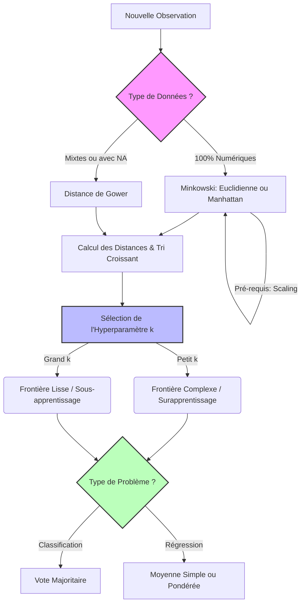

# 5 - k-Nearest Neighbors (k-NN)

Date de création: 24 mars 2026 09:35
Cours: Machine Learning
Quadrimestre: Q2
État: Terminé

# Introduction

Le modèle **k-NN** prédit la valeur ou la classe d'une nouvelle donnée en copiant de manière déterministe les caractéristiques de ses $k$ voisins les plus proches dans l'espace des descripteurs.

---

## Pourquoi k-NN a besoin d'une "Distance" ?

### 1. k-NN 🤝 Distance

- **La Distance est le capteur (Le GPS) :** C'est une simple règle mathématique (comme un mètre ruban) qui mesure l'écart entre deux points.
- **Le k-NN est le décideur (Le Juge) :** Il prend la mesure fournie par la distance, isole les $k$ points les plus proches, et lance un vote pour prendre sa décision.
- **Conclusion :** Sans formule de distance, le k-NN est aveugle. Il ne sait pas définir le mot "proche".

<aside>
💡

**Tinder et le Filtre Kilométrique**

Le **k-NN**, c'est la mécanique de l'application qui vous montre des profils pour faire un "Match".
La **Distance**, c'est l'API de localisation GPS réglée sur "rayon de 5 km". Si le module GPS (Distance) plante, la mécanique de Match (k-NN) s'arrête car elle ne sait plus qui vous présenter.

</aside>

---

# Mesures de Distances (Minkowski & Dérivées)

## Définition et Formules

Le calcul du voisinage repose sur la distance entre un point existant $x$ et un nouveau point $\tilde{x}$. L'équation mère est la **distance de Minkowski**, régie par le paramètre $q$ qui définit la géométrie de l'espace.

---

### **Distance de Minkowski (Générique)**

$$
||x-\tilde{x}||_{q}=\left(\sum_{j=1}^{p}|x_{j}-\tilde{x}_{j}|^{q}\right)^{\frac{1}{q}}
$$

En fixant $q$, on obtient les deux distances les plus courantes : **Manhattan et Euclidienne**

---

### **Distance de Manhattan (**$q=1$**) :**

$$
d_{Manhattan}(x,\tilde{x})=\sum_{j=1}^{p}|x_{j}-\tilde{x}_{j}|
$$

---

### **Distance Euclidienne (**$q=2$**) :**

$$
d_{Euclidean}(x,\tilde{x})=\sqrt{\sum_{j=1}^{p}(x_{j}-\tilde{x}_{j})^{2}}
$$

---

## Exemples Numériques (Espace 2D)

Soient deux points issus du document de référence : $x = (1, 1)$ et $\tilde{x} = (5, 4)$.

- **Manhattan** : $d(x, \tilde{x}) = |5 - 1| + |4 - 1| = 4 + 3 = \mathbf{7}$. (Trajet en "escalier").
- **Euclidienne** : $d(x, \tilde{x}) = \sqrt{(5 - 1)^2 + (4 - 1)^2} = \sqrt{16 + 9} = \sqrt{25} = \mathbf{5}$. (Trajet direct).

---

# Le k-NN en Classification

## Mécanique

Pour un problème de classification (assigner une catégorie), le k-NN applique la règle du **vote majoritaire** sur le voisinage $N_k(x_{new})$.

### **Formule de probabilité a posteriori :**

$$
\hat{\pi}_{l}(x) = \frac{1}{k}\sum_{i:x^{(i)}\in N_{k}(x)}\mathbb{I}(y^{(i)}=l)
$$

### **Règle de décision :**

$$
\hat{h}(x) = \arg\max_{l\in\{1,...,g\}} \hat{\pi}_{l}(x)
$$

---

## Exemple Pratique - Recommandation Rôle

Vous voulez déterminer automatiquement le rôle d'un nouveau joueur $x_{new}$ dans un jeu en ligne en fonction de ses statistiques de fin de partie (Dégâts infligés, Soins prodigués, Dégâts bloqués). Vous fixez $k=3$.
Après avoir calculé les distances euclidiennes avec votre base de joueurs connus ($\mathcal{D}_{train}$), les 3 joueurs avec les statistiques les plus proches de $x_{new}$ sont :

```
1. Voisin 1 : `Support` (distance = 120)
2. Voisin 2 : `Tank` (distance = 150)
3. Voisin 3 : `Tank` (distance = 165)
```

**Calculs (Vote Majoritaire) :**

- $\hat{\pi}_{DPS}(x_{new}) = 0/3 = 0\%$
- $\hat{\pi}_{Support}(x_{new}) = 1/3 = \mathbf{33\%}$
- $\hat{\pi}_{Tank}(x_{new}) = 2/3 = \mathbf{67\%}$

**Résultat :** $\hat{h}(x_{new}) =$ `Tank`. Le système assigne le rôle Tank au joueur.

---

# Prédiction (Régression) & Impact de $k$

La régression k-NN est **hautement pratique et massivement utilisée** dans l'industrie. Contrairement à la classification qui prédit une "étiquette", la régression prédit une **valeur continue** (un prix, un âge, un score).

---

## Définition et Formules (Régression)

La prédiction est simplement la **moyenne** des valeurs $y$ du voisinage. En réalité, on utilise presque toujours une **pondération par la distance** pour éviter qu'un voisin un peu trop lointain ne fausse le résultat.

### **Moyenne simple :**

$$
\hat{f}(x)=\frac{1}{k}\sum_{i:x^{(i)}\in N_{k}(x)}y^{(i)}
$$

### **Moyenne pondérée par la distance :**

$$
\hat{f}(x)=\frac{1}{\sum_{i}w^{(i)}}\sum_{i:x^{(i)}\in N_{k}(x)}w^{(i)}y^{(i)} \quad \text{avec} \quad w^{(i)}=\frac{1}{d(x^{(i)},x)}
$$

---

## Le Paramètre $k$

- $k$ **petit (**$k=1$**)** : Modèle très local, complexe. S'ajuste au bruit (**Surapprentissage** / *Overfitting*). La frontière est "dentelée".
- $k$ **grand (**$k=50$**)** : Modèle global, plus lisse. Ignore les variations locales (**Sous-apprentissage** / *Underfitting*).

---

## **L'algorithme de calcul du MMR (Matchmaking Rating)**

Votre MMR (le score de niveau caché qui décide contre qui vous jouez) est **une valeur continue.** 
Si vous créez un nouveau compte (Smurf), le jeu doit déterminer votre MMR réel très vite.
Il analyse vos stats brutes (APM, Précision, Dégâts) sur les 3 premières parties. 
Ensuite, il cherche dans sa base de données les $k=10$ joueurs qui ont exactement les mêmes stats que vous (Distance Euclidienne minimale). Votre MMR de départ sera assigné comme la **moyenne** du MMR de ces 10 joueurs.

---

# Standardisation & Distance de Gower

La **Distance de Gower** résout le problème des datasets hétérogènes (variables quantitatives ET qualitatives dans la même base) et gère dynamiquement les valeurs manquantes (`NA`). Elle normalise nativement les valeurs continues entre 0 et 1 (Standardisation intégrée).

---

## Formule de Gower

$$
d_{gower}(x,\tilde{x})=\frac{\sum_{j=1}^{p}\delta_{x_{j},\tilde{x}_{j}}\cdot d_{gower}(x_{j},\tilde{x}_{j})}{\sum_{j=1}^{p}\delta_{x_{j},\tilde{x}_{j}}}
$$

### **Mécanique du Poids Indicateur ($\delta_{x_{j},\tilde{x}_{j}}$) :**

Vaut $1$, SAUF (vaut $0$) si :

- Donnée manquante (`NA`) pour l'un des deux individus.
- Variable binaire asymétrique où les deux valeurs sont $$0$$.

### **Mécanique de la Sous-Distance (**$d_{gower}(x_{j},\tilde{x}_{j})$**) :**

- **Variables nominales/catégorielles** : $0$ si égal, $1$ si différent.
- **Variables continues** : $\frac{|x_{j}-\tilde{x}_{j}|}{Range(j)}$ (différence absolue divisée par l'amplitude totale de la variable dans le dataset).

---

## **Le Matchmaking Vinted**

**Comment Vinted calcule que deux articles se ressemblent alors qu'ils ont des données incomparables** ? Prix (Numérique), Marque (Texte nominal), et Couleur (Texte). 

La distance Euclidienne exploserait sur du texte. 

L'algorithme Gower traduit tout en pourcentage (0 à 100%) : 

- Même marque ? 0% d'écart.
- Prix différent de 10€ sur un max de 100€ ? 10% d'écart.

Ensuite, il fait la moyenne de ces pourcentages. Si un vendeur n'a pas mis la marque (NA), l'algorithme annule cette ligne au dénominateur et calcule sur le reste.

---

**✅ Avantage de la Pondération en Régression**

Atténue l'impact négatif d'un $k$ trop grand : même avec 50 voisins, un voisin situé très loin aura un poids $w^{(i)}$ proche de zéro et ne polluera pas la moyenne de la prédiction cible.

**❌ Inconvénient de Gower**

**Coût CPU exponentiel :** Le calcul des bornes (Range) sur les variables continues exige de reparcourir l'ensemble de la base de données. Gower est inexploitable en temps réel sur des bases massives (Big Data) sans pré-calcul en cache.

---

# Tableaux de Confrontation

---

## Euclidienne vs Manhattan : Quand les utiliser ?

| Critère | Euclidienne ($q=2$) | Manhattan ($q=1$) |
| --- | --- | --- |
| **Mécanique spatiale** | Ligne droite ("vol d'oiseau"). | Grille urbaine ("city block"). |
| **Sensibilité aux Outliers** | ⚠️ **Élevée**. Met les écarts au carré (une seule valeur extrême écrase tout le calcul). | ✅ **Faible**. Utilise les valeurs absolues (tolère les anomalies isolées). |
| **Fléau de la dimension** | Décline rapidement si le nombre de *features* ($p$) est massif. | Reste robuste mathématiquement en haute dimension. |
| **Cas d'usage optimal** | ✅ **Le standard par défaut.** À utiliser sur des données continues, denses, propres et standardisées. | ✅ **Données bruitées ou catégorielles.** À utiliser si vous avez beaucoup d'outliers, des grilles discrètes (NLP, pixels bruts) ou une dimensionnalité extrême. |

---

## Évolution de l'Hyperparamètre $k$

| Critère | Petit $k$ (ex: $k=1$) | Grand $k$ (ex: $k=50$) |
| --- | --- | --- |
| **Biais** | Faible (s'adapte à chaque donnée). | Élevé (lisse aveuglément les données). |
| **Variance** | Élevée (sensible au moindre bruit). | Faible (stable face aux anomalies). |
| **Frontière de décision** | Très complexe, découpée en îlots. | Lisse, approche une ligne/courbe simple. |

---

## Distance Classique vs Distance de Gower

| Critère | Minkowski / Euclidienne | Gower |
| --- | --- | --- |
| **Type de données** | Exclusivement Numériques. | Mixtes (Numériques, Nominales, Binaires). |
| **Gestion des `NA`** | ❌ Plante (ou nécessite imputation préalable). | ✅ Ignore la variable dynamique au calcul. |
| **Mise à l'échelle** | Nécessite une standardisation externe absolue. | ✅ Standardise nativement en interne (par division du Range). |

---

# 🗺️ Mécanique Complète du k-NN

