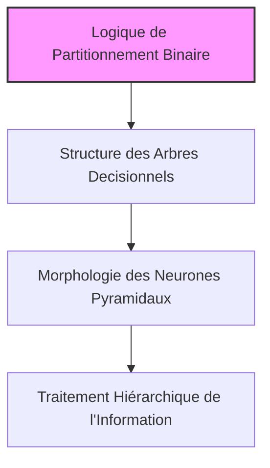
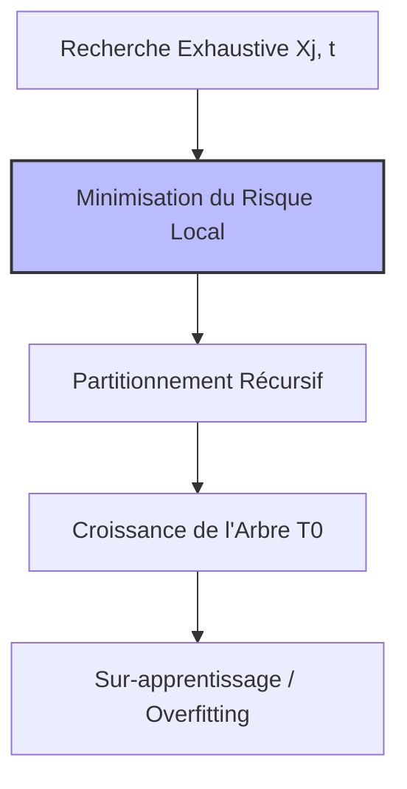
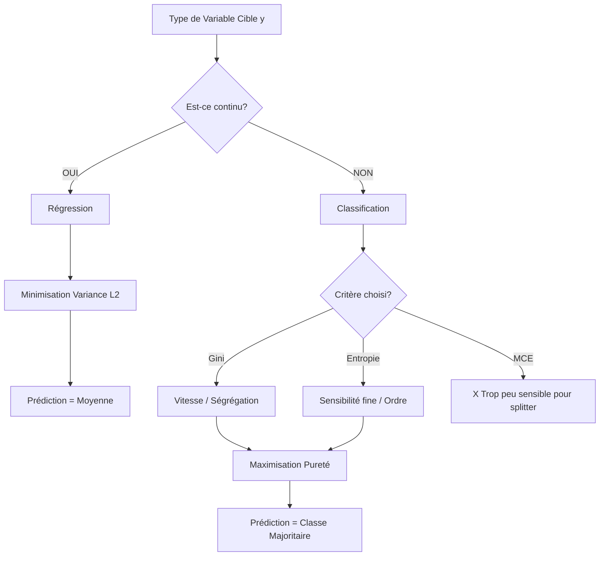
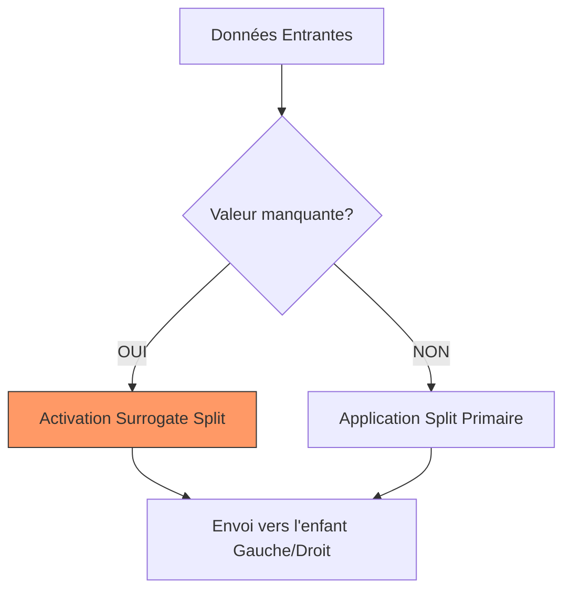

# 6 - Arbre de Classification et de Régression

Date de création: 24 mars 2026 09:35
Cours: Machine Learning
Quadrimestre: Q2
État: Terminé

# 1. L'Anatomie du Modèle CART

L'algorithme **CART** (Classification and Regression Trees) est un modèle d'apprentissage supervisé non paramétrique. Il transforme un espace de données complexe en régions décisionnelles rectangulaires via une hiérarchie binaire.

---

## Formule

$$
f(x) = \sum_{m=1}^{M} c_m \mathbb{I}(x \in Q_m)
$$

- $M$ : Nombre de feuilles (nœuds terminaux).
- $c_m$ : Prédiction constante dans la région $Q_m$.
- $\mathbb{I}$ : Fonction indicatrice (vaut 1 si $x$ appartient à la région, 0 sinon).

---

## Flux étape par étape

1. **Initialisation** : Le **nœud racine** englobe l'intégralité du dataset.
2. **Nœuds Internes — Partitionnement** : Application d'une règle binaire ($X_j < t$) sur une caractéristique unique.
3. **Propagation** : Descente des observations dans les **nœuds internes**.
4. **Conclusion** : Assignation d'une valeur ou d'une classe dans les **feuilles** (nœuds terminaux).

---

---

## Explication Simplifié

---

## Pros & Cons

---

### ✅ **Avantages**

Interprétabilité totale (modèle "Boîte Blanche"), capture des interactions complexes, gestion naturelle des outliers.

### ❌ **Inconvénients**

Instabilité (variance élevée), mauvaise modélisation des relations purement linéaires (diagonales).

---

# 2. La Croissance de l'Arbre (*Tree Growing*) **et Optimisation Gloutonne**

La construction de l'arbre repose sur une **optimisation gloutonne** (greedy) et récursive. L'algorithme cherche localement le meilleur split sans anticiper les étapes futures.

---

## Formule

Le split optimal $(j, t)$ pour un nœud $\mathcal{N}$ est défini par :

$$
\arg \min_{j,t} [\mathcal{R}(\mathcal{N}_1) + \mathcal{R}(\mathcal{N}_2)]
$$

Où :

- $\mathcal{N}_1$ et $\mathcal{N}_2$ sont les ensembles résultant de la division.
- $\mathcal{R}(\mathcal{N})$ est le risque empirique (ex: variance pour la régression, impureté pour la classification).

---

## **Recherche Exhaustive**

1. **Balayage** : Pour chaque variable $X_j$, tester tous les points de coupure $t$ possibles.
2. **Évaluation** : Calculer la réduction d'impureté globale pour chaque candidat $(j, t)$.
3. **Sélection** : Choisir le split qui maximise l'homogénéité des nœuds enfants.
4. **Placement** : Le point de coupure est fixé au milieu exact des deux observations les plus proches de la frontière pour maximiser la marge.

---

## **L'optimisation de "Build" dans un Action-RPG**

Quand vous gagnez un niveau, vous choisissez la compétence qui donne le bonus le plus élevé *immédiatement* (stratégie gloutonne), sans savoir si cela bloquera un build surpuissant 50 heures plus tard (effet d'horizon).

---

<aside>
⚠️

**L'Effet d'Horizon** : Un split médiocre à l'étape $N$ peut être le prérequis nécessaire pour un split exceptionnel à l'étape $N+1$. L'approche gloutonne l'ignore.

---

**Insensibilité aux Transformations** : Les transformations monotones (log, racine carrée) n'affectent pas la structure de l'arbre, car seul l'ordre relatif des points compte.

</aside>

---

# Les Critères de Division (*Splitting Criteria*)

---

## **A. Branche Régression (Cible Continue)**

En régression, l'objectif est de **minimiser l'écart** *quadratique* **entre les observations et la valeur prédite du nœud.**

---

### Prédiction Optimale

$$
c_N = \frac{1}{|N|} \sum_{(x,y) \in N} y
$$

> *Moyenne locale*
> 

---

### Critère de split (Perte $L_2$)

$$
\mathcal{R}(N) = \sum_{(x,y) \in N} (y - c_N)^2
$$

> *Somme des Carrés des Erreurs*
> 

---

### Mécanique

1. **Calculer la moyenne** des $y$ dans le nœud actuel.
2. **Évaluer la variance** (impureté $L_2$) pour chaque split potentiel.
3. **Choisir le split** $(j, t)$ qui divise les données en deux groupes ayant la variance interne la plus faible.
    
    $$
    arg\,min [\mathcal{R}(\mathcal{N}_1) + \mathcal{R}(\mathcal{N}_2)]
    $$
    

---

### Analogie : **Le trading algorithmique (HFT)**

La régression cherche à prédire le prix exact d'un actif. Chaque split tente de regrouper les moments de marché où le prix est stable (faible variance) autour d'une valeur moyenne, pour réduire l'erreur de prévision du "prix cible".

---

## B. **Branche** Classification (Cible catégorielle)

En classification, l'objectif est d'**atteindre la pureté maximale**, où chaque nœud ne contient idéalement qu'une seule classe d'observations.

---

### **Gini (Score de Brier)**

Mesure la probabilité qu'un élément choisi au hasard soit mal classé s'il était étiqueté selon la distribution des classes du nœud. C'est une mesure de **ségrégation statistique**.

$$
I(G) = \sum_{k=1}^{g} \hat{\pi}_k (1 - \hat{\pi}_k)
$$

> $\hat{\pi}_k$ représente la proportion de la classe $k$ dans le nœud.
> 

---

### **Entropie (Shannon)**

Mesure le degré de **désordre** ou d'incertitude dans le nœud selon la théorie de Shannon. Plus le mélange des classes est homogène, plus l'entropie est élevée.

$$
H(N) = - \sum_{k=1}^{g} \hat{\pi}_k \log_2(\hat{\pi}_k)
$$

> $\hat{\pi}_k$ représente la proportion de la classe $k$ dans le nœud.
> 

---

### **MCE (Misclassification Error)**

Représente simplement le taux d'erreur si l'on prédisait la classe majoritaire pour chaque point du nœud.

$$
MCE(N) = 1 - \max(\hat{\pi}_k)
$$

<aside>
💡

### Pourquoi la MCE est-elle "Invalide" pour le Split ?

Bien que la **MCE** soit l'objectif métier final (précision), elle souffre d'un manque de **sensibilité**. Un split peut améliorer radicalement la pureté des nœuds enfants (ex: passer de 50/50 à 80/20) sans que la classe majoritaire ne change. Dans ce cas, la MCE reste identique, "aveuglant" l'algorithme sur l'amélioration réelle, alors que Gini et l'Entropie auraient détecté ce gain de pureté.

</aside>

---

### **Tableau de Confrontation : Critères de Classification**

| Caractéristique | Indice de Gini | Entropie (Shannon) | MCE (Error) |
| --- | --- | --- | --- |
| **Usage** | Split (Standard) | Split (Précis) | Évaluation finale |
| **Complexité** | Faible (Rapide) | Élevée ($\log$) | Nulle |
| **Sensibilité** | Bonne | Maximale | **Faible (Effet palier)** |
| **Plage (Binaire)** | $[0 \,;\, 0.5]$ | $[0 \,;\, 1.0]$ | $[0 \,;\, 0.5]$ |

---

### Analogie : **La curation de contenu sur un flux social**

- **Gini** : C'est comme s'assurer que si vous cliquez sur une vidéo au hasard dans votre feed "Sport", vous tombez bien sur du sport. On réduit la "chance de se tromper".
- **Entropie** : C'est mesurer à quel point votre feed est "pollué" par des sujets divers. Si vous avez 50% de sport et 50% de cuisine, l'entropie est maximale (désordre total). L'algorithme cherche à "nettoyer" le feed pour qu'il ne reste qu'un seul sujet (ordre pur).
- **MCE** : C'est le score final. Si votre feed est à 51% Sport et 49% Cuisine, la MCE dira "C'est un feed Sport" (Taux d'erreur 49%). Si un split donne 90% Sport et 10% Cuisine, c'est toujours un "feed Sport", la prédiction ne change pas, mais la qualité (pureté) a explosé. Gini le voit, la MCE non.

---

### Mécanique

1. Calculer l'impureté initiale (Gini ou Entropie) du nœud parent.
2. Évaluer le **Gain d'Information** : $Gain = Impureté_{Parent} - \sum (Poids_{Enfant} \times Impureté_{Enfant})$.
3. Sélectionner le split offrant le gain le plus élevé.

---

## **Tableau de Confrontation : Régression vs Classification**

| Critère | Régression | Classification |
| --- | --- | --- |
| **Prédicteur** $c_N$ | Moyenne arithmétique. | Vecteur de probabilités / Mode. |
| **Objectif Math** | Réduction de la variance. | Réduction du désordre (Entropie/Gini). |
| **Sensibilité** | Très sensible aux outliers. | Sensible à la distribution des classes. |
| **Impureté nulle** | Tous les $y$ sont identiques. | Une seule classe présente (100%). |

---

# **4. Régularisation (Pré vs Post-Élagage)**

La régularisation limite la complexité de l'arbre pour garantir sa capacité de généralisation et éviter l'**overfitting** (apprentissage du bruit).

---

## A. Pré-élagage (Stopping Criteria)

**Mécanique** : Fixation de seuils avant l'entraînement (profondeur max, $n$  minimum par feuille).

<aside>
⚠️

**L'Effet d'Horizon** : Un split actuellement médiocre pourrait être la condition nécessaire à un split futur exceptionnel. Le stopper prématurément tue cette opportunité.

</aside>

---

## B. Post-élagage (Cost-Complexity Pruning - CCP)

### **Risque Régularisé**

$$
R_{\alpha}(T) = \mathcal{R}(T) + \alpha |T|
$$

### **Mécanique** :

1. Laisser l'arbre pousser à son maximum ($T_0$).
2. Pénaliser chaque feuille par un coefficient $\alpha$.
3. Supprimer récursivement les branches dont le gain en précision ne justifie pas leur "coût" en complexité.

---

### Analogie : **La taille d'un bonsaï**

Le **pré-élagage**, c'est empêcher l'arbre de pousser dès qu'une branche dépasse 10cm. C'est risqué car vous ne saurez jamais si cette branche aurait donné de magnifiques fleurs. 

Le **post-élagage**, c'est laisser l'arbre s'épanouir totalement, puis couper chirurgicalement les petites branches inutiles pour ne garder que la structure la plus esthétique et robuste.

---

# 5. Subtilités Computationnelles

---

## Insensibilité aux Transformations Monotones

L'algorithme CART est invariant aux transformations de type $\log(x)$, $\sqrt{x}$ ou mise à l'échelle.

**Pourquoi ?** Le choix du split repose uniquement sur l'**ordre relatif** (rang) des observations sur l'axe $X_j$. La valeur numérique absolue n'influence pas la position de la coupure optimale.

---

## Gestion des Variables Catégorielles

Le nombre de partitions possibles pour $m$ catégories est $2^{m-1}-1$ (explosion combinatoire).

**L'Astuce** : Trier les catégories par la moyenne de la cible (régression) ou la proportion de la classe cible (classification binaire). On traite alors la variable comme **ordinale**, réduisant la recherche à seulement $m-1$ splits.

---

## Valeurs Manquantes : Surrogate Splits (Splits de Secours)

- **Définition** : Si la donnée $X_j$ est manquante pour une observation lors du passage dans l'arbre, CART utilise une variable $X_k$ qui imite le mieux la séparation induite par $X_j$.
- **Analogie** : Le **Plan B**. Si votre GPS (variable principale) tombe en panne, vous utilisez les panneaux de signalisation (variable surrogate) qui mènent à la même destination.

---

---

## Tableau de Confrontation : Subtilités

| Problème | Solution CART | Impact Performance |
| --- | --- | --- |
| **Outliers sur X** | Invariance par rang | Nul (Robuste) |
| **Variables catégorielles m >> 1** | Tri par moyenne cible | Drastique (Gain $O(2^m)$) |
| **Données manquantes** | Surrogate Splits | Maintient la précision globale |

---

# 6. Bilan : Pourquoi utiliser CART ?

| **Forces ✅** | **Faiblesses ❌** |
| --- | --- |
| **Interprétabilité :** On peut l'exprimer sous forme de règles "SI... ALORS...". | **Instabilité (Variance élevée) :** Supprimer une seule observation peut changer tout le haut de l'arbre. |
| **Robuste :** Gère les outliers et ne nécessite pas de normalisation des données. | **Linéarité :** Très mauvais pour modéliser une simple ligne diagonale (doit faire des "marches d'escalier" complexes). |
| **Interactions :** Capture naturellement les liens complexes entre variables sans réglage manuel. | **Extrapolation :** Incapable de prédire en dehors des bornes des données d'entraînement (prédiction constante par zone). |