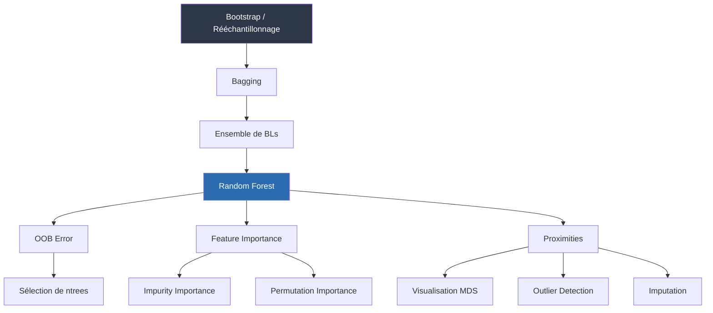
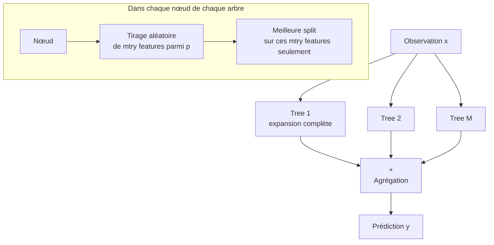
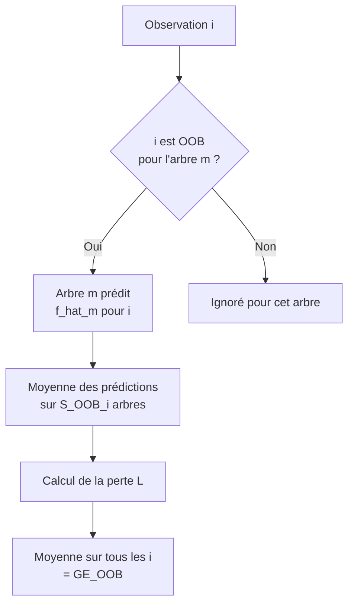
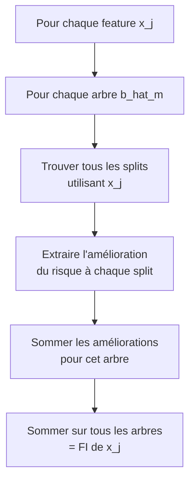
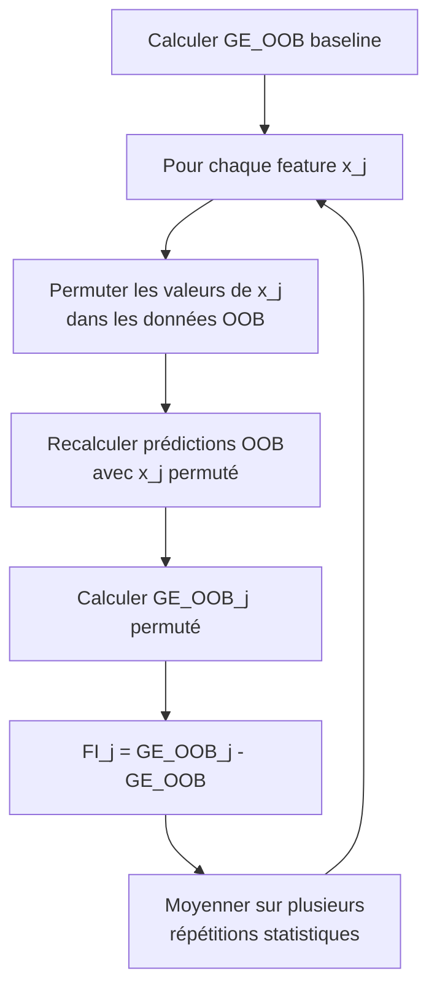
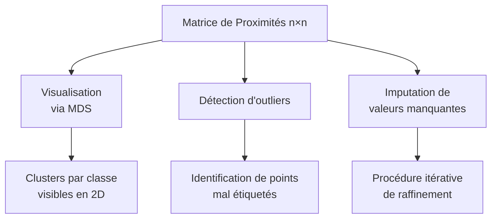

# 7 - Random Forest

Date de création: 31 mars 2026 14:18
Cours: Machine Learning
Quadrimestre: Q2
État: Terminé

# Introduction

Un arbre de décision seul est instable et imprécis ; le Random Forest résout ce problème en combinant des centaines d'arbres décorrélés pour transformer une variance élevée en prédictions robustes.

---

## Indice Visuel des Dépendances

---

# Bagging (Bootstrap Aggregation)

Le **Bagging** est une méthode d'ensemble **homogène** : elle entraîne M copies du même type de base learner (BL) sur M échantillons bootstrap distincts, puis agrège leurs prédictions.

## Mécanique étape par étape

**Tirage avec remise** : chaque bootstrap sample D⁽ᵐ⁾ contient n observations tirées depuis D, certaines apparaissant plusieurs fois. Les observations non tirées forment l'ensemble **OOB** (Out-Of-Bag).

### Formules d'agrégation

$$
\hat{f}(\mathbf{x}) = \frac{1}{M} \sum_{m=1}^{M} \hat{f}^{[m]}(\mathbf{x}) \quad \text{(régression / score)}
$$

$$
\hat{h}(\mathbf{x}) = \arg\max_{k \in \mathcal{Y}} \sum_{m=1}^{M} \mathbb{I}\left(\hat{h}^{[m]}(\mathbf{x}) = k\right) \quad \text{(vote majoritaire)}
$$

$$
\hat{\pi}k(\mathbf{x}) = \frac{1}{M} \sum{m=1}^{M} \hat{\pi}_k^{[m]}(\mathbf{x}) \quad \text{(probabilités par moyenne)}
$$

### *Analogie Niveau 3 (Culture Gen Z)*

*Le bagging fonctionne comme un **système de votes sur un sondage TikTok**. Imagine 500 comptes différents (chacun avec un feed légèrement différent) qui votent sur la même question. Un seul compte peut voter de façon bizarre à cause de son algorithme particulier, mais la moyenne de 500 comptes aux feeds diversifiés donne une opinion beaucoup plus représentative. Les comptes qui n'ont pas vu certains posts = OOB.*

---

## Pourquoi le Bagging aide

Le bagging réduit la **variance** des prédictions en moyennant les erreurs aléatoires de chaque BL. Il est particulièrement efficace quand les erreurs d'un BL sont **dues à la variabilité** (instabilité) plutôt qu'à un biais systématique. CART est l'exemple canonique de learner instable → fortement bénéficiaire du bagging.

---

## Ensembles Homogènes vs Hétérogènes

| Critère | Homogène (Bagging) | Hétérogène |
| --- | --- | --- |
| Type de BL | ✅ Identique (ex: CART) | ❌ Différents (LR + SVM + ...) |
| Diversité par | Bootstrap + randomisation | Diversité architecturale |
| Exemple | Random Forest | Stacking |

---

# Random Forest

Le **Random Forest** (Breiman 2001) étend le bagging avec deux mécanismes supplémentaires : (1) **random feature sampling** à chaque nœud, (2) arbres **entièrement développés** (non élagués).

## Architecture

---

## Formule de Variance d'Ensemble

Avecc $\text{Var}(\hat{b}^{[m]}) = \sigma^2$ et $\text{Corr}(\hat{b}^{[m]}, \hat{b}^{[j]}) = \rho$ :

$$
\text{Var}(\hat{f}) = (1 - \rho)\frac{\sigma^2}{M} + \rho\sigma^2
$$

💡 **Lecture critique** : si $\rho = 0$, la variance décroît linéairement en $\sigma^2/M$. Si $\rho = 1$, aucune réduction. Le RF vise à **minimiser $\rho$** via le feature sampling.

### Hyperparamètres Clés

| HP | Rôle | Défaut (ranger) | Règle empirique |
| --- | --- | --- | --- |
| **mtry** | Nb features considérées par nœud | — | Classification : $\lfloor\sqrt{p}\rfloor$, Régression : $\lfloor p/3 \rfloor$ |
| **min.node.size** | Taille minimale d'un nœud terminal | 5 | Plus petit → arbres plus profonds |
| **maxDepth** | Profondeur maximale | $\infty$ | Arbres non élagués par défaut |
| **ntrees** | Nombre d'arbres | 100–500 | Plus grand = plus stable, rendement décroissant |

⚠️ **Trade-off mtry** : réduire mtry décolle les arbres (↓ $\rho$) mais les rend plus aléatoires individuellement (↑ $\sigma^2$ de chaque arbre). La règle empirique optimise ce compromis.

### RF et Overfitting

- ✅ Augmenter `ntrees` **réduit la variance sans augmenter l'overfitting** (chaque arbre entraîné indépendamment).
- ⚠️ Des arbres trop complexes capturant du bruit → RF capture ce bruit en moyenne.
- ✅ La randomisation + le moyennage atténuent ce risque comparativement à un CART seul.

---

## Diagnostic Métier

|  | Avantages RF | Inconvénients RF |
| --- | --- | --- |
| Preprocessing | ✅ Minimal requis |  |
| Valeurs manquantes | ✅ Gestion native |  |
| Haute dimension | ✅ Performant |  |
| Variables bruit | ✅ Robuste |  |
| Extrapolation |  | ❌ Même problème que CART |
| Interprétabilité |  | ❌ Boîte noire (vs arbre seul) |
| Mémoire |  | ❌ Consommation élevée |
| Prédiction |  | ❌ Coûteuse pour grands ensembles |
| Parallélisation | ✅ Facile |  |

---

# Out-Of-Bag (OOB) Error Estimate

L'**OOB Error** est un estimateur du **Generalization Error (GE)** calculable **pendant l'entraînement**, sans holdout set séparé, en utilisant les observations non tirées dans chaque bootstrap.

---

## Probabilité OOB

$$
\mathbb{P}\left(i \in \text{OOB}^{[m]}\right) = \left(1 - \frac{1}{n}\right)^n \xrightarrow{n \to \infty} \frac{1}{e} \approx 0.37
$$

💡 Chaque observation est OOB dans ~37% des arbres → comparable à un **holdout de 1/3** ou une **3-fold CV**.

---

## Définitions Formelles

$$
\text{IB}^{[m]} = {i \in {1,\ldots,n} \mid (\mathbf{x}^{(i)}, y^{(i)}) \in \mathcal{D}^{[m]}}
$$

$$
\text{OOB}^{[m]} = {i \in {1,\ldots,n} \mid (\mathbf{x}^{(i)}, y^{(i)}) \notin \mathcal{D}^{[m]}}
$$

$$
S_{\text{OOB}}^{(i)} = \sum_{m=1}^{M} \mathbb{I}(i \in \text{OOB}^{[m]}) \quad \text{(nb d'arbres où } i \text{ est OOB)}
$$

---

## Calcul de la Prédiction OOB

$$
\hat{f}{\text{OOB}}^{(i)} = \frac{1}{S{\text{OOB}}^{(i)}} \sum_{m=1}^{M} \mathbb{I}(i \in \text{OOB}^{[m]}) \cdot \hat{f}^{[m]}(\mathbf{x}^{(i)})
$$

---

## Estimation du GE

$$
\widehat{\text{GE}}{\text{OOB}} = \frac{1}{n} \sum{i=1}^{n} L\left(y^{(i)}, \hat{f}_{\text{OOB}}^{(i)}\right)
$$

---

## Mécanique Visuelle

## Usages Pratiques

| Usage | Description |
| --- | --- |
| 💡 Performance initiale | Première estimation rapide sans CV |
| ⚙️ Sélection de ntrees | Observer stabilisation de la courbe OOB |
| ⚙️ Tuning HP | Évaluer différentes configs sans re-entraîner |
| ⚠️ Comparaison inter-modèles | Préférer CV pour cohérence entre modèles différents |

---

# Feature Importance (FI)

Le RF perd l'interprétabilité d'un arbre unique. La **Feature Importance** restaure partiellement cette lisibilité en quantifiant la contribution de chaque feature au modèle.

---

## Variante 1 — Impurity Importance (FI par amélioration des splits)

Somme de toutes les améliorations du critère de split aux nœuds où la feature $x_j$ est utilisée, sur tous les arbres.

### **Algorithme** :

---

## Variante 2 — Permutation Feature Importance (PFI)

Augmentation du GE OOB quand les valeurs de $x_j$ sont permutées aléatoirement (relation feature-target détruite, distribution marginale préservée).

$$
\widehat{\text{FI}}j = \widehat{\text{GE}}{\text{OOB},j} - \widehat{\text{GE}}_{\text{OOB}}
$$

### **Algorithme** :

### Tableau Comparatif FI

| Critère | Impurity Importance | Permutation Importance |
| --- | --- | --- |
| Calcul | Pendant training | Après training |
| Coût | ✅ Faible | ❌ Plus élevé |
| Biais features continues | ⚠️ Oui | ⚠️ Oui |
| Dépendance à la tâche | ⚙️ Critère de split | ⚙️ Métrique de GE |
| Utilisation OOB | ❌ Non | ✅ Oui |

⚠️ **Biais commun** : les deux méthodes favorisent les features avec **plus de niveaux** (features continues ou catégorielles à haute cardinalité) — Strobl et al. 2007.

## Application Pratique Immédiate

Sur `mtcars` (régression), les deux méthodes identifient `disp` et `wt` comme features dominantes, mais les scores absolus diffèrent. Utiliser PFI pour des comparaisons fiables entre features de types différents.

---

# Proximities

La **proximity** entre deux observations $\mathbf{x}^{(i)}$ et $\mathbf{x}^{(j)}$est la proportion d'arbres qui les place dans le **même nœud terminal**.

$$
\text{prox}\left(\mathbf{x}^{(i)}, \mathbf{x}^{(j)}\right) = \frac{1}{M} \sum_{m=1}^{M} \mathbb{I}\left(\text{même feuille dans } \hat{b}^{[m]}\right)
$$

Toutes les proximités forment une **matrice symétrique $n \times n$**.

### Usages des Proximités

### Procédure d'Imputation

1. Remplacer les valeurs manquantes par la **médiane** de la feature.
2. Calculer la matrice de proximités.
3. Remplacer les manquants de $\mathbf{x}^{(i)}$ par la **moyenne pondérée** des valeurs des autres observations, poids $\propto$ proximité.
4. **Répéter** les étapes 2–3 jusqu'à convergence.

---

# Mise au point

**Bootstrap** est juste une technique de tirage — comme couper un jeu de cartes en repiochant des cartes déjà utilisées. Ça ne fait rien seul.

**OOB** n'est pas une technique qu'on choisit d'appliquer. C'est juste le nom des cartes qu'on n'a pas piochées. Elles existent automatiquement dès qu'on fait un bootstrap.

**Bagging** est le premier vrai algorithme. Il prend le bootstrap, entraîne M modèles dessus, et moyenne leurs prédictions. Il fonctionne avec n'importe quel type de modèle — pas seulement les arbres.

**Random Forest** est un Bagging particulier qui dit : "on va utiliser des arbres comme modèles, mais à chaque nœud on ne regarde que quelques features tirées au hasard". Ce détail — le `mtry` — est ce qui sépare RF du simple bagging d'arbres. Sans ça, les arbres feraient tous les mêmes erreurs et la moyenne n'aiderait pas vraiment.

---

# Cas Pratique

---

## 1. L'algorithme TikTok qui choisit tes créateurs

TikTok veut prédire : est-ce que ce créateur va **exploser en 30 jours** ou rester dans l'ombre ? Features disponibles : taux de completion des vidéos, fréquence de post, ratio commentaires/vues, et croissance des followers sur 7 jours.

### **Problème : un analyste seul**

- Un chargé de curation regarde 3 vidéos de `@chef_lucas` et dit "pas de potentiel".
- Son collègue tombe sur 3 autres vidéos du même compte et dit "va exploser".

Même créateur, données différentes, verdict opposé → c'est l'instabilité d'un arbre seul.

---

### **Bootstrap**

TikTok a 1000 créateurs en base. Pour construire l'analyste numéro 1, on tire 1000 créateurs avec remise : `@chef_lucas` apparaît deux fois, `@danse_nina` n'est pas tiré du tout. 

`@danse_nina` est OOB pour l'analyste 1. 500 analystes, 500 feeds différents.

---

### **OOB**

`@danse_nina` n'a jamais été dans le feed de l'analyste 1. Quand on lui demande de prédire le potentiel de `@danse_nina`, sa réponse est honnête donc pas contaminée. 

On agrège les prédictions OOB de tous les analystes sur tous leurs créateurs manquants. 

Résultat : une OOB Error de 17% sans jamais réserver un holdout set.

---

### **Bagging**

500 analystes votent sur `@chef_lucas`. 

- 380 disent "va percer",
- 120 disent "non".

Vote : "va percer". L'erreur de l'analyste qui a vu les 3 mauvaises vidéos disparaît dans la masse.

---

### **Random Forest**

Problème du bagging pur : si tous les 500 analystes regardent "taux de completion" en premier, ils arrivent tous à la même conclusion. Leurs votes sont redondants. 

**Solution RF :**

- L'analyste 1 est forcé de regarder uniquement "completion + fréquence de post".
- L'analyste 2 : "commentaires + croissance".
- L'analyste 3 : "croissance + completion".

Chacun voit 2 métriques tirées au hasard parmi les 4 disponibles, c'est le `mtry`. Leurs erreurs deviennent différentes. Le vote devient réellement informatif.

---

### **Feature Importance**

On permute les valeurs de "taux de completion" entre tous les créateurs. L'OOB Error explose de 17% à 44% : FI = +27 pts. C'est de loin la métrique la plus prédictive. 

On permute "nombre de likes" : OOB Error passe à 18%. FI = +1 pt. Quasi inutile. 

**Conclusion :** les likes ne prédisent pas la viralité. La qualité d'attention : est-ce que les gens regardent jusqu'à la fin.

Sans le RF, un product manager aurait optimisé les likes pendant des mois pour rien.

---

# Synthèse des Formules Clés

$$
\hat{f}(\mathbf{x}) = \frac{1}{M} \sum_{m=1}^{M} \hat{f}^{[m]}(\mathbf{x})
$$

$$
\hat{h}(\mathbf{x}) = \arg\max_{k} \sum_{m=1}^{M} \mathbb{I}\left(\hat{h}^{[m]}(\mathbf{x}) = k\right)
$$

$$
\text{Var}(\hat{f}) = (1-\rho)\frac{\sigma^2}{M} + \rho\sigma^2
$$

$$
\mathbb{P}\left(i \in \text{OOB}^{[m]}\right) \xrightarrow{n \to \infty} e^{-1} \approx 0.37
$$

$$
\hat{f}{\text{OOB}}^{(i)} = \frac{1}{S{\text{OOB}}^{(i)}} \sum_{m=1}^{M} \mathbb{I}(i \in \text{OOB}^{[m]}) \cdot \hat{f}^{[m]}(\mathbf{x}^{(i)})
$$

$$
\widehat{\text{GE}}{\text{OOB}} = \frac{1}{n} \sum{i=1}^{n} L\left(y^{(i)}, \hat{f}_{\text{OOB}}^{(i)}\right)
$$

$$
\widehat{\text{FI}}j = \widehat{\text{GE}}{\text{OOB},j} - \widehat{\text{GE}}_{\text{OOB}}
$$

$$
\text{prox}\left(\mathbf{x}^{(i)}, \mathbf{x}^{(j)}\right) = \frac{1}{M} \sum_{m=1}^{M} \mathbb{I}\left(\text{même feuille dans } \hat{b}^{[m]}\right)
$$