# 8 - Neural Networks

Date de création: 31 mars 2026 21:07
Cours: Machine Learning
Quadrimestre: Q2
État: Terminé

# Introduction

Ce rapport synthétise la convergence entre **l'informatique** et les **neurosciences**, en modélisant les structures mathématiques des réseaux de neurones artificiels (ANN) sur l'architecture hiérarchique du cortex cérébral.

Pour illustrer ces concepts complexes de manière cohérente, nous suivrons le développement de Kael, un personnage de jeu vidéo dont l'évolution, de simple apprenti à héros légendaire dans le monde de "Neuronica", servira de fil rouge narratif.

## **Le "Pourquoi"**

L'enjeu central est de traduire l'organisation biologique en algorithmes capables d'extraire des représentations abstraites à partir de données brutes haute-dimensionnelles.

---

# 1. **Du Perceptron au Neurone Pyramidal**

Le **Perceptron** est l'unité de calcul de base. Il effectue une intégration de caractéristiques 
d'entrée ($x$) pondérées par des coefficients ($w$) pour produire une décision binaire ou continue.

La sortie $f(x)$ est le résultat d'une transformation affine suivie d'une fonction d'activation $\tau$ :

$$
f(x) = \tau\left(\sum_{j=1}^{p} w_j x_j + b\right) \quad \text{ou} \quad f(x) = \tau(w^T x + b)
$$

*Où* $w$ *est le vecteur de poids,* $x$ *le vecteur d'entrée, et* $b$ *le biais.*

---

## Flux étape par étape

1. **Réception** : Collecte des signaux d'entrée (Features).
2. **Pondération** : Multiplication de chaque entrée par son poids synaptique ($w$).
3. **Sommation Affine** : Addition des résultats et ajout du biais ($b$) pour obtenir $z_{in}$.
4. **Activation** : Passage de $z_{in}$ à travers $\tau$ pour introduire la non-linéarité ou définir le type de sortie.

<aside>
❌

**Inconvénients** : Incapacité intrinsèque à modéliser des relations non-linéaires sans couches cachées (problème du XOR).

</aside>

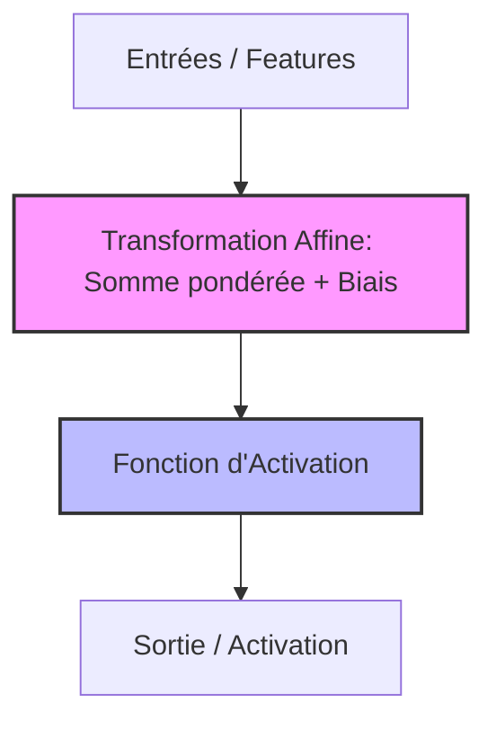

---

## Le "Stat-Checker" de RPG

**Imaginez** Kael dans un jeu vidéo. Pour réussir une "Action Spéciale" (Saut), le moteur de jeu vérifie ses statistiques : $(\text{Vitesse} \times w_1) + (\text{Force} \times w_2)$. 

Le **Biais** ($b$) représente la difficulté intrinsèque du niveau. 

Si le score total dépasse le seuil de difficulté, l'animation de saut se déclenche (**Activation**). Sans ce calcul, **votre** personnage resterait immobile face à l'obstacle.

---

## **ML vs Neurobiologie**

| Concept Machine Learning | Équivalent Biologique | Rôle Technique |
| --- | --- | --- |
| **Entrée (Feature)** | Signal Dendritique | Information brute captée. |
| **Poids (Weight)** | Efficacité Synaptique | Importance accordée à l'info. |
| **Biais (Bias)** | Potentiel de Repos / Seuil | Facilité de déclenchement. |
| **Sommation Linéaire** | Intégration dans le Soma | Somme spatio-temporelle. |
| **Sortie (Activation)** | Potentiel d'Action (Axone) | Transmission du signal au suivant. |

---

# 2. **Fonctions d'Activation et Non-linéarité**

La **fonction d'activation** est la transformation mathématique appliquée à la sortie de la sommation affine. Elle permet au réseau de sortir du cadre de la simple régression linéaire pour apprendre des motifs complexes et des relations non-linéaires.

---

## Les 2 fonctions d’activation

### **Sigmoïde (Logistique)**

Historique, imite le taux de décharge biologique.

$$
\sigma(z) = \frac{1}{1 + \exp(-z)}
$$

---

### **ReLU (Rectified Linear Unit)**

Standard actuel, plus efficace et biologiquement plausible.

$$
f(z) = \max(0, z)
$$

---

## **Flux étape par étape**

1. **Transformation** : Le signal affine $z$ arrive dans la fonction.
2. **Filtrage** :
    - Pour la **Sigmoïde**, le signal est écrasé entre 0 (repos) et 1 (saturation).
    - Pour la **ReLU**, tout signal négatif est supprimé ($0$), et le signal positif passe tel quel.
3. **Propagation** : Le signal transformé devient l'entrée de la couche suivante.

---

## Analogie : Le Variateur de Lumière vs l'Interrupteur Intelligent

**Imaginez** deux types de contrôles dans l'interface (UI) de **votre** jeu :

- **La Sigmoïde** est un vieux curseur analogique : **vous** le tournez, la lumière augmente doucement mais stagne vite au maximum. Si **vous** êtes au bout du curseur, changer la valeur ne change plus l'éclairage (**Vanishing Gradient**).
- **La ReLU** est un interrupteur "Power-up" : en dessous de zéro, rien ne se passe. Dès que le score est positif, la puissance de l'effet visuel est strictement proportionnelle au score, sans limite de saturation.

---

## Sigmoïde vs ReLU

| Critère | Sigmoïde | ReLU |
| --- | --- | --- |
| **Plage de sortie** | $[0, 1]$ | $[0, +\infty[$ |
| **Avantage** | Interprétation probabiliste facile. | Calcul ultra-rapide, évite la saturation. |
| **Inconvénient** | Saturation (gradients nuls). | "Dead ReLU" (si entrée toujours négative). |
| **Lien Bio** | Taux de décharge saturé. | Rectification à demi-onde du cortex visuel. |

✅ **Avantages** : La ReLU permet l'entraînement de réseaux très profonds sans perte de signal d'erreur.

❌ **Inconvénients** : L'usage exclusif de fonctions linéaires rendrait un réseau profond aussi "bête" qu'un neurone unique.

---

## Application pratique immédiate

**Vous** utilisez la **ReLU** pour toutes les couches cachées de **votre** IA pour garantir la vitesse d'apprentissage, et gardez la **Sigmoïde** (ou Softmax) uniquement pour la couche finale afin d'obtenir un score de confiance entre $0$ et $1$.

---

# 3. **Couches Cachées et Abstraction**

L'architecture **Multicouche** (ou Deep Learning) consiste à empiler des couches de neurones entre l'entrée et la sortie. Les **couches cachées** agissent comme des extracteurs de caractéristiques de plus en plus abstraites, transformant les données brutes en concepts.

Un réseau profond à $l$ couches est une composition de fonctions (chaîne) :

$$
f(x) = \tau \circ \phi_{out} \circ \sigma^{(l)} \circ \phi^{(l)} \circ \dots \circ \sigma^{(1)} \circ \phi^{(1)}(x)
$$

*Où $z^{(i)} = \sigma^{(i)}(W^{(i)T} z^{(i-1)} + b^{(i)})$ avec $z^{(0)} = x$*

---

## Flux étape par étape

1. **Propagation Avant (Forward Pass)** : Les données traversent chaque couche de gauche à droite.
2. **Extraction de Bas Niveau** : Les premières couches détectent des détails simples (bords, points).
3. **Combinaison de Caractéristiques** : Les couches intermédiaires assemblent ces détails en formes (cercles, carrés).
4. **Représentation Abstraite** : Les couches profondes identifient des objets complets (visages, dragons).

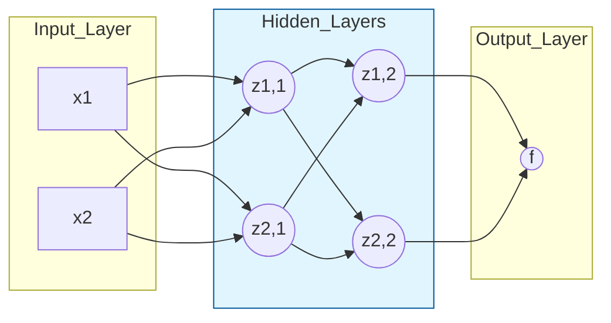

✅ **Avantages** : Capacité à apprendre automatiquement les caractéristiques (Representation Learning), éliminant le besoin de "Feature Engineering" manuel.

❌ **Inconvénients** : Risque de **Sur-apprentissage** (Overfitting) si le nombre de neurones ou de couches est trop élevé par rapport à la quantité de données.

---

# 4. Convolution et Pooling

Les réseaux de neurones convolutifs (**CNN**) sont conçus pour traiter des données tensorielles (images). La **Convolution** extrait des motifs locaux via des filtres, tandis que le **Pooling** réduit la résolution spatiale pour assurer l'invariance.

### Conceptuelle

Une "Feature Map" $S$ est générée par le glissement d'un noyau (noyau/filtre) $K$ sur une image $I$ :

$$
(i, j) = (I * K)(i, j) = \sum_{m} \sum_{n} I(i-m, j-n) K(m, n)
$$

*En pratique, cela correspond à un produit scalaire local répété sur toute la surface de l'image.*

---

## Flux étape par étape

1. **Scan (Convolution)** : Un petit filtre (ex: 3x3 pixels) glisse sur l'image pour détecter des bords ou des textures.
2. **Activation** : Passage par une **ReLU** pour ne garder que les détections positives.
3. **Résumé (Max-Pooling)** : On découpe l'image en zones et on ne garde que la valeur maximale de chaque zone.
4. **Réduction** : La taille de l'image diminue, mais l'information sémantique se concentre.

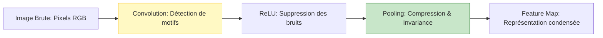

---

## Analogie La Loupe de "Loot"

**Imaginez** Kael explorant une immense carte. Il possède une **Loupe Magique** (le Filtre) qui ne brille que lorsqu'elle passe sur une épée.

- **Convolution** : Kael fait glisser sa loupe sur chaque centimètre de la carte. Partout où ça brille, il met un point sur son carnet.
- **Max-Pooling** : Pour ne pas s'encombrer, il divise son carnet en carrés. Dans chaque carré, il ne garde que le point le plus brillant. Même si l'épée bouge un peu, Kael sait toujours qu'il y a du "Loot" dans cette zone.

---

### Tableaux de Confrontation : Convolution vs Pooling

| Opération | Rôle Principal | Effet sur la Dimension | Équivalent Biologique |
| --- | --- | --- | --- |
| **Convolution** | Extraction de patterns. | Conservation / Légère réduction. | **Cellules Simples** (Aire V1). |
| **Pooling** | Invariance spatiale. | Réduction drastique ($1/2$ ou $1/4$). | **Cellules Complexes** (Hubel & Wiesel). |

---

# 5. **Backpropagation et Dopamine**

L'apprentissage est le processus d'ajustement des poids ($w$) et biais ($b$) pour minimiser une **fonction de perte** (Loss). La **Backpropagation** (rétropropagation) calcule l'influence de chaque poids sur l'erreur totale en utilisant la règle de dérivation en chaîne.

---

## Les Formules

### **Fonction de Perte (Cross-Entropy)**

Mesure l'écart entre la prédiction $\hat{y}$ et la réalité $y$.

$$
L(y, \hat{y}) = -(y \log \hat{y} + (1-y) \log(1-\hat{y}))
$$

---

### **Mise à jour des poids (Descente de Gradient)**

$$
\Delta w = -\alpha \frac{\partial L}{\partial w}
$$

*Où* $\alpha$ *est le taux d'apprentissage (Learning Rate).*

---

## Flux étape par étape

1. **Forward Pass** : Le réseau fait une prédiction.
2. **Calcul du Loss** : On calcule l'erreur par rapport à la vérité terrain (Label).
3. **Backward Pass** : On remonte le réseau de la fin vers le début pour calculer le gradient (l'erreur) de chaque neurone.
4. **Optimisation** : On ajuste légèrement chaque poids dans la direction qui réduit l'erreur.

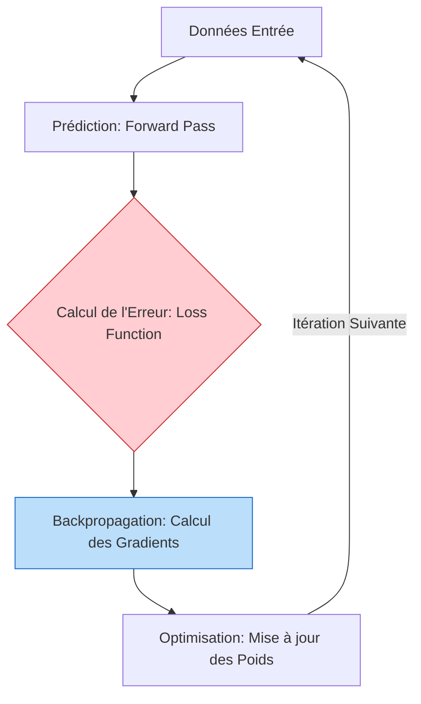

---

## Analogie : **Le prof qui corrige à l'envers**

**Imaginez** que vous rendez une rédaction de 10 pages. Le prof ne vous donne pas juste une note globale. Il remonte chaque phrase et vous dit : "Si cette conclusion est fausse, c'est parce que cet argument en page 5 était faible, qui lui-même venait d'une mauvaise idée en page 1". En corrigeant la petite idée du début, toute la fin devient meilleure.

---

# 6. Coût Métabolique et Élagage

L'**élagage** (Pruning) et la **régularisation** sont des processus visant à optimiser l'efficacité structurelle du réseau. L'objectif est d'obtenir la performance maximale avec un minimum de connexions actives, imitant la sobriété énergétique du cerveau humain.

La régularisation ajoute une pénalité à la fonction de perte pour favoriser des poids ($w$) petits ou nuls :

$$
L_{total} = L(y, \hat{y}) + \lambda \Omega(w)
$$

*Où* $\lambda$ *est la force de régularisation et* $\Omega(w)$ *est souvent la norme L2 :* $\frac{1}{2}\|w\|^2$*.*

---

## Flux étape par étape

1. **Expansion** : Durant l'apprentissage initial, le réseau crée de nombreuses connexions (synaptogénèse).
2. **Évaluation** : Le système identifie les poids proches de zéro ou inutiles pour la prédiction.
3. **Élagage (Pruning)** : Suppression définitive des connexions faibles.
4. **Sparsification** : Le réseau devient "creux" (sparse) : il consomme moins de mémoire et de calcul.

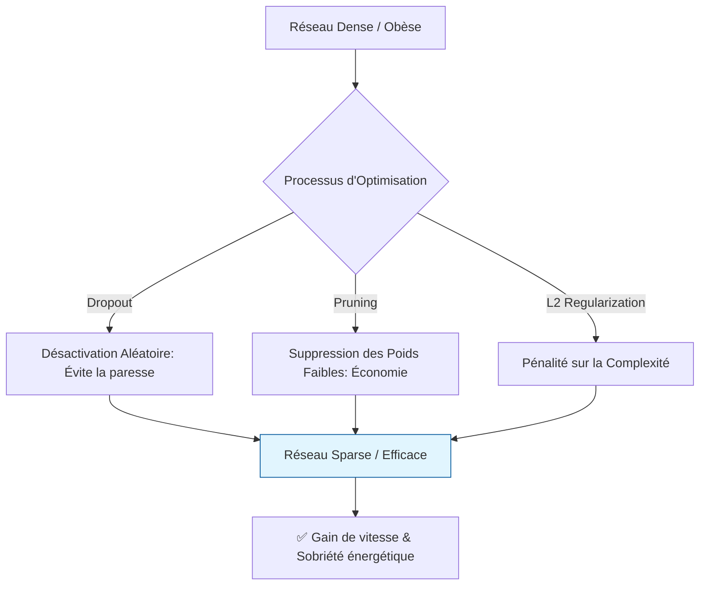

---

## Analogie : Gestion d'Inventaire et Stamina

**Imaginez** que Kael a une barre de **Stamina** limitée. S'il transporte 50 épées rouillées inutiles (poids faibles), il s'épuise en marchant. L'**Élagage**, c'est jeter tout ce qui ne sert pas au combat final pour ne garder que l'équipement légendaire. Moins de poids = plus de vitesse et d'énergie pour battre le boss.

---

## Tableaux de Confrontation : Efficacité Bio vs Artificielle

| Critère | Cerveau Humain | Deep Learning (GPU) |
| --- | --- | --- |
| **Consommation** | ~20 Watts (une ampoule). | Des milliers de Watts. |
| **Connectivité** | Creuse (Sparse < 1%). | Dense (souvent 100% au début). |
| **Mécanisme** | Élagage par les microglies. | Dropout / Pruning algorithmique. |
| **Objectif** | Survie et économie de glucose. | Vitesse d'inférence et stockage. |

---

# **7. Softmax et Décision Catégorielle**

La fonction **Softmax** est utilisée en couche de sortie pour les problèmes de classification multi-classes. Elle transforme un vecteur de scores bruts (logits) en une distribution de probabilités où la somme est égale à 1 (100%).

Pour une classe $k$ parmi $g$ classes possibles :

$$
f_{out,k} = \frac{\exp(f_{in,k})}{\sum_{k'=1}^{g} \exp(f_{in,k'})}
$$

---

## Flux étape par étape

1. **Réception des Logits** : La couche de sortie produit des scores pour chaque classe (ex: Feu: 10, Glace: 2, Éclair: -1).
2. **Exponentiation** : On applique l'exponentielle pour rendre tous les scores positifs et amplifier les écarts.
3. **Normalisation** : On divise chaque score par la somme de tous les scores exponentiés.
4. **Verdict** : Le réseau donne une probabilité (ex: Feu: 95%, Glace: 4%, Éclair: 1%).

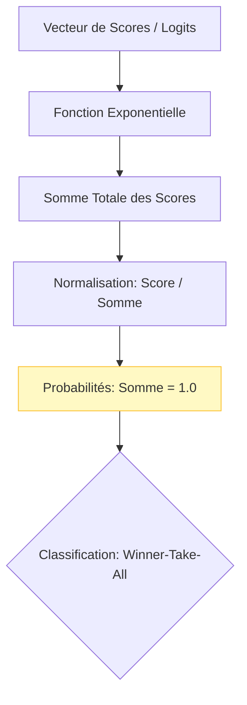

---

## Analogie : Le Choix de l'Armure Légendaire

**Imaginez** Kael devant le Boss Final. Le monstre peut être de type Feu, Glace ou Électrique. Kael possède trois conseillers dans sa tête. Le Softmax est le **Juge de Paix** : il écoute celui qui crie le plus fort, fait taire les autres (**Inhibition Latérale**), et annonce : "Nous sommes sûrs à 95% que c'est du feu". Kael enfile l'armure rouge et gagne.

---

## Classification Binaire vs Multi-classe

| Critère | Classification Binaire | Classification Multi-classe |
| --- | --- | --- |
| **Couche de sortie** | 1 neurone. | $g$ neurones (un par classe). |
| **Activation finale** | Sigmoïde. | **Softmax**. |
| **Interprétation** | Probabilité de la classe "1". | Distribution sur $g$ classes. |
| **Bio Equivalent** | Déclenchement simple. | Inhibition latérale (Cortex Préfrontal). |

---

# Schémas de Synthèse

### 1. Processus du Perceptron Élémentaire

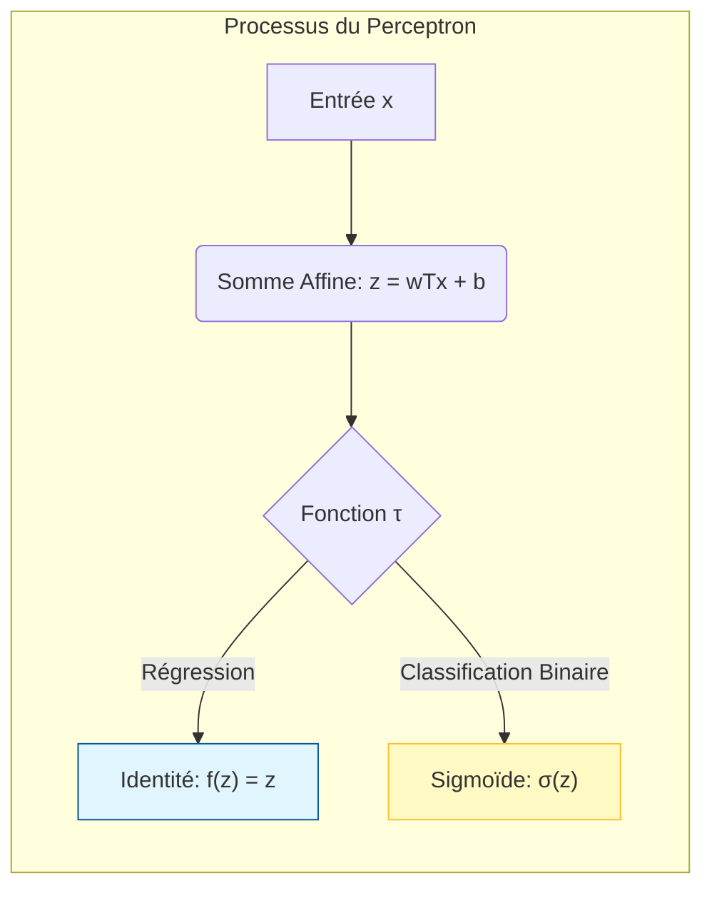

### 2. Architecture Profonde (DNN) et Règle de la ReLU

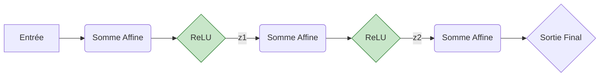

### 3. Traitement Vision (CNN) : Convolution & Pooling

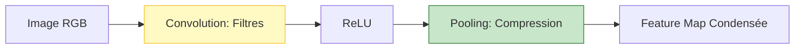

### 4. Cycle d'Apprentissage et Correction

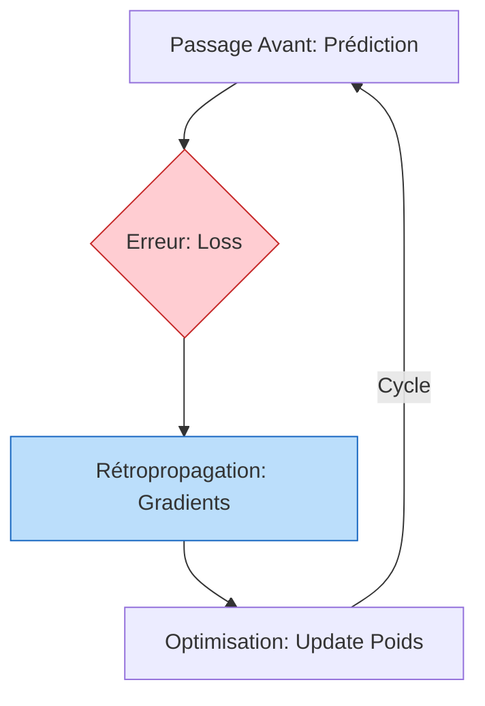

### 5. Prise de Décision Softmax (Multi-classe)

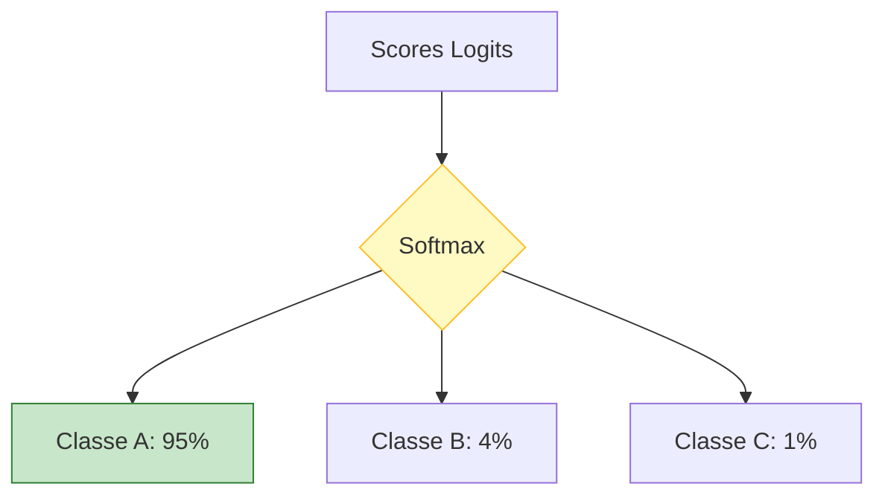